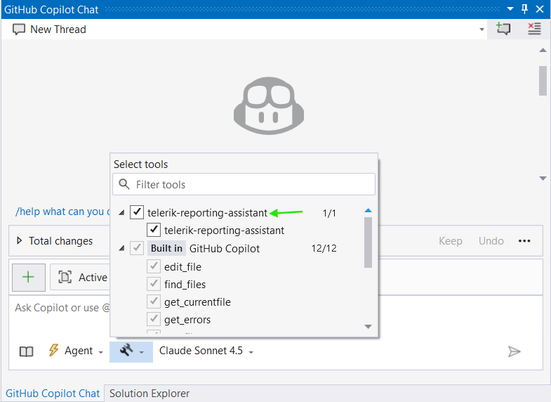
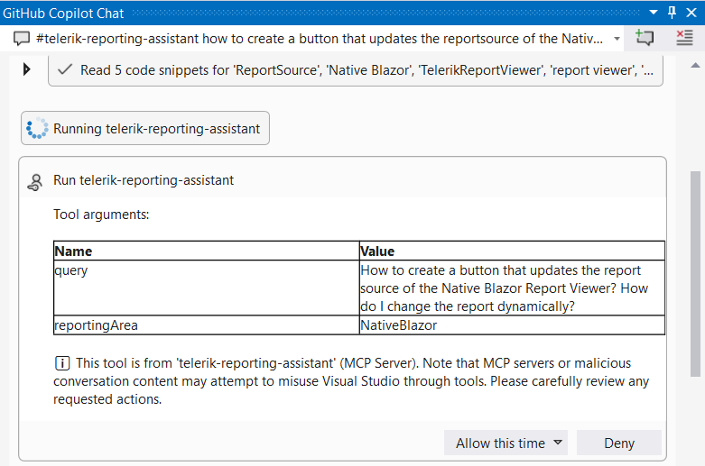
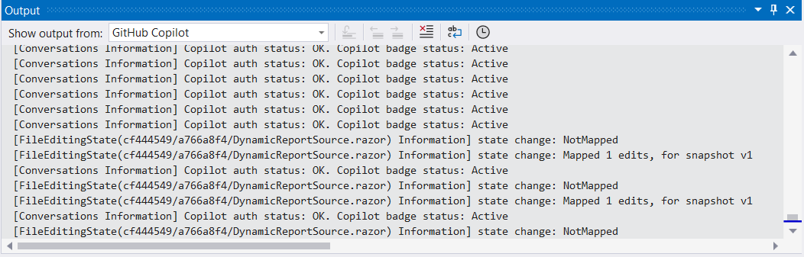

# Telerik Reporting MCP Server (NuGet)

The Telerik Reporting [MCP (Model Context Protocol) Server](https://modelcontextprotocol.io/introduction) is also available as a NuGet package. This NuGet distribution exposes the same AI Coding Assistant functionality as the npm package. 

Beginning with **.NET 10**, it can be executed directly via the `dnx` command. For **.NET 8 and .NET 9** (where `dnx` is not available), you can [install it as a global dotnet tool](https://learn.microsoft.com/en-us/dotnet/core/tools/dotnet-tool-install) and invoke its executable.

## Prerequisites

| Target Runtime | Required SDK | Invocation Method | Notes |
|----------------|--------------|-------------------|-------|
| .NET 8 / .NET 9 | .NET 8 or .NET 9 SDK | [dotnet tool](https://learn.microsoft.com/en-us/dotnet/core/tools/global-tools) | `dnx` not supported; install tool manually |
| .NET 10 | .NET 10 SDK (Preview 6 or newer) | `dnx` dynamic execution | Simplest approach; no prior install step |

Additional requirements:

* A [Telerik user account](https://www.telerik.com/account/).
* An active [license](https://www.telerik.com/purchase/individual/reporting.aspx) covering the usage of Telerik Reporting.
* An application that uses the [Telerik Reporting]().

## Summary of Installation Approaches

| Aspect | .NET 8 / 9 | .NET 10 |
|--------|------------|---------|
| Availability of `dnx` | Not available | Available |
| Install Command | `dotnet tool install Telerik.Reporting.MCP` | None (resolved on demand) |
| .mcp.json Command | `dotnet` | `dnx` |
| .mcp.json Args | `telerik-reporting-assistant` | `Telerik.Reporting.MCP`, `--yes` |
| Update Version | Re-run tool install with `--version` or `tool update` | Handled by latest package resolved by `dnx` |
| Offline Use | Requires prior tool install | Requires prior NuGet cache warm-up |

## Server Installation

### .NET 8 / .NET 9

Install the MCP server as a local tool in your solution root (or another chosen path):

````powershell
dotnet tool install -g Telerik.Reporting.MCP
````

If updating:

````powershell
dotnet tool update -g Telerik.Reporting.MCP
````

These commands install/update the Telerik Reporting MCP [dotnet tool](https://learn.microsoft.com/en-us/dotnet/core/tools/global-tools) globally. Global tools are installed in the following directories by default when you specify the **-g** or **--global** option:

- Windows - `%USERPROFILE%\.dotnet\tools`
- Linux/MacOS - `$HOME/.dotnet/tools`

### .NET 10

No manual install step is needed. The `dnx` command will download and execute the NuGet package on demand.

## Server Configuration

### .NET 8 / .NET 9 Configuration (`.mcp.json`)

Add a `.mcp.json` file to your solution root (or to `%USERPROFILE%` for global usage):

````json
{
	"servers": {
	"telerik-reporting-assistant": {
		"type": "stdio",
		"command": "dotnet",
		"args": ["telerik-reporting-assistant"],
		"env": {
			"TELERIK_LICENSE_PATH": "THE_PATH_TO_YOUR_LICENSE_FILE"
			}
		}
	}
}
````

If you prefer embedding the license string directly:

````json
"env": {
	"TELERIK_LICENSE": "YOUR_LICENSE_KEY"
}
````

### .NET 10 Configuration (`.mcp.json`)

Use these settings when configuring the server in your MCP client:

````json
{
	"servers": {
		"telerik-reporting-assistant": {
			"type": "stdio",
			"command": "dnx",
			"args": [
				"Telerik.Reporting.MCP",
				"--yes"
			],
			"env": {
				"TELERIK_LICENSE_PATH": "THE_PATH_TO_YOUR_LICENSE_FILE"
			}
		}
	}
}
````


You may substitute `TELERIK_LICENSE` instead of `TELERIK_LICENSE_PATH` (*see [License Configuration](#license-configuration) section below for details and recommendations*). The `inputs` array is optional and not required for the current functionality.

After saving the file, restart Visual Studio and enable the `telerik-reporting-assistant` tool in the [Copilot Chat window's tool selection dropdown](https://learn.microsoft.com/en-us/visualstudio/ide/mcp-servers?view=vs-2022#configuration-example-with-github-mcp-server).



### Global Setup

To enable the server globally for all projects, add the `.mcp.json` file to your user directory (`%USERPROFILE%`, e.g., `C:\Users\{YourName}\.mcp.json`).

### Telerik Visual Studio Extension Setup:

The `.mcp.json` file can be created and updated by using the [Telerik Visual Studio Extension]() menu in Visual Studio.


The `Configure MCP Server Globally` option creates (or updates if existing) the global `%USERPROFILE%\.mcp.json` file and adds  the Telerik server entry.

The `Configure MCP Server for Solution` option is visible only if you have a project opened in Visual Studio. The option creates (or updates if existing) the  `.mcp.json` file in the solution directory.

The `Add/Update GitHub Copilot Instructions` option is visible only if you have a project opened in Visual Studio. The option creates (or updates if existing) an [copilot-instructions.md](https://docs.github.com/en/copilot/how-tos/configure-custom-instructions/add-repository-instructions?tool=visualstudio) file in the `.github\` folder of the solution (`\SolutionDir\.github\copilot-instructions.md`), which includes extra context that is automatically used with the prompt given to the Copilot chat in Visual Studio.

## License Configuration

Add your [Telerik license key]() using one of these options in the `env` section.

__Option 1: License File Path (Recommended)__

````json
"env": {
	"TELERIK_LICENSE_PATH": "THE_PATH_TO_YOUR_LICENSE_FILE"
}
````

The `THE_PATH_TO_YOUR_LICENSE_FILE` should point to the `telerik-license.txt` file, usually in the AppData folder. Often it will look like:

`"TELERIK_LICENSE_PATH": "%appdata%/Telerik/telerik-license.txt"`

__Option 2: Direct License Key__

````json
"env": {
	"TELERIK_LICENSE": "YOUR_LICENSE_KEY_HERE"
}
````

> Option 1 is recommended unless you're sharing settings across different systems. Remember to [update your license key](#updating-your-license-key) when necessary.

## Visual Studio Usage

After configuration and restart:

1. Open Copilot Chat.
2. Enable the `telerik-reporting-assistant` tool.
3. Grant permissions when prompted (*per session, workspace, or always*).



Start fresh sessions for unrelated prompts to avoid context pollution. You can check the Output pane of Visual Studio for diagnostics (select output from **GitHub Copilot**).



## Usage

Begin prompts with any of these triggers to explicitly invoke the server:

- `/telerik` / `@telerik` / `#telerik`
- `/telerikreporting` / `@telerikreporting` / `#telerikreporting`
- `#telerik-reporting-assistant`

## Sample Prompts

Examples you can try:

* `#telerik-reporting-assistant How do I set up the Telerik Reporting REST Service in an ASP.NET Core project that targets .NET 10?`
* `#telerik-reporting-assistant Can I use a database as a storage for my report files in the Reporting REST service? Show me an example.`
* `#telerik-reporting-assistant How to change the displayed report after a button is clicked in the Native Blazor Report Viewer?`

## See Also

* [AI Coding Assistant Overview]()
* [npm-based Telerik Reporting MCP Server]()
