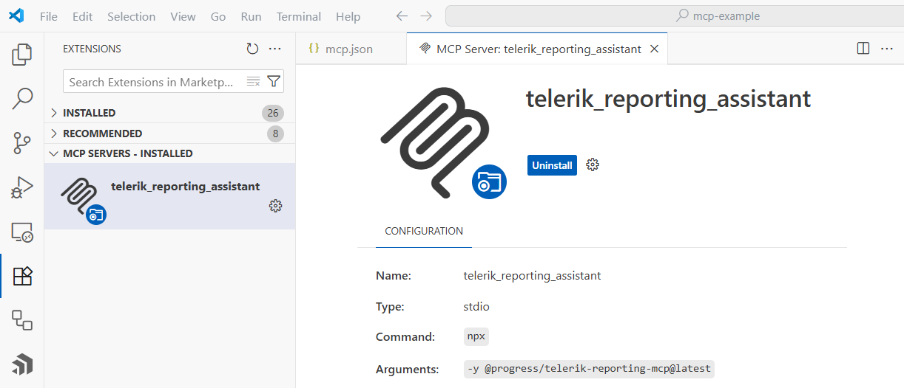
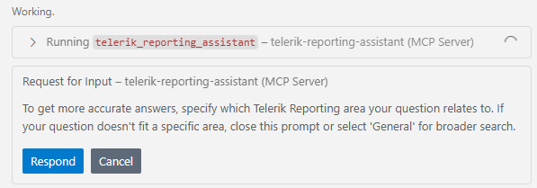
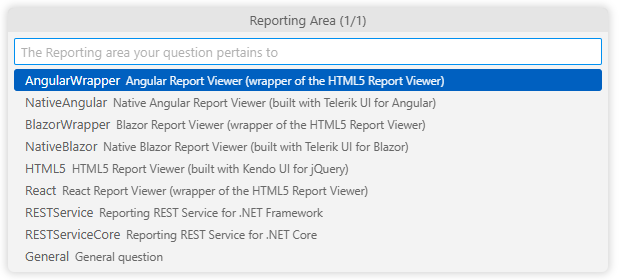

# Telerik Reporting MCP Server

The Telerik Reporting [MCP (Model Context Protocol) Server](https://modelcontextprotocol.io/introduction) enhances your AI-powered development experience by providing specialized context about Telerik Reporting.

This MCP server enables AI-powered IDEs and tools to generate more accurate, tailored code that leverages [Telerik Reporting](https://www.telerik.com/products/reporting.aspx) APIs. You can ask complex questions about integrating Telerik Reporting in web applications, request specific implementations, and generate comprehensive code solutions.

## Prerequisites

To use the Telerik Reporting MCP Server, you need:

* [Node.js](https://nodejs.org/en) 18 or newer.
* An [MCP-compatible client (IDE, code editor, or app)](https://modelcontextprotocol.io/clients) that supports **MCP tools** (latest version recommended). For example, the latest [Visual Studio Code](https://code.visualstudio.com/).
* [.NET 10.0 SDK](https://dotnet.microsoft.com/en-us/download/dotnet/10.0).
* A [Telerik user account](https://www.telerik.com/account/).
* An active [license](https://www.telerik.com/purchase/individual/reporting.aspx) covering the usage of Telerik Reporting.
* An application that uses the [Telerik Reporting]().


## Installation

Install the Telerik Reporting MCP server using npm:

````bash
npm i @progress/telerik-reporting-mcp
````

### Configuration

Use these settings when configuring the server in your MCP client:

|Setting|Value|
|----|----|
| Package Name | `@progress/telerik-reporting-mcp` |
| Type | `stdio` (standard input/output transport) |
| Command | `npx` |
| Arguments | `-y` |
| Server Name | `telerik-reporting-assistant` (customizable) |

### License Configuration

Add your [Telerik license key]() as an environment parameter in your `mcp.json` file using one of these options:

* Option 1: License File Path (Recommended)

````json
"env": {
	"TELERIK_LICENSE_PATH": "THE_PATH_TO_YOUR_LICENSE_FILE"
}
````


* Option 2: Direct License Key

````json
"env": {
	"TELERIK_LICENSE": "YOUR_LICENSE_KEY_HERE"
}
````


> **Option** 1 is recommended unless you're sharing settings across different systems. Remember to [update your license key](#updating-your-license-key) when necessary.

## Visual Studio

For complete setup instructions, see [Use MCP servers in Visual Studio](https://learn.microsoft.com/en-us/visualstudio/ide/mcp-servers).

> Early Visual Studio 17.14 versions require the **Copilot Chat** window to be open when opening a solution for the MCP server to work properly.

### Workspace-Specific Setup:

1. Add `.mcp.json` to your solution folder (mind the leading dot '.'):

	````json
{
		"servers": {
			"telerik-reporting-assistant": {
			"type": "stdio",
			"command": "npx",
			"args": ["-y", "@progress/telerik-reporting-mcp@latest"],
			"env": {
					"TELERIK_LICENSE_PATH": "THE_PATH_TO_YOUR_LICENSE_FILE",
					// or
					"TELERIK_LICENSE": "YOUR_LICENSE_KEY"
				}
			}
		}
	}
````


1. Restart Visual Studio.
1. Enable the `telerik-reporting-assistant` tool in the [Copilot Chat window's tool selection dropdown](https://learn.microsoft.com/en-us/visualstudio/ide/mcp-servers?view=vs-2022#configuration-example-with-github-mcp-server).

### Global Setup:

Add the `.mcp.json` file to your user directory (`%USERPROFILE%`, e.g., `C:\Users\{user}\.mcp.json`).

## Visual Studio Code

For complete setup instructions, see [Use MCP servers in Visual Studio Code](https://code.visualstudio.com/docs/copilot/chat/mcp-servers).

> **Visual Studio Code 1.102.1 or newer** is required to use the Telerik MCP Server

The basic setup in Visual Studio Code follows these steps:

1. Enable [`chat.mcp.enabled`](vscode://settings/chat.mcp.enabled) in Visual Studio Code settings.
2. Create `.vscode/mcp.json` in your workspace root (or user folder for global setup):

	````json
{
		"servers": {
			"telerik-reporting-assistant": {
			"type": "stdio",
			"command": "npx",
			"args": ["-y", "@progress/telerik-reporting-mcp@latest"],
			"env": {
					"TELERIK_LICENSE_PATH": "THE_PATH_TO_YOUR_LICENSE_FILE",
					// or
					"TELERIK_LICENSE": "YOUR_LICENSE_KEY"
				}
			}
		}
	}
````


	This enables you to call the MCP Server with the `#telerik-reporting-assistant` handle. To use a custom handle, change the server name in the `mcp.json`.

3. For global discovery, enable [`chat.mcp.discovery.enabled`](vscode://settings/chat.mcp.discovery.enabled) in `settings.json`:

	````json
{
	"chat.mcp.discovery.enabled": true
}
````


4. Restart Visual Studio Code.



## Cursor

For complete setup instructions, see [Model Context Protocol](https://docs.cursor.com/context/mcp).

Create `.cursor/mcp.json` in your workspace root (or user folder for global setup):

````json
{
	"mcpServers": {
		"telerik-reporting-assistant": {
		"type": "stdio",
		"command": "npx",
		"args": ["-y", "@progress/telerik-reporting-mcp@latest"],
		"env": {
				"TELERIK_LICENSE_PATH": "THE_PATH_TO_YOUR_LICENSE_FILE",
				// or
				"TELERIK_LICENSE": "YOUR_LICENSE_KEY"
			}
		}
	}
}
````

This enables you to call the MCP Server with the `#telerik-reporting-assistant` handle. To use a custom handle, change the server name in the `mcp.json`.


## Usage

> When switching between tasks and files, start a new session in a new chat window to avoid polluting the context with irrelevant or outdated information.
 
To use the Telerik Reporting MCP Server:

1. Choose your preferred mode and model.<br/>At the time of publishing, **Claude Sonnet 4** and **GPT-5** produce optimal results.

2. Start your prompt with `#telerik-reporting-assistant` (or with '#' followed by your [custom MCP server name](#configuration), if set):

3. Inspect the output and verify that the MCP server is used. Look for messages similar to the ones below:

	- Visual Studio: `Running telerik-reporting-assistant`
	- Visual Studio Code: `Running telerik-reporting-assistant`
	- Cursor: `Calling MCP tool telerik-reporting-assistant`

4. If the Telerik Reporting MCP server is not used even though it's installed and enabled, double-check the server name in your configuration and try rephrasing your prompt.
5. If requested, grant the Telerik Reporting MCP Server permissions to run for this session, workspace, or always.

6. Start fresh sessions for unrelated prompts to avoid context pollution.

### Improving Server Usage

**Determining the Reporting Area**: To better specify the context for each prompt, the MCP Server will attempt to determine the Telerik Reporting Area the prompt relates to. These areas represent the supported web frameworks and backend technologies, as listed below as pairs consisting of identifier and description:

- AngularWrapper - _Angular Report Viewer (wrapper of the HTML5 Report Viewer)_
- NativeAngular - _Native Angular Report Viewer (built with Kendo UI for Angular)_
- BlazorWrapper- _Blazor Report Viewer (wrapper of the HTML5 Report Viewer)_
- NativeBlazor - _Native Blazor Report Viewer (built with Telerik UI for Blazor)_
- HTML5 - _HTML5 Report Viewer (built with Kendo UI for jQuery)_
- React - _React Report Viewer (wrapper of the HTML5 Report Viewer)_
- RESTService - _Reporting REST Service for .NET Framework_
- RESTServiceCore - _Reporting REST Service for .NET Core/.NET 8+_
- General - _General question_

If the Reporting Area cannot be determined automatically, the MCP Server will display a dialog asking to pick the corresponding area in which the prompt falls in:



 After clicking on 'Respond' button, the MCP Server will display a drop-down list with all the areas and wait for selecting the corresponding Reporting Area. If there is no applicable entry, please select 'General' entry at the end of the list.



**Custom Instructions**: To increase the likelihood of the Telerik MCP server being used, or to call it without the need to mention "telerik-reporting" explicitly, add custom instructions to your AI tool:

- [GitHub Copilot custom instructions](https://docs.github.com/en/copilot/customizing-copilot/adding-repository-custom-instructions-for-github-copilot#about-repository-custom-instructions-for-github-copilot-chat)
- [Cursor rules](https://docs.cursor.com/context/rules)

### Sample Prompts

The following examples demonstrate useful prompts for the Telerik Reporting MCP Server:

* "`#telerik-reporting-assistant` Add a Telerik Report Viewer to my native Angular application."
* "`#telerik-reporting-assistant` Connect the Telerik Report Viewer to my Telerik Report Server instance."

>tip Visit the [Telerik Reporting Prompt Library]({%slug ai-prompt-library%) for more sample prompts.

## Usage Limits

A Telerik [Subscription license](https://www.telerik.com/purchase.aspx?filter=web) is recommended in order to use the Telerik Reporting AI Coding Assistant without restrictions. Perpetual license holders and trial users can make a [limited number of requests per year](#number-of-requests).

## Connect to Local AI Model

You can use the Telerik Reporting MCP server with local large language models (LLMs):

1. Run a local model, for example, through [Ollama](https://ollama.com).
1. Use a bridge package like [MCP-LLM Bridge](https://github.com/patruff/ollama-mcp-bridge).
1. Connect your local model to the Telerik MCP server.

This setup allows you to use the Telerik AI Coding Assistant without cloud-based AI models.

## See Also

* [Telerik Reporting GitHub Copilot Extension]()
* [AI Coding Assistant Overview]()
* [Telerik Reporting Prompt Library]()
* [Kendo UI for Angular MCP Server](https://www.telerik.com/kendo-angular-ui/components/ai-assistant/mcp-server)
* [Telerik Blazor MCP Server](https://www.telerik.com/blazor-ui/documentation/ai/mcp-server)
