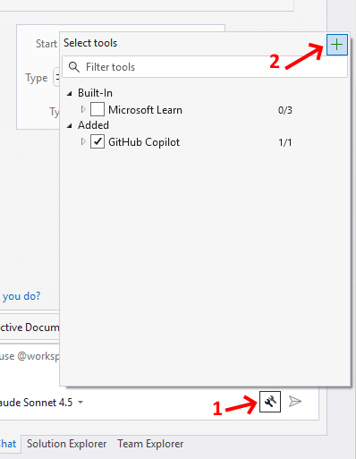
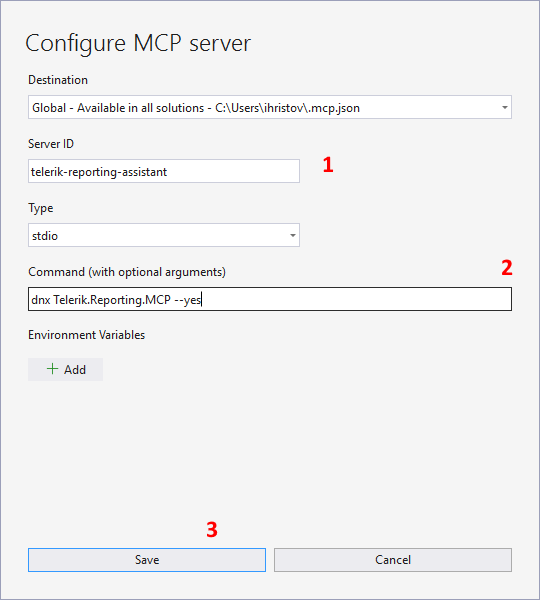

# Telerik Reporting MCP Server

The Telerik Reporting [MCP (Model Context Protocol) server](https://modelcontextprotocol.io/introduction) enhances your AI-powered development experience by providing specialized context about Telerik Reporting.

This MCP server enables AI-powered IDEs and tools to generate more accurate, tailored code that leverages [Telerik Reporting](https://www.telerik.com/products/reporting.aspx) APIs. You can ask complex questions about integrating Telerik Reporting in web applications, request specific implementations, and generate comprehensive code solutions.

## Prerequisites

To use the Telerik Reporting MCP Server, you need:

* [.NET](https://learn.microsoft.com/en-us/dotnet/core/whats-new/dotnet-8/overview) 8 or later, or [Node.js](https://nodejs.org/en) 18 or later.
* An [MCP-compatible client (IDE, code editor, or app)](https://modelcontextprotocol.io/clients) that supports MCP tools (latest version recommended). For example, the latest [Visual Studio Code](https://code.visualstudio.com/).
* A [Telerik user account](https://www.telerik.com/account/).
* An active [license](https://www.telerik.com/purchase/individual/reporting.aspx) covering the usage of Telerik Reporting.
* An application that uses the [Telerik Reporting]().

## Installation

Depending on your environment, you can install the Telerik Reporting MCP server in any of the following ways:

* By using the `dnx` script (.NET 10 or later only) or the `dotnet` CLI (.NET 8 and .NET 9):

	* .NET 10:

		````bash
dnx Telerik.Reporting.MCP
````


	* .NET 8 and .NET 9:

		````bash
dotnet tool install Telerik.Reporting.MCP
````


* By using npm:

	````bash
npm i @progress/telerik-reporting-mcp
````


Next, make sure the configuration in your `mcp.json` is [correct](#configuring-mcp-json), and then [add your Telerik license](#configuring-your-license).

### Configuring mcp.json

Use the settings in the following table to configure the Telerik Reporting MCP server in the [`mcp.json` file](https://code.visualstudio.com/docs/copilot/customization/mcp-servers) of your code editor. Select the correct value based on your development environment.

| Setting Name | .NET 10 Value | .NET 8/9 Value | Node.js Value |
|---------|---------------|-----------------------|---------------|
| Package Name | `"Telerik.Reporting.MCP"` | `"Telerik.Reporting.MCP"` | `@progress/telerik-reporting-mcp` |
| Type | `"stdio"` | `"stdio"` | `stdio` |
| Command | `"dnx"` | `"dotnet"` | `npx` |
| Arguments | `"Telerik.Reporting.MCP", "--yes"` | `"tool", "run", "telerik-reporting-assistant"` | `-y` |
| Server Name | `"telerik-reporting-assistant"` | `"telerik-reporting-assistant"` | `telerik-reporting-assistant` |

### Configuring Your License

An active Telerik Reporting license is required to use the Telerik Reporting MCP server.

* When installing the MCP server by using the .NET tooling (`dnx` or `dotnet tool install`), the [license key file]() will be retrieved automatically if it is present in the default directory on your system (`%AppData%\Telerik\telerik-license.txt` on Windows and `~/.telerik/telerik-license.txt` on Linux). No additional action is required.
* When using the .NET tooling, but your [license key file]() is not in the default directory, use one of the options below to configure your license.
* When using Node.js, add your [license key file]() as an environment variable in your `mcp.json` file using one of the options below:

	* As a license file path (recommended):

		````JSON
"env": {
			"TELERIK_LICENSE_PATH": "THE_PATH_TO_YOUR_LICENSE_FILE"
		}
````


	* As a license key value:

		````JSON
"env": {
			"TELERIK_LICENSE": "YOUR_LICENSE_KEY_HERE"
		}
````


> Using a license file path is recommended unless you're sharing settings across different systems. Remember to [update your license key]((#updating-your-license-key)) when necessary.

## Visual Studio Configuration

> * Early Visual Studio 17.14 versions require the Copilot Chat window to be open when a solution loads for the MCP server to work properly.
> * For complete setup instructions, see [Use MCP servers in Visual Studio](https://learn.microsoft.com/en-us/visualstudio/ide/mcp-servers).

The Telerik Reporting MCP server is available as a NuGet package: https://www.nuget.org/packages/Telerik.Reporting.MCP.

### Automatic Configuration through the Visual Studio UI

1. Open the Configure MCP server menu in Visual Studio
	* Open the [Visual Studio GitHub Copilot Chat](https://learn.microsoft.com/en-us/visualstudio/ide/visual-studio-github-copilot-get-started?view=vs-2022) 
	* Click on the button at the bottom right corner to open the _Select tools_ context menu.
	* Click on the `+` button at the top right corner of the menu to open the _Configure MCP server_ menu.

	

1. Use the following values for the configuration fields:
	* In `Destination` select either _Global-Available in all solutions_ or _Solution-Available in this solution_.
	* For `Server ID` use _telerik-reporting-assistant_.
	* Select _stdio_ as `Type`.
	* The `Command (with optional arguments)` field should contain _dnx Telerik.Reporting.MCP --yes_.
	* Click on the `Save` button to preserve the configuration.

	

1. Enable the `telerik-reporting-assistant` tool in the [Copilot Chat window's tool selection dropdown](https://learn.microsoft.com/en-us/visualstudio/ide/mcp-servers?view=vs-2022#configuration-example-with-github-mcp-server).

	The `telerik-reporting-assistant` tool should now appear in the _Select tools_ context menu. Check it to enable the Telerik Reporting AI Coding Assistant:
	
	

### Manual Configuration

The steps below describe the sample procedure for configuring the Telerik Reporting MCP server in Visual Studio.

1. Add an `.mcp.json` file to either of the following locations:

	* For a workspace-specific setup, add the file to the solution's folder.
	* For a global setup, add the file to your user directory, `%USERPROFILE%` (for example, `C:\Users\YourName\.mcp.json`).

1. Add the following configuration to the `.mcp.json` file:

	* In .NET 10:

		````JSON
{
			"servers": {
				"telerik-reporting-assistant": {
				"type": "stdio",
				"command": "dnx",
				"args": ["Telerik.Reporting.MCP", "--yes"],
				}
			}
		}
````


	* In .NET 8 and .NET 9:

		````JSON
{
			"servers": {
				"telerik-reporting-assistant": {
				"type": "stdio",
				"command": "dotnet",
				"args": ["tool", "run", "telerik-reporting-assistant"],
				}
			}
		}
````


	* In Node.js:

		````JSON
{
			"servers": {
				"telerik-reporting-assistant": {
				"type": "stdio",
				"command": "npx",
				"args": ["-y", "@progress/telerik-reporting-mcp@latest"],
				"env": {
						"TELERIK_LICENSE_PATH": "THE_PATH_TO_YOUR_LICENSE_FILE",
						// or
						"TELERIK_LICENSE": "YOUR_LICENSE_KEY"
					}
				}
			}
		}
````


1. Restart Visual Studio.
1. Enable the `telerik-reporting-assistant` tool in the [Copilot Chat window's tool selection dropdown](https://learn.microsoft.com/en-us/visualstudio/ide/mcp-servers?view=vs-2022#configuration-example-with-github-mcp-server).

>warning Known Issue: Hanging tool calls in Visual Studio
>
> When using Telerik AI tools in Visual Studio, GitHub Copilot may:
>
> - **hang** during tool invocation;
> - show UI for a successful tool response, but actually **fail silently**;
> - continue generation without waiting for **parallel tool calls**.
>
> In these cases, the response may be generated but not provided to the Copilot Agent UI.
>
> This is a known issue in Visual Studio Copilot, not related to Telerik MCP servers or AI tools, and does not reproduce in VS Code.
>
> For more details, see the related Visual Studio Developer Community issue:  
> https://developercommunity.visualstudio.com/t/Copilot-stopped-working-after-latest-upd/10936456
>
> Microsoft has acknowledged the issue and marked it as **Fixed - Pending Release**. A future Visual Studio update is expected to resolve it.

## Visual Studio Code

> * Visual Studio Code 1.102.1 or later is required to use the Telerik Reporting MCP Server.
> * For complete setup instructions, see [Use MCP servers in Visual Studio Code](https://code.visualstudio.com/docs/copilot/chat/mcp-servers).

The basic setup in Visual Studio Code involves the following steps:

1. Enable [`chat.mcp.enabled`](vscode://settings/chat.mcp.enabled) in Visual Studio Code settings.
1. Create `.vscode/mcp.json` in your workspace root (or user folder for global setup). The settings below let you use the `#telerik-reporting-assistant` handle to call the Telerik Reporting MCP server. To use a custom handle, change the server name in the `mcp.json`.

	* In .NET 10:

		````JSON
		{
			"servers": {
				"telerik-reporting-assistant": {
				"type": "stdio",
				"command": "dnx",
				"args": ["Telerik.Reporting.MCP", "--yes"],
				}
			}
		}
		````

	* In .NET 8 and .NET 9:

		````JSON
		{
			"servers": {
				"telerik-reporting-assistant": {
				"type": "stdio",
				"command": "dotnet",
				"args": ["tool", "run", "telerik-reporting-assistant"],
				}
			}
		}
		````

	* In Node.js:

		````JSON
		{
			"servers": {
				"telerik-reporting-assistant": {
				"type": "stdio",
				"command": "npx",
				"args": ["-y", "@progress/telerik-reporting-mcp@latest"],
				"env": {
						"TELERIK_LICENSE_PATH": "THE_PATH_TO_YOUR_LICENSE_FILE",
						// or
						"TELERIK_LICENSE": "YOUR_LICENSE_KEY"
					}
				}
			}
		}
		````

1. For global discovery, enable [`chat.mcp.discovery.enabled`](vscode://settings/chat.mcp.discovery.enabled) in `settings.json`:

	````json
	{
		"chat.mcp.discovery.enabled": true
	}
	````

1. Restart Visual Studio Code.


## Cursor

> For complete setup instructions, see [Model Context Protocol](https://cursor.com/docs/context/mcp).

Create a `.cursor/mcp.json` file in your workspace root (or user folder for global setup):

* In .NET 10:

	````JSON
	{
		"mcpServers": {
			"telerik-reporting-assistant": {
			"type": "stdio",
			"command": "dnx",
			"args": ["Telerik.Reporting.MCP", "--yes"],
			}
		}
	}
	````

* In .NET 8 and .NET 9:

	````JSON
	{
		"mcpServers": {
			"telerik-reporting-assistant": {
			"type": "stdio",
			"command": "dotnet",
			"args": ["tool", "run", "telerik-reporting-assistant"],
			}
		}
	}
	````

* In Node.js:

	````JSON
	{
		"mcpServers": {
			"telerik-reporting-assistant": {
			"type": "stdio",
			"command": "npx",
			"args": ["-y", "@progress/telerik-reporting-mcp@latest"],
			"env": {
					"TELERIK_LICENSE_PATH": "THE_PATH_TO_YOUR_LICENSE_FILE",
					// or
					"TELERIK_LICENSE": "YOUR_LICENSE_KEY"
				}
			}
		}
	}
	````

This enables you to call the MCP Server with the `#telerik-reporting-assistant` handle. To use a custom handle, change the server name in the `mcp.json`.

## Usage

> When switching between tasks and files, start a new session in a new chat window to avoid polluting the context with irrelevant or outdated information.
 
To use the Telerik Reporting MCP Server:

1. Choose your preferred mode and model.<br/>At the time of publishing, **Claude Sonnet 4** and **GPT-5** produce optimal results.
1. Start your prompt with `#telerik-reporting-assistant` (or with '#' followed by your [custom MCP server name](#configuration), if set):
1. Inspect the output and verify that the MCP server is used. Look for messages similar to the ones below:

	- Visual Studio: `Running telerik-reporting-assistant`
	- Visual Studio Code: `Running telerik-reporting-assistant`
	- Cursor: `Calling MCP tool telerik-reporting-assistant`

1. If the Telerik Reporting MCP server is not used even though it's installed and enabled, double-check the server name in your configuration and try rephrasing your prompt.
1. If requested, grant the Telerik Reporting MCP Server permissions to run for this session, workspace, or always.
1. Start fresh sessions for unrelated prompts to avoid context pollution.

### Improving Server Usage

**Determining the Reporting Area**: To better specify the context for each prompt, the MCP Server will attempt to determine the Telerik Reporting Area the prompt relates to. These areas represent the supported web frameworks and backend technologies, as listed below as pairs consisting of an identifier and a description:

- AngularWrapper - _Angular Report Viewer (wrapper of the HTML5 Report Viewer)_
- NativeAngular - _Native Angular Report Viewer (built with Kendo UI for Angular)_
- BlazorWrapper- _Blazor Report Viewer (wrapper of the HTML5 Report Viewer)_
- NativeBlazor - _Native Blazor Report Viewer (built with Telerik UI for Blazor)_
- HTML5 - _HTML5 Report Viewer (built with Kendo UI for jQuery)_
- React - _React Report Viewer (wrapper of the HTML5 Report Viewer)_
- RESTService - _Reporting REST Service for .NET Framework_
- RESTServiceCore - _Reporting REST Service for .NET Core/.NET 8+_
- General - _General question_

If the Reporting Area cannot be determined automatically, the MCP Server will display a dialog asking to pick the corresponding area in which the prompt falls in:


 After clicking on the 'Respond' button, the MCP Server will display a drop-down list with all the areas and wait for selecting the corresponding Reporting Area. If there is no applicable entry, please select the 'General' entry at the end of the list.


**Custom Instructions**: To increase the likelihood of the Telerik MCP server being used, or to call it without the need to mention "telerik-reporting" explicitly, add custom instructions to your AI tool:

- [GitHub Copilot custom instructions](https://docs.github.com/en/copilot/customizing-copilot/adding-repository-custom-instructions-for-github-copilot#about-repository-custom-instructions-for-github-copilot-chat)
- [Cursor rules](https://docs.cursor.com/context/rules)

### Sample Prompts

The following examples demonstrate useful prompts for the Telerik Reporting MCP Server:

* "`#telerik-reporting-assistant` Add a Telerik Report Viewer to my native Angular application."
* "`#telerik-reporting-assistant` Connect the Telerik Report Viewer to my Telerik Report Server instance."

>tip Visit the [Telerik Reporting Prompt Library]() for more sample prompts.

## Usage Limits

A Telerik [Subscription license](https://www.telerik.com/purchase.aspx?filter=web) is recommended to use the Telerik Reporting AI Coding Assistant without restrictions. Perpetual license holders and trial users can make a [limited number of requests per year](#number-of-requests).

## Connect to Local AI Model

You can use the Telerik Reporting MCP server with local large language models (LLMs):

1. Run a local model, for example, through [Ollama](https://ollama.com).
1. Use a bridge package like [MCP-LLM Bridge](https://github.com/patruff/ollama-mcp-bridge).
1. Connect your local model to the Telerik MCP server.

This setup allows you to use the Telerik AI Coding Assistant without cloud-based AI models.

## See Also

* [AI Coding Assistant Overview]()
* [Telerik Reporting Prompt Library]()
* [Kendo UI for Angular MCP Server](https://www.telerik.com/kendo-angular-ui/components/ai-assistant/mcp-server)
* [Telerik Blazor MCP Server](https://www.telerik.com/blazor-ui/documentation/ai/mcp-server)
