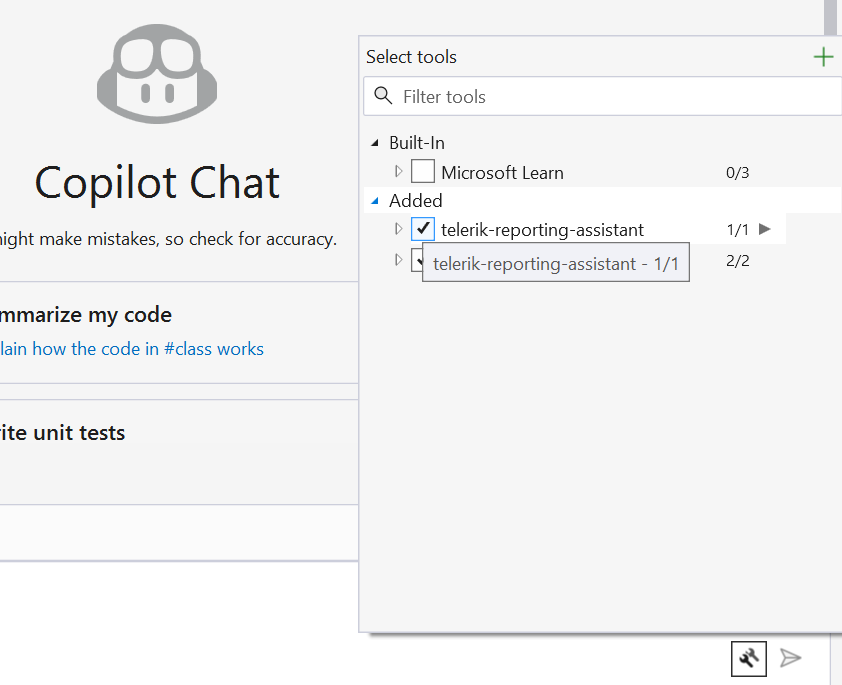

# Troubleshooting

This article provides solutions to common issues you may encounter when working with the Telerik Reporting AI Tools.

### I Started a Trial License but Cannot Activate the MCP Server

When you activate a trial license, you must download and install the updated license key to enable access to the AI Tools. To resolve this issue:

1. Follow the steps in the [Updating Your License Key](slug:license-key#updating-your-license-key) section.
1. Restart your IDE to ensure the changes take effect.

The MCP server validates your license during initialization. Without a properly activated license key, the server cannot authenticate your access to the AI Tools.

## MCP Assistants Not Recognized by Visual Studio

If the Telerik MCP server assistants are not available or recognized by GitHub Copilot in Visual Studio, you may need to manually enable them:

1. Click on the _Select Tools_ button on the bottom right part of the Copilot chat window.
1. In the popup that opens, check **telerik-reporting-mcp** from the list to enable it.

   

## Hanging Tool Calls in Visual Studio

When using Telerik AI tools in Visual Studio, GitHub Copilot may:

- **Hang** during tool invocation.
- Show UI for a successful tool response, but actually **fail silently**.
- Continue generation without waiting for **parallel tool calls**.

This is a [known issue](https://developercommunity.visualstudio.com/t/Copilot-stopped-working-after-latest-upd/10936456) in older Visual Studio versions that has been fixed in **Visual Studio 2026 Insiders 18.3.0 (11426.168)**.

## See Also

- [Telerik Reporting AI Tools](slug:ai-coding-assistant)
- [Licensing](slug:license-key)
