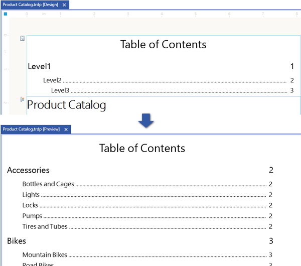
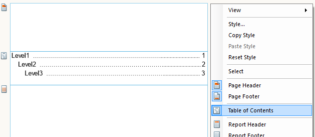
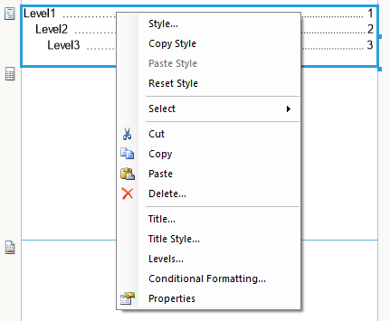

# Table of Contents Overview

The table of contents (TOC) provides a summary/overview of the report structure and a set of navigational links to report items in the rendered report and displays the page numbers of the pages where these report items are located. The user can click the entries in the table of contents to navigate to the report page which displays that item. The table of contents is part of the report and can be displayed before or after the report header/footer section. As such it will be included in the page numbering of the report. The following image illustrates the table of contents section during design-time and at run-time.         

  

The table of contents can be added to the report by enabling it from the report's context menu:         

  

## Structure

The position of the TOC section in the report can be controlled via the  [Position](/reporting/api/Telerik.Reporting.TocSection#Telerik_Reporting_TocSection_Position)  property. This property can be switched between four different states which place the TOC before or after the report header or the report footer section.         

At run-time, the table of contents entries are defined by the  [TocText](/reporting/api/Telerik.Reporting.ReportItemBase#Telerik_Reporting_ReportItemBase_TocText) property of any report section/item/group. Valid values are static text, expression, or text with embedded expressions. The resulting text will be displayed in the corresponding TOC entry. To form a hierarchical structure of the TOC, you need to set the TocText property of the report groups, the CrossTab/Table groups, the Detail section and the Report (useful for SubReports). To add a report item to the TOC, you may use the  [TocText](/reporting/api/Telerik.Reporting.ReportItemBase#Telerik_Reporting_ReportItemBase_TocText)  property of that item. However, note that all report items (except the Detail section and the Report itself) produce leaf nodes in the TOC.         

The table of contents definition contains a title and a hierarchy of levels. The title text can be configured using the [Title](/reporting/api/Telerik.Reporting.TocSection#Telerik_Reporting_TocSection_Title) property. Its style is controlled via the  [TitleStyle](/reporting/api/Telerik.Reporting.TocSection#Telerik_Reporting_TocSection_TitleStyle)  property.           

  

The  [Levels](/reporting/api/Telerik.Reporting.TocSection#Telerik_Reporting_TocSection_Levels)  property contains the properties and styles for each TOC level. The hierarchy of levels corresponds to the hierarchical structure of the report sections, items, and groups for which the  [TocText](/reporting/api/Telerik.Reporting.ReportItemBase#Telerik_Reporting_ReportItemBase_TocText)  property is set. The properties and styles of a particular level in the Levels collection will be applied only to TOC entries for report sections/items/groups which have the exact same level in the report hierarchy.         

When the report hierarchy is deeper (has more levels) than the number of levels defined in the [Levels](/reporting/api/Telerik.Reporting.TocSection#Telerik_Reporting_TocSection_Levels) collection, the style of the last TOC level in the collection will be applied to the remaining TOC entries.         

>note When using a report book to combine different reports, each separate TOC will be displayed as part of the report it belongs to. To display a single TOC for all of the reports in the report book, you need to configure a [Report Book Table of Contents](../../report-book/report-book-table-of-contents).           

>note TOC navigational links are handled internally as [Bookmark Actions](../actions/bookmark-action). When the report item/section/group does not have a  [BookmarkId](/reporting/api/Telerik.Reporting.ReportItemBase#Telerik_Reporting_ReportItemBase_BookmarkId) value, a unique value will be automatically assigned to it at run-time. If you need to set the  [BookmarkId](/reporting/api/Telerik.Reporting.ReportItemBase#Telerik_Reporting_ReportItemBase_BookmarkId) value, make sure that it is unique in the scope of the whole report (report book), otherwise the TOC navigational links may not work correctly.          

## Levels

The  [Levels](/reporting/api/Telerik.Reporting.TocSection#Telerik_Reporting_TocSection_Levels)  property of the TocSection contains a collection of levels. Each level has its own  [LeaderSymbol](/reporting/api/Telerik.Reporting.TocLevel#Telerik_Reporting_TocLevel_LeaderSymbol) property which defines a single character. This character is used to fill the space between the TOC text and the page number. The default character is a dot (.). To prevent the leader symbol from appearing between the text and the page number, you will need to delete this character. Each level also has a  [Style](/reporting/api/Telerik.Reporting.Drawing#Telerik_Reporting_Drawing_Style)  property. The style configured there will be applied to all of the TOC entry elements: text, leader symbol, page number.         

When adding a TOC section to the report for the first time, the  [Levels](/reporting/api/Telerik.Reporting.TocSection#Telerik_Reporting_TocSection_Levels) collection will be empty. In this case, the TOC entries will be styled with a default style and leader symbol. You can add levels and configure them by clicking on the ellipsis button of the [Levels](/reporting/api/Telerik.Reporting.TocSection#Telerik_Reporting_TocSection_Levels)  property to invoke the levels collection editor.         

# See Also

 * [How to Add a Report Group to Table of Contents]()

 * [How to Add a Table Group to Table of Contents]()

 * [How to Add a Report Item to Table of Contents]()

 * [How to Add a Table of Contents to Report Book]()
