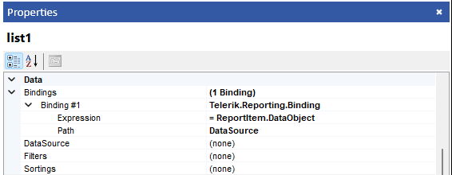

# Binding a Data Item to Data

You can work with a data item by binding it to a data source component such as an __ObjectDataSource__ or a __SqlDataSource__. The data source component connects to a data source such as a database or middle-tier object to retrieve the data. The data-bound item will then use this data. To perform the binding, you need to set the data item's __DataSource__ property to point to a data source component. When a data-bound item is bound to a data source component, little or no additional code is required for data operations, because the data-bound item can automatically take advantage of the data services provided by the data source component.

> For backwards compatibility reasons Telerik Reporting supports binding directly to __IEnumberable__ / __IListSource__ objects (incl. arrays, collections, __DataSet__, __DataTable__, __DataView__, and __DbDataAdapter__ ). Instead consider using the __ObjectDataSource__ that can handle these types of data sources.

## Binding to data at design-time

Data Source Components are used to connect to data at design-time. Having valid data source attached to a [Data Source Component]() at design-time allows you to take advantage of all design time features and work with the [Data Explorer](). For more information please see [Data Source Components]() and [DataSource Wizard](). After you create and configure a data source component via its wizard you can assign it to the data item's __DataSource__ property using the __Properties__ window in the report designer.

## Binding to data at run-time

To bind a data item to data at run-time, you need to access the __DataSource__ property of the data item and set its value programmatically. For more information on how to access data items please see [Access Report Items Programmatically]().

## Binding to data from the parent data item

Oftentimes the data needed for your Table, Chart, or another data item will already be present in the parent's data source e.g., the report's data source. In such cases, you can improve the report performance by reusing the data from the parent, instead of creating and configuring a new data source component to retrieve the data anew. You can reuse the data by adding a [Binding]() to the data item's __DataSource__ property, which sets the following expression:

`= ReportItem.DataObject`

The __DataObject__ property is an object instance representing the data that an item is bound to when processed. Depending on the [Data Scope]() in which the data item is present, __DataObject__ may return all of the parent's data or a selection of its data rows. For example, binding a Graph located inside a report group will result in the Graph retrieving data only for the current report group instance.

> To reach the data of an item that is higher in the hierarchy, you can use __Parent__ keyword: `= ReportItem.Parent.DataObject`. Parent keyword can be used as many times as neccessary in order to reach the required item.

For more information please see [How to use the ReportItem.DataObject property in expressions]().
