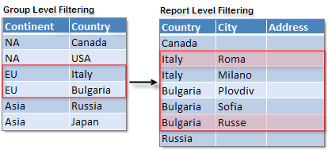

# Filtering Rules

Filters are used to limit the number of records in a report based on specified filter rules. If the conditions of the rules are met the record is included in the report. Multiple rules can be defined that make up a filter. Filters are defined using the [Edit Filter Dialog]().

## Creating Filter Rules

Each filter rule is made up of an `Expression`, `Operator` and `Value`.

* `Expression` can be a data field from the __Fields__ collection or defined using the [Edit Expression Dialog]().
* `Operator` can be simple comparison operators but can also include __Like__ and additional operators to include the top and bottom number of records and the top and bottom percentage of records. See the table of operators below.
* `Value` can be a literal value, "`<blank>`" or an expression defined in the [Edit Expression Dialog]().

|   |   |
| ------ | ------ |
 __Operator__ | __Description__ |
|`>`| __Expression__ is greater than __Value__ |
|`<`| __Expression__ is less than __Value__ |
|`>=`| __Expression__ is greater than or equal to __Value__ |
|`<=`| __Expression__ is less than or equal to __Value__ |
|`=`| __Expression__ is equal to __Value__ |
|`<>`| __Expression__ is not equal to __Value__ |
|`In`| __Expression__ is in __Value__. __Value__ should be a collection of objects. The condition is met when __Expression__ evaluates to an object which is present inside the collection of objects in __Value__. To enter a collection of objects in __Value__ use parentheses: ("Bikes", "Clothing", "Accessories")  Example: *Fields.ProductCategory In ("Bikes", "Clothing", "Accessories")* will allow all product records where the "ProductCategory" field is equal to "Bikes", "Clothing", or "Accessories".|
|`Like`| __Expression__ is like __Value__. Use the "%" wildcard to represent any number of other characters.  Example: *Fields.ProductName Like "%Bike%"* will allow all records where the "ProductName" field contains "Bike".|
|`Not Like`| __Expression__ is Not like __Value__. Use the "%" wildcard to represent any number of other characters.  Example: *Fields.ProductName NotLike "%Bike%"* will allow all records where the "ProductName" field -does not- contain "Bike".|
|`Top N`|Returns the top N ranked records, where N is an Integer.  At first the records are ordered by the __Expression__ in descending order and then the rank is assigned. If two or more records tie for a rank, each tied records receives the same rank and the filter may return more than the exact count specified in __Value__.  If __Expression__ is blank the filter returns the exact number of records specified by __Value__. For example "Top N 5" returns exactly five records.|
|`Bottom N`|Returns the bottom N ranked records, where N is an Integer.  At first the records are ordered by the __Expression__ in descending order and then the rank is assigned. If two or more records tie for a rank, each tied records receives the same rank and the filter may return more than the exact count specified in __Value__.  If __Expression__ is blank the filter returns the exact number of records specified by __Value. __ For example "Bottom N 5" returns exactly five records.|
|`Top %`|Returns the top N percentage of ranked records.  At first the records are ordered by the __Expression__ in descending order and then the rank is assigned. The N is calculated as a percentage of the maximum rank. If two or more records tie for a rank, each tied records receives the same rank and the filter may return more than the exact percent specified in __Value__.  If __Expression__ is blank the filter returns the percentage of total records specified in __Value.__ If the report has an initial 1000 records and the filter is "Top % 5", 50 records are returned.|
|`Bottom %`|Returns the bottom N percentage of ranked records.  At first the records are ordered by the __Expression__ in descending order and then the rank is assigned. The N is calculated as a percentage of the maximum rank. If two or more records tie for a rank, each tied records receives the same rank and the filter may return more than the exact percent specified in __Value__.  If __Expression__ is blank the filter returns the percentage of total records specified in __Value__. If the report has an initial 1000 records and the filter is "Bottom % 5", 50 records are returned|

## Filters used at the Group and Report Level

Filtering can be performed at the Group and Report level through the `Filters` property.

Group filters are intended to limit the number of group members and the filter Expression can contains Aggregate functions.

Report filters limit the report data and Aggregate functions are not allowed.

For example, consider the simplified data in the example diagram below. The data is first grouped by Country and filtered by Continent where Continent = 'EU'. This returns two records for Italy and Bulgaria. The data can be further constrained by adding a report filter "City LIKE R%" that returns only "Roma" and "Russe". If the filtering criteria is satisfied, then the group is included in the report. The data within the group is then further limited by the report filter.

