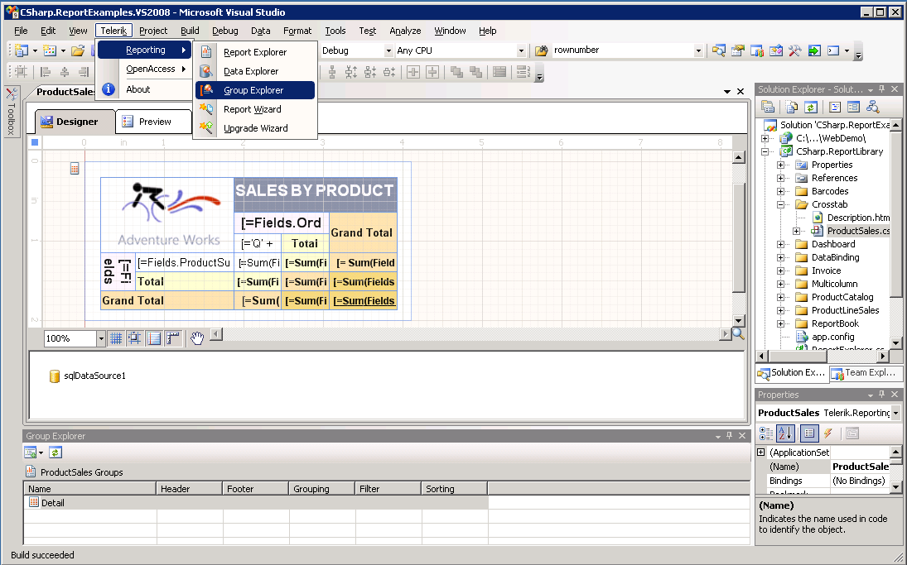
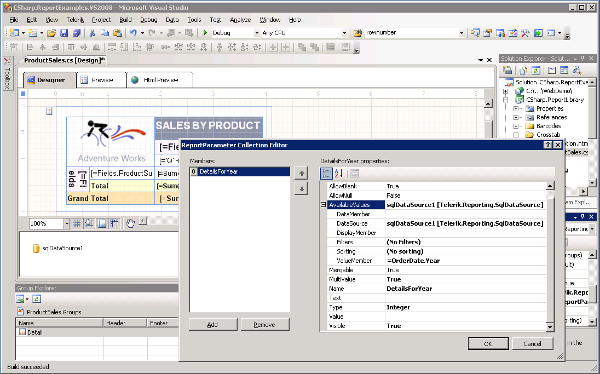
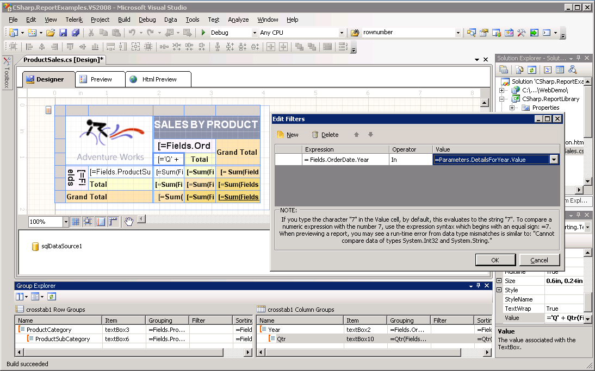
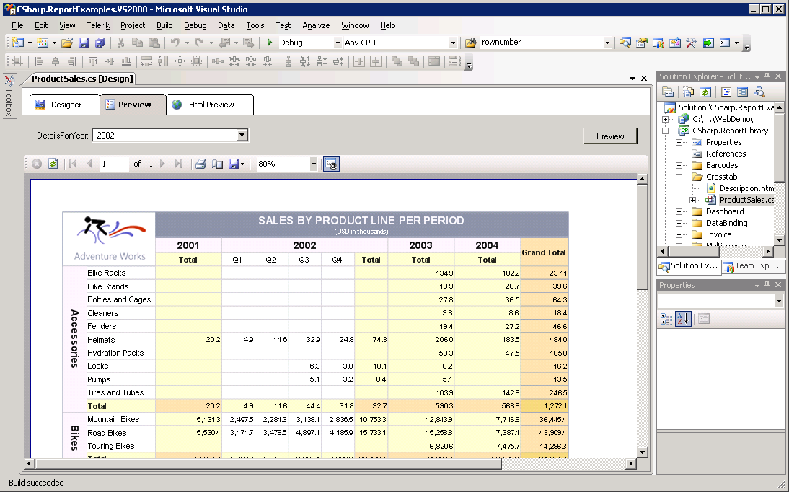

# Adding Filtering to Group

A filter defined on a report/table group limits the group members to certain values. These filters operate over the group members after the groups are calculated. Group filters are similar to the `HAVING` clause in a SQL statement.

We will use the filter to hide/show the dynamic groups members. Additionally we add the possibility for dynamic filtering by using report parameters. The example shown is based on the [ProductSales](https://demos.telerik.com/reporting/product-sales) demo report.

## Using dynamic filter to show/hide crosstab group members

1. Open the report in the designer and show the Group Explorer

	>caption Group Explorer

	

1. Define a new [Report Parameter]() _DetailsForYear_ as shown on the picture. Use the same DataSource as for the report. The parameter should be MultiValue.

	>caption Define Report Parameter

	

1. Select the Crosstab (or any cell in it) and invoke the [Edit Filters dialog]() for the _Qtr Column_ group. Enter the filter expression as shown on next picture

	>caption Set Filter

	

1. Preview the report. Now it is possible to select for which year to show Quarter columns and hide for the rest. 

	>caption Preview

	

## See Also

* [Filter Group members](#filter-group-members)
