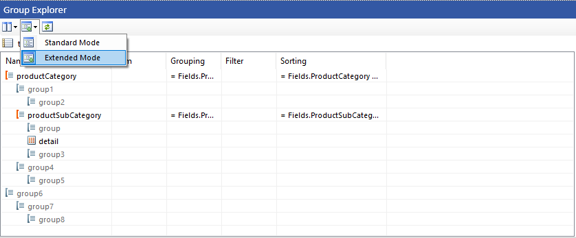

# Adding Groups to Tables

Table, Crosstab, and List items are template variations of the same Table data item and use row and column groups to organize data hierarchically. Unlike Report groups, table groups expand both horizontally (column groups) and vertically (row groups) to create flexible data layouts.

Use the [Group Explorer]() to add and manage groups in table items. You can create parent, child, adjacent, or details groups, and configure filtering, sorting, and aggregation settings for each group.

>tip The instructions in this article apply to all three template variations: Table, Crosstab, and List items.

## Add a Row/Column Group Using the Report Designer

### Add a Parent or Child Group

To add a parent or child row/column group:

1. Select the Table, Crosstab, or List item on the design surface.
1. In the [Group Explorer](), right-click an existing group.
1. Click **Add Group**, and then click **Parent Group** or **Child Group** depending on where you want to add the group. The **Table Group** dialog box opens.
1. In the **Group by** section, click the **New** button.
1. Enter an expression for the grouping criteria (for example, `= Fields.Category`).
1. (Optional) Select **Add Header** to add a group header row or column.
1. (Optional) Select **Repeat On Every Page** to repeat the header on each page.
1. (Optional) Select **Add Footer** to add a group footer row or column.
1. (Optional) Select **Repeat On Every Page** to repeat the footer on each page.
1. Click **OK**.

The group is added to the [Group Explorer]() hierarchy, and the corresponding rows or columns are added to the data item on the design surface.

>tip When using **Repeat On Every Page**, you can display different content for repeated instances of the header or footer. Use the [`ReportItem.IsRepeated`](#reportitem) property in expressions to conditionally modify the displayed content, for example, appending "(continued)" text. For more details, see [Display Continued Text for Repeated Table Group Headers]().

### Add an Adjacent Group

To add an adjacent row/column group:

1. Select the Table, Crosstab, or List item on the design surface.
1. In the [Group Explorer](), right-click an existing group.
1. Click **Add Group**, and then click **Adjacent Above** or **Adjacent Below** to specify where to add the group. The **Table Group** dialog box opens.
1. In the **Group by** section, click the **New** button.
1. Enter an expression for the grouping criteria (for example, `= Fields.Category`).
1. (Optional) Select **Add Header** to add a group header row or column.
1. (Optional) Select **Repeat On Every Page** to repeat the header on each page.
1. (Optional) Select **Add Footer** to add a group footer row or column.
1. (Optional) Select **Repeat On Every Page** to repeat the footer on each page.
1. Click **OK**.

The group is added to the [Group Explorer]() at the specified position, and the corresponding rows or columns are added to the data item on the design surface.

>tip When using **Repeat On Every Page**, you can display different content for repeated instances of the header or footer. Use the [`ReportItem.IsRepeated`](#reportitem) property in expressions to conditionally modify the displayed content, for example, appending "(continued)" text. For more details, see [Display Continued Text for Repeated Table Group Headers]().

>caution Repeatable headers and footers are not compatible with the `PageBreak` property. If any group in the table has a `PageBreak` value other than `None`, repeatable headers and footers will not be processed and rendered, even if `PrintOnEveryPage` is enabled.

## Add a Details Group Using the Report Designer

A details group displays individual data records without grouping. For row groups, this creates a row for each record; for column groups, this creates a column for each record.

To add a details group:

1. Select the Table, Crosstab, or List item on the design surface.
1. In the [Group Explorer](), right-click the innermost child group.
1. Click **Add Group**, and then click **Child Group**. The **Table Group** dialog box opens.
1. Select **Show detail data**.
1. Click **OK**.

The details group is added to the [Group Explorer]() and displays the details group icon. A new row (for row groups) or column (for column groups) is added to the table to display the detail data.

## Edit an Existing Group

To edit an existing group's properties, including grouping expressions, sorting, filtering, and other settings:

1. Select the Table, Crosstab, or List item on the design surface.
1. In the [Group Explorer](), right-click the group, and then click **Group Properties**.
1. Configure the group properties:

	+ **GroupKeepTogether**&mdash;Specify the keep together options to control whether group content stays together across page breaks.
	+ **PageBreak**&mdash;Specify where page breaks occur relative to the group.
	+ **PrintOnEveryPage**&mdash;Controls whether the corresponding header or footer row/column repeats on every page. This property is available only on static groups. See [Edit the Repeat On Every Page Behavior](#edit-the-repeat-on-every-page-behavior) for details.
	+ **Visible**&mdash;Control the visibility of the group.
	+ **Filters**&mdash;Click the ellipsis to configure filters. Click **New** to add a filter, then specify the **Expression**, **Operator**, and **Value**.
	+ **Groupings**&mdash;Click the ellipsis to add or modify grouping expressions. Click **New** to add additional expressions. All expressions are combined using a logical AND.
	+ **Sortings**&mdash;Click the ellipsis to configure sort order. Click **New** to add a sort expression, then choose **ASC** (ascending) or **DESC** (descending) from the **Direction** drop-down list.
	+ **BookmarkId**&mdash;Set a bookmark identifier for this group.
	+ **DocumentMapText**&mdash;Specify the text to display in the document map for this group.
	+ **TocText**&mdash;Specify the text to display in the table of contents for this group.
	+ **Name**&mdash;Enter the name of the group.

1. Click **OK**.

### Edit the Repeat On Every Page Behavior

When you enable **Repeat On Every Page** in the [Table Group Dialog](), the reporting engine creates a **static group** for the header or footer row/column and sets its `PrintOnEveryPage` property to `True`. Static groups have no grouping expressions&mdash;they represent fixed structural rows or columns such as group headers and footers.

To change the repeat behavior after group creation:

1. Select the Table, Crosstab, or List item on the design surface.
1. In the [Group Explorer](), switch to **Extended Mode**. Static groups are hidden in the default Standard Mode.

	

1. Locate the static group that represents the header or footer. Static groups appear with a distinct icon and gray text. The correct group to edit depends on its position in the hierarchy:

	+ **Header:** the leaf static groups appearing above the detail group. Reading the hierarchy top-to-bottom, headers for outer groups appear higher up, and headers for inner groups appear just above the detail group.
	+ **Footer:** the leaf static group positioned immediately **after** its parent dynamic group's children. Footers for inner groups appear just below the detail group, and footers for outer groups appear further down.
	+ A **leaf** static group is one with no child groups. In a nested hierarchy each dynamic group has its own pair of leaf static groups for its header and footer. `PrintOnEveryPage` is only respected on leaf static groups — setting it on a non-leaf static group has no effect.

1. Double-click the static group to open the **Group Properties** editor.
1. Set `PrintOnEveryPage` to `True` to repeat the header/footer on every page, or `False` to disable repeating.
1. Click **OK**.

>tip To control the content displayed in repeated headers or footers, use the [`ReportItem.IsRepeated`](#reportitem) property in expressions. For example, you can append "(continued)" text to repeated headers. See [Display Continued Text for Repeated Table Group Headers]().

## Delete a Group Using the Report Designer

To delete a group:

1. Select the Table, Crosstab, or List item on the design surface.
1. In the [Group Explorer](), right-click the group, and then click **Delete Group**.
1. In the **Delete Group** dialog box, select one of the following options:

	+ **Delete group and related rows and columns**&mdash;Choose this option to delete the group definition and all related rows and columns that display group data. For the details group, if the same row or column belongs to both detail and group data, only the detail data rows and columns are deleted.
	+ **Delete group only**&mdash;Choose this option to keep the structure of the data item and delete only the group definition.

1. Click **OK**.

## Add a Group Programmatically

{{source=CodeSnippets\CS\API\Telerik\Reporting\TableSnippets.cs region=AddNewGroupSnippet}}
{{source=CodeSnippets\VB\API\Telerik\Reporting\TableSnippets.vb region=AddNewGroupSnippet}}

## See Also

* [Table Group Dialog (Desktop Designers)]()
* [Table Group Dialog (Web Report Designer)]()
* [Display Continued Text for Repeated Table Group Headers]()
* [ColumnGroups](/api/Telerik.Reporting.Table#Telerik_Reporting_Table_ColumnGroups)
* [RowGroups](/api/Telerik.Reporting.Table#Telerik_Reporting_Table_RowGroups)
