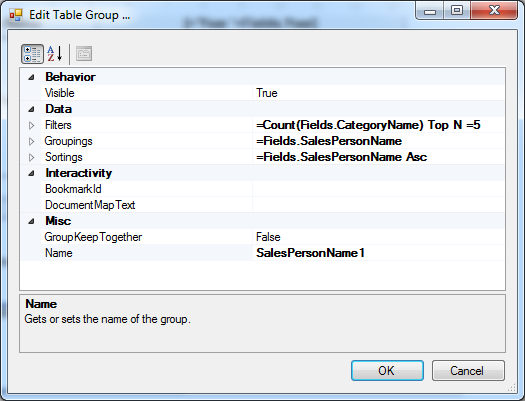
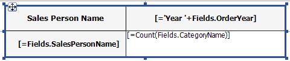
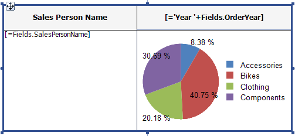
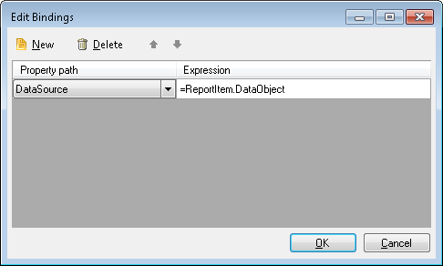

# Hosting a Graph Item in a Table

The Telerik Reporting data items are used to present data by two dimensions (the Table defines Row and Column groups, the Graph defines Category and Series groups). Often it is useful to create another dimension, which will result in an additional data "slice" and will give us the opportunity to display more measures.

This can be achieved with simply nesting data items. In this case the nested data item will get its data from the "master" data item, binding its data source to the master item's DataObject.

As a real life scenario, in the current example we will list the top 5 performing agents and the amount of their sales divided by product categories on a yearly basis, presented in a pie chart. We will use a [Crosstab item]() as a master data item and it will define the dimensions "Sales Person Name" and "Year". For a nested data item we will use a [Graph item]() which will add the dimension "Product Category".

We will use the __AdventureWorks__ sample database and the [Telerik Report Designer]().

## Steps for Nesting a Graph item in a Table item

1. Open the Telerik Report Designer and create a new report.
1. Cancel the Telerik Report Wizard, because it would not be needed for the current example.
1. Start the CrossTab Wizard and create a new SqlDataSource with the following select statement:

	````SQL
SELECT
		C.FirstName + ' ' + COALESCE (C.MiddleName, '') + ' ' + C.LastName AS SalesPersonName
		, YEAR(SOH.OrderDate) as OrderYear
		, PC.Name as CategoryName
		FROM
		Sales.SalesPerson AS SP
		INNER JOIN Sales.SalesOrderHeader AS SOH ON SOH.SalesPersonID = SP.SalesPersonID
		INNER JOIN Sales.SalesOrderDetail AS SOD ON SOD.SalesOrderID = SOH.SalesOrderID
		INNER JOIN Production.Product AS P ON P.ProductID = SOD.ProductID
		INNER JOIN Production.ProductSubcategory AS PSC ON PSC.ProductSubcategoryID = P.ProductSubcategoryID
		INNER JOIN Production.ProductCategory AS PC ON PC.ProductCategoryID = PSC.ProductCategoryID
		INNER JOIN HumanResources.Employee AS E ON E.EmployeeID = SP.SalesPersonID
		INNER JOIN Person.Contact AS C ON C.ContactID = E.ContactID
````


1. On the following page add the __SalesPersonName__ field to the __RowGroups__ box, __OrderYear__ to the __Column Groups__ box and the __CategoryName__ field to the __Detail Values__ box, where it will be automatically changed to __Count(CategoryName)__. After the wizard ends, you can make some design adjustments to the generated crosstab to make it look better.
1. Set the row group's __Filters__ to `"Count(Fields.CategoryName) Top N =5"`. Your group properties should now be set like this:

	

1. Set the crosstab headers to `"Person Name"` and `"Total Sales"` and the row group textbox expressions to `"Fields.SalesPersonName"` and `"Count(CategoryName)"`:

	

	If you preview the report now, you will see that the crosstab shows the top 5 sales agents along with their sales count by year.

	Now we have to set up the pie chart which will display their sales divided by product categories.

1. Select the cell that displays the count and choose the __Pie Chart__ item from the __Insert__ menu. The __Graph Wizard__ will appear. Since we will bind our graph to the current __ReportItem.DataObject__ , actually there is no need to connect it to a data source, but on the other hand, the design-time support might come in handy.
1. Select the data source and on the next page add the __CategoryName__ field to the __Series__ and __Values__ box, where it will be automatically changed to `Count(CategoryName)`. You can make some additional adjustments like removing the graph title, aligning the texts and resizing the crosstab's rows and columns. Finally your crosstab should look like the one below:

	

	If you preview the report, you will notice that the chart data stays the same on every row and column of the crosstab. That's why we connected it to the whole dataset. In order to connect it to the current row group data, defined by the expression `"Fields.SalesPersonName"`, we have to bind the graph data source to the current report item's data object.

1. Open the Graph's [Bindings]() editor and create a new binding for the DataSource property as shown below:

	

	Since we are explicitly binding the __DataSource__ property, we don't need to declare it in the Graph's properties, so you can set it to __No Data Source__. Please note that this will cancel the design-time support and the data will not be previewed in the graph designer.

	Your report is now ready. When you preview it, you will see that the pie chart is displayed on every cross-section of a sales person and an year, showing the percentage of the product categories sales.

## Live examples

The described report is similar to our [online demo Dashboard report](https://demos.telerik.com/reporting/dashboard).

You may also find it also as a `.TRDP`, `.CS` and `.VB` report definition in our examples that come with the installation of the product. By default, the TRDP report may be found in `C:\Program Files (x86)\Progress\Telerik Reporting {{site.suiteversion}}\Report Designer\Examples` and CS examples get deployed in the folder `C:\Program Files (x86)\Progress\Telerik Reporting {{site.suiteversion}}\Examples\CSharp\.NET Framework\ReportLibrary`.

The same approach is used in the `Product Sales` example report which is also shipped with the Telerik Reporting installation. This report displays the monthly sales trend using a line chart for the product subcategories and a column chart for the total fields. You can see the report in action if you have a valid connection to the __AdventureWorks__ sample database.

## See Also

* [Table/Crosstab/List]()
* [Graph Structure]()
* [How to use the ReportItem.DataObject in expressions]()
