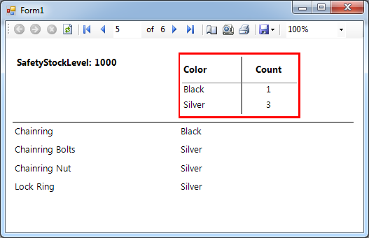
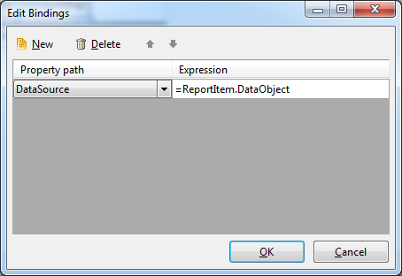

# How to use the ReportItem.DataObject property in expressions

This topic illustrates how to use the ReportItem.DataObject property in an expressions and master-detail scenarios.

DataObject is an object instance that represents the data that an item is bound to when processed. In the examples below we will illustrate how to use it in the most common scenarios.       

When used in the context of data item (table, subreport, grapth and etc.) expression ReportItem.DataObject references the parent's data item data.       

## Work with raw data type's methods and properties

The DataObject implements [IDataObject](/reporting/api/Telerik.Reporting.Processing.IDataObject) interface which defines the RawData property. This property is the actual data object that is being wrapped by the IDataObject and referring to DataObject, we actually refer to its RawData values. Thus to get the actual data object you can work with __ReportItem.DataObject.RawData__. The __RawData__  object exposes all properties and methods of the data object's type.         

For example:      
    
````c#
public class Phone
 {
     public string Number { get; set; }
     public string GetFormattedNumber()
     {
        return Number.Replace(' ','-');
     }
 }
````
````vb.net
Public Class Phone
    Public Property Number() As String
        Get
            Return _Number
        End Get
        Set
            _Number = Value
        End Set
    End Property
    Private _Number As String
    Public Function GetFormattedNumber() As String
        Return Number.Replace(" ", "-")
    End Function
End Class
````

If the data object above is bound to a [data item](), __=ReportItem.DataObject.RawData__ will return the exact data object of type __Phone__. This allows you to use the GetFormattedNumber method in an expression by calling __=ReportItem.DataObject.RawData.GetFormattedNumber()__, or use a property of the type e.g., __=ReportItem.DataObject.RawData.Number__.         

## Use parent data item data for child data item datasource parameter

In the context of data item ReportItem.DataObject references the parent's data item data. Thus the ReportItem.DataObject.MyField retrieves the MyField data from the parent data item datasource. This way you can make use of of the datasource relations capability. For example when SqlDataSourceReport is set to the report and SqlDataSourceTable is set to a table. You can bind the SqlDataSourceTable datasource parameter to a SqlDataSourceReport data field as shown in the following datasource parameter example:         

| Name | Type | Value |
| ------ | ------ | ------ |
|@MyParameter|string|= ReportItem.DataObject.MyField|

### Use DataObject in an expression and user-defined function

When complicated logic should be applied or.NET framework routines need to be utilized it is more appropriate to create a user defined function instead of an expression. In this case it is useful to pass the current data item to the user function which will do the processing logic instead of writing a complicated expression. In the following example we will show how to display properly the __AdditionalContactsInfo__ field, which is stored in XML format in the __AdventureWorks Person.Contact__ table.         

### Steps:

1. Create or open an existing report.

1. Add an SqlDataSource connected to __AdventureWorks__ sample database and set it as a report's datasource.

1. Put the following text in the SqlDataSource's SelectCommand value:
    
    ````sql
select Contact.*
from Person.Contact
where Contact.AdditionalContactInfo is not null
````

1. Place two textboxes on your report’s detail section.

1. Set the first textbox's expression to

  ````
=Fields.FirstName
````

1. Switch to code window and place the following code snippet:

{{source=CodeSnippets\CS\API\Telerik\Reporting\Expressions\ReportItemDataObjectSnippets.cs region=ReportItemDataObjectGetContactInfo}}
   ````C#
public static string GetContactInfo(object sender)
{
    var dataObject = (Telerik.Reporting.Processing.IDataObject)sender;
    var contactInfo = dataObject["AdditionalContactInfo"] as string;
    var xDoc = System.Xml.Linq.XDocument.Parse(contactInfo);
    var telephones = xDoc.Root
                     .Elements()
                     .Where(elem => elem.Name.LocalName == "telephoneNumber")
                     .Select(elem => elem.Value);
    return string.Format("{0}{1}'s telephones: {2}", dataObject["Title"], dataObject["LastName"], string.Join("; ", telephones));
}
````

{{source=CodeSnippets\VB\API\Telerik\Reporting\Expressions\ReportItemDataObjectSnippets.vb region=ReportItemDataObjectGetContactInfo}}
   ````VB
Public Shared Function GetContactInfo(sender As Object) As String
    Dim dataObject = DirectCast(sender, Telerik.Reporting.Processing.IDataObject)
    Dim contactInfo = TryCast(dataObject("AdditionalContactInfo"), String)
    Dim xDoc = System.Xml.Linq.XDocument.Parse(contactInfo)
    Dim telephones = xDoc.Root.Elements().Where(Function(elem) elem.Name.LocalName = "telephoneNumber").[Select](Function(elem) elem.Value)
    Return String.Format("{0}{1}'s telephones: {2}", dataObject("Title"), dataObject("LastName"), String.Join("; ", telephones))
End Function
````

   In this step we process the passed data argument as IDataObject, retrieving the fields by name.

1. Rebuild your project.

1. Set the second textbox's expression to the user defined function you created in __step 6__  and pass the __ReportItem.DataObject__ as its argument.
 The function name is __YourNamespace.GetContactInfo(data)__, so your expression should look like this:

  ````
= YourNamespace.GetContactInfo(ReportItem.DataObject)
````

1. Preview or run your report. The second textbox now should show the concatenated person names and telephone numbers.

### Use DataObject as a datasource for nested data items (Table, List, Crosstab, Graph)

This scenario takes place when the currently bound data object have to be used as a datasource for a nested report item - table, graph or a subreport - for example, when it is needed to process some grouped data and show summary in the group header. The following example uses the __AdventureWorks’ Product__ table, groups products by their __SafetyStockLevel__ field and shows summary info about the products color in a crosstab placed in the group header.         

The following screenshot shows the expected report output that should be created as a result of this example:  

  

### Steps:

1. Create or open an existing report.

1. Add an SqlDataSource as a report's DataSource and set its SelectCommand property to:
    
    ````sql
select top 100 Product.Name, Product.ProductNumber, Product.Color, Product.SafetyStockLevel
from Production.Product
where Product.Color is not null
order by Product.Name, Product.Color
````

1. Place two textboxes on your report's detail section and set their expressions to

  ````
= Fields.Name
````

   and

  ````
= Fields.Color
````

   respectively.             

1. Add a report group using either the report's context menu or the Group Explorer and set its grouping to

  ````
= Fields.SafetyStockLevel
````

1. Place a textbox on report's group header and set its expression to

  ````
= 'SafetyStockLevel: '+Fields.SafetyStockLevel
````

1. Add a crosstab to your report's group header and create a row or column group with the expression

  ````
= Fields.Color
````

    as a grouping expression. Set the detail textbox's expression to             

  ````
= Count(Fields.Color)
````

    Alternatively you may use the crosstab wizard choosing the SqlDataSource used for the whole report, so that you have design-time support (Data explorer, Expression Builder in the context of the crosstab).             

1. Add a[binding]()to the crosstab using __DataSource__ as a __PropertyPath__ and __=ReportItem.DataObject__  as an __Expression__, as shown in the following screenshot. This means that when the crosstab is processed its data source will be replaced with the result
 of the binding expression evaluation. This way it will be populated with the data of the current group insance.  

  

1. Preview or start your report. You should now see the products information listed in the details section for every group and a summary info about the products colors summarized in the group headers.

> This approach might also be used when you need to have page breaks in a __Table, Crosstab__ or __List__. Because having page breaks in these data items’ groups is not supported by design, you can create a report group, add and bind a data item in the report group header and set the report group footer section __PageBreak__ property as required.          

