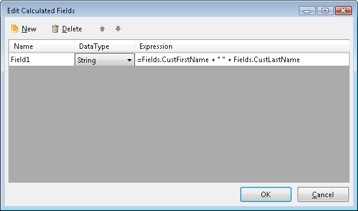

# Calculated Fields Overview

Calculated fields can be used to create new values that do not exist in the data source. For example, a calculated field can represent a new value, a constant, an expression value, user defined function or even a report parameter, or an existing field that is converted to a different datatype.

You specify a calculated field manually by creating an expression. To open the Edit Calculated Fields dialog:

* Right click on the target DataSource component and select the Properties option from the context menu.
* Click on the `CalculatedFields` property ellipsis.

	

The dialog accepts `Name` , `DataType` and `Expression`.

> Names must be unique in the datasource and the expression for a calculated field cannot contain aggregates.

Examples:

For example, you can combine text found in two fields. You can create a calculated field that combines the text found in the columns First Name and Last Name, as in the following example (see image above):

| Family Name | First Name | Full Name (Calculated Field) |
| ------ | ------ | ------ |
|Harrington|Mark|Mark Harrington|
|Pak|Jae|Jae Pak|
|Reinhart|Marie|Marie Reinhar|

You can combine the text in the first two columns by entering the following formula for the calculated column:

`=Fields.CustFirstName + " " + Fields.CustLastName`

You can also create `Calculated fields` that work with calendar dates. In the following example, the calculated field automatically fills in the date when a business process will be completed. The expression assumes that the process takes seven days to complete.

| Date Submitted | Work Complete (Calculated Field) |
| ------ | ------ |
|12/05|12/12|
|12/06|12/13|
|12/07|12/1|

The expression for this calculated field is: `=Fields.SubmittedDate.AddDays(CDbl(7))`
