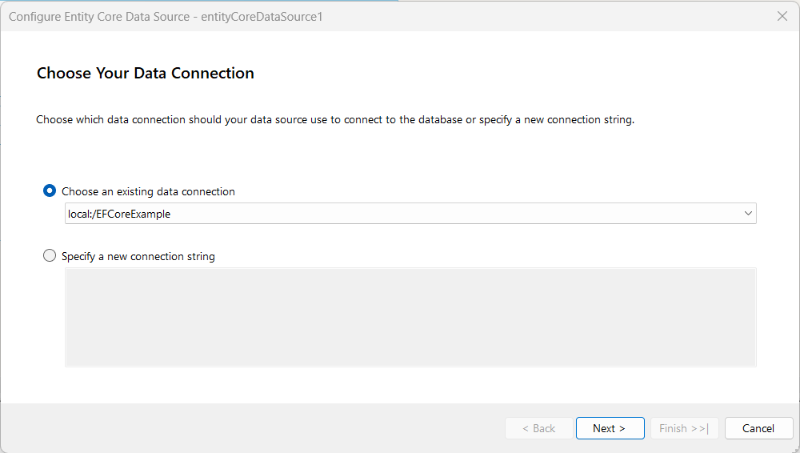
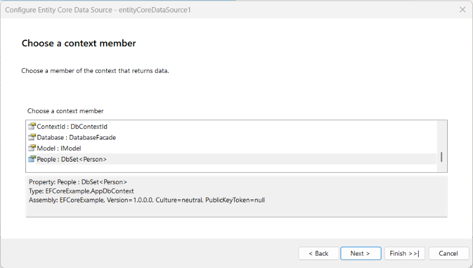

# Connecting to a DbContext with the EntityCoreDataSource Component

This article describes how to connect the `EntityCoreDataSource` component to an [Entity Framework Core](https://learn.microsoft.com/en-us/ef/core/) `DbContext` for both the **Code First** and **Database First** workflows. The examples use an `AdventureWorksDbContext` that exposes a `Products` `DbSet<T>` and a custom queryable projection.

## Configuring the Component in the Designer

Ensure your project fulfills the [DbContext Requirements](slug:entitycoredatasource-overview#dbcontext-requirements).

The simplest way to configure `EntityCoreDataSource` in either the [Standalone Report Designer (.NET)](slug:telerikreporting/designing-reports/report-designer-tools/desktop-designers/standalone-report-designer/overview) or the [Web Report Designer](slug:telerikreporting/designing-reports/report-designer-tools/web-report-designer/overview) is through the wizard. The wizard starts automatically when you create a new **Entity Framework Core Data Source** from the toolbox, and you can launch it again later from the **Configure** option of the data source context menu.

The wizard walks you through the following pages:

1. **Choose Your Data Connection** Select the connection string source for the report — a literal value, a named entry from the configuration file, or none if the `DbContext` resolves its own connection.

	

1. **Choose a DbContext** Select the `DbContext` type from the assemblies referenced by the report project.

	

1. **Choose a context member** Select the `DbSet<T>`, queryable property, or method that returns the data for the report.

	

1. **Configure Parameters** (_optional_) Map any method arguments to [report parameters](slug:telerikreporting/designing-reports/connecting-to-data/report-parameters/overview) or literal values.
1. **Configure Designer Parameters** (_optional_) Provide design-time values used to render the live preview.
1. **Preview data source results** Preview first 100 data rows based on the design-time parameter values.

After the wizard completes, the component appears in the [Data Explorer](slug:telerikreporting/designing-reports/report-designer-tools/desktop-designers/tools/data-explorer) with the schema of the selected entity, and the report data items can bind to its fields.

## Configuring the Component Programmatically

The `EntityCoreDataSource` class exposes three constructors:

```CSharp
public EntityCoreDataSource();
public EntityCoreDataSource(object context, string contextMember);
public EntityCoreDataSource(string connectionString, object context, string contextMember);
```

The simplest configuration uses the parameterless constructor and assigns at least the `Context` and `ContextMember` properties. Assign the `DbContext` type to `Context` and the name of the `DbSet<T>`, queryable property, or method to `ContextMember`:

```CSharp
var dataSource = new Telerik.Reporting.EntityCoreDataSource
{
    Context = typeof(AdventureWorksDbContext),
    ContextMember = "Products"
};
```

Use the three-argument constructor when you also need to set a connection string in one expression:

```CSharp
var dataSource = new Telerik.Reporting.EntityCoreDataSource(
    "Server=.;Database=AdventureWorks;Integrated Security=True;TrustServerCertificate=True",
    typeof(AdventureWorksDbContext),
    "Products");
```

## Binding to a DbContext Type Versus an Instance

The `Context` property is typed as `object` and accepts either a `Type` reference or a live `DbContext` instance:

- When you supply a **type**, the component instantiates the `DbContext`, holds it for the duration of report processing, and disposes it automatically. This is the recommended pattern because it preserves [lazy loading](slug:entitycoredatasource-context-lifecycle) for the duration of report processing.
- When you supply an **instance**, the application owns the lifetime of the context. The component does not call `Dispose` on the supplied instance.

```CSharp
var context = new AdventureWorksDbContext(connectionString);

var dataSource = new Telerik.Reporting.EntityCoreDataSource
{
    Context = context,
    ContextMember = "Products"
};

// You have to dispose the context explicitly when done with the report.
```

## Code First Versus Database First

Both workflows are supported because the component only requires a `DbContext` derivative; it makes no assumption about how the model was authored:

- **Code First.** The `DbContext` derives from `Microsoft.EntityFrameworkCore.DbContext` and configures the model in `OnModelCreating` or through data annotations. Provide a constructor that accepts a connection string so that the report designer can pass the design-time connection string at runtime.
- **Database First.** The `DbContext` is generated by `Scaffold-DbContext` against an existing database. The generated class typically already exposes a constructor that accepts `DbContextOptions<TContext>` and one that accepts a connection string.

## See Also

- [EntityCoreDataSource Component Overview](slug:entitycoredatasource-overview)
- [Configuring the Database Connectivity with the EntityCoreDataSource Component](slug:entitycoredatasource-configuring-database-connectivity)
- [Using Parameters with the EntityCoreDataSource Component](slug:entitycoredatasource-using-parameters)
- [Entity Framework Core Documentation](https://learn.microsoft.com/en-us/ef/core/)
