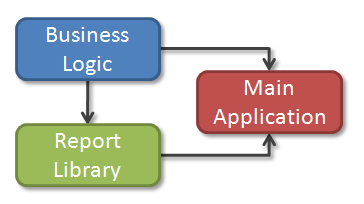

# Configuring the Database Connectivity with the EntityDataSource Component

This section discusses how to specify a database connection to the `EntityDataSource` component that can be used both at design-time and when running the report in production. The provided examples and code snippets assume an existing __Entity Data Model__ of the __Adventure Works__ sample database with the following structure:


Strictly speaking, it is not necessary to specify a database connection when working with the `EntityDataSource` component. Simply specifying an __ObjectContext/DbContext__ and a member is enough to connect to the __Entity Data Model__, because the __ObjectContext/DbContext__ is already configured to access the database. The following code snippet shows the minimum code necessary to setup the `EntityDataSource` component:

{{source=CodeSnippets\CS\API\Telerik\Reporting\EntityDataSourceSnippets.cs region=PropertyBindingSnippet}}
{{source=CodeSnippets\VB\API\Telerik\Reporting\EntityDataSourceSnippets.vb region=PropertyBindingSnippet}}

When running the report in production the above code should work just fine. However, this is not the case when generating a preview of the same report in the designer, for example. The problem is that the __ObjectContext/DbContext__ searches its connection string in the configuration file of the current executing application or web site. When it is your application that is currently running, all that is necessary is to make sure the connection string is present in the right configuration file. On the other side, when running the report in the designer, the current executing application is __Microsoft Visual Studio__, so the connection string is no longer available. To overcome this, you can specify your connection string to the `ConnectionString` property of the `EntityDataSource` component, as shown in the following example:

> When using __DbContext__ by default the context class generated (Database First or Model First) provides only a default (parameterless) constructor. However for design time purposes a constructor with connection string (string argument) is needed so that while processing the report the correct connection string can be passed. If Code First is used there is no need for a constructor with string parameter. That is because this approach uses connection strings without metadata (which is needed for the mapping). This means that the connection string of the context can be directly set to this connection string, without the need to be resolved first. Adding the needed constructor is as simple as it is adding the snippet below:

````C#
partial class AdventureWorksContext
{
	public AdventureWorksContext(string connectionString) : base(connectionString) {}
}
````
````VB
Partial Class AdventureWorksContext
	Public Sub New(connectionString As String)
		MyBase.New(connectionString)
	End Sub
End Class
````

{{source=CodeSnippets\CS\API\Telerik\Reporting\EntityDataSourceSnippets.cs region=ConnectionStringSnippet}}
{{source=CodeSnippets\VB\API\Telerik\Reporting\EntityDataSourceSnippets.vb region=ConnectionStringSnippet}}

The `ConnectionString` property can accept an inline connection string or the name of an existing connection string stored in the configuration file. When running the report `EntityDataSource` searches the configuration file for a connection string with the specified name. If such connection string exists `EntityDataSource` uses that connection string to connect to the database otherwise it is assumed that the value of the `ConnectionString` property represents an inline connection string.

> Specifying an inline connection string directly to the `ConnectionString` property of the `EntityDataSource` component is not recommended, because it might be difficult to maintain all your reports later, when that connection string changes. The recommended approach is to always specify the name of an existing connection string stored in the configuration file. When specifying a connection string form a configuration file it is important to understand which configuration file is used at design-time or when running the report in production. For example, let us consider the following simplified structure of a business application:
>
> 
>
>The above schema assumes that the different parts of the business application are represented as separate projects in the solution, each with its own configuration file. Initially, when you create the __Entity Data Model__ in the __Business Logic__ project, the connection string is stored automatically in the configuration file of that project. Later, when creating new reports in the __Report Library__ project, you need to add the connection string to the configuration file of that project, because this is where __Report Designer__ searches for existing connection strings. Finally, when deploying your application or web site in production, you need to add the connection string to the configuration file of your __Main Application__.
