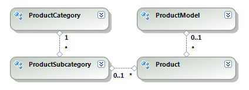
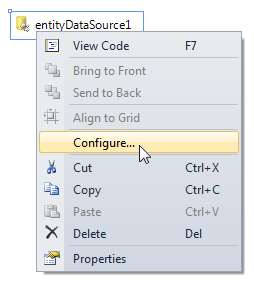

# Connecting to an Entity Data Model with the EntityDataSource Component

This section discusses how to connect the `EntityDataSource` component to an __Entity Data Model__ in the case of __Database First__ or __Model First__ or directly to the __DbContext__ inheritor in the case of __Code First__ approach. The provided examples and code snippets assume an existing __Entity Data Model__ of the __Adventure Works__ sample database with the following structure:

The simplest way to configure `EntityDataSource` in __Report Designer__ is to use the [EntityDataSource Wizard](). That wizard is started automatically when you create a new `EntityDataSource`, but you can invoke it manually at any time from the context menu associated with the data source by choosing `Configure`:

To configure the `EntityDataSource` component programmatically you need to specify at least an __ObjectContext/DbContext__ and a property or a method from that __ObjectContext/DbContext__ which is responsible for data retrieval. Assign the type of the __ObjectContext/DbContext__ to the `Context` property of `EntityDataSource` and the name of the desired member to the `ContextMember` property, as shown in the following example:

{{source=CodeSnippets\CS\API\Telerik\Reporting\EntityDataSourceSnippets.cs region=PropertyBindingSnippet}}
{{source=CodeSnippets\VB\API\Telerik\Reporting\EntityDataSourceSnippets.vb region=PropertyBindingSnippet}}

The above code snippet connects the `EntityDataSource` component to the `AdventureWorksEntities` context and retrieves the information for all products from the `Products` auto-generated property. Instead of specifying a type you can assign a live instance of the __ObjectContext/DbContext__. In this case however it is your responsibility to destroy that __ObjectContext/DbContext__ instance when done with the report:

{{source=CodeSnippets\CS\API\Telerik\Reporting\EntityDataSourceSnippets.cs region=InstanceBindingSnippet}}
{{source=CodeSnippets\VB\API\Telerik\Reporting\EntityDataSourceSnippets.vb region=InstanceBindingSnippet}}

Binding to a method is more flexible than binding to a property, because it is possible to execute some custom business logic when retrieving data for the report. If the specified method has arguments, the `EntityDataSource` component allows you to pass parameters to those arguments via the `Parameters` collection. For example, let us extend the `AdventureWorksEntities` context using a partial class that defines the following method:

{{source=CodeSnippets\CS\API\Telerik\Reporting\EntityDataSourceSnippets.cs region=SampleMethodSnippet}}
{{source=CodeSnippets\VB\API\Telerik\Reporting\EntityDataSourceSnippets.vb region=SampleMethodSnippet}}

You can bind the EntityDataSource component to that method with the following code snippet:

{{source=CodeSnippets\CS\API\Telerik\Reporting\EntityDataSourceSnippets.cs region=MethodBindingSnippet}}
{{source=CodeSnippets\VB\API\Telerik\Reporting\EntityDataSourceSnippets.vb region=MethodBindingSnippet}}

> The names and types of the parameters in the `Parameters` collection should match exactly the names and types of the method arguments. In case this requirement is not fulfilled the `EntityDataSource` component will not be able to resolve or call correctly the method and will raise an exception at runtime.
