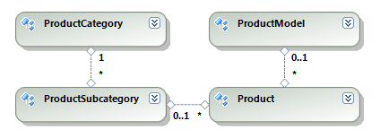

# Retrieving data from an Entity Data Model with the EntityDataSource component

This section discusses various techniques for retrieving data from an __Entity Data Model__ with the help of the __EntityDataSource__ component. The provided examples and code snippets assume an existing __Entity Data Model__ of the __Adventure Works__ sample database with the following structure:

  

The simplest approach to extract entities from an __Entity Data Model__ is to bind the __EntityDataSource__ component directly to an auto-generated property of the model, as shown in the sample code below:           

{{source=CodeSnippets\CS\API\Telerik\Reporting\EntityDataSourceSnippets.cs region=PropertyBindingSnippet}}
{{source=CodeSnippets\VB\API\Telerik\Reporting\EntityDataSourceSnippets.vb region=PropertyBindingSnippet}}

You can specify expressions to the data item to group, sort or filter the selected entities. The expressions are evaluated on the application level by the reporting engine after all entities are downloaded from the database. Sometimes it is preferable to offload certain tasks on the database level instead. To do this you need to define a custom method in the __ObjectContext/DbContext__ class that performs the required business logic. For example, the following method uses the __Where__ extension method to filter the __Product__ entities: 

{{source=CodeSnippets\CS\API\Telerik\Reporting\EntityDataSourceSnippets.cs region=SampleMethodSnippet}}
{{source=CodeSnippets\VB\API\Telerik\Reporting\EntityDataSourceSnippets.vb region=SampleMethodSnippet}}

Using a method instead of a property has the additional benefit that you can pass data source parameters to it, as illustrated in the following code snippet: 

{{source=CodeSnippets\CS\API\Telerik\Reporting\EntityDataSourceSnippets.cs region=MethodBindingSnippet}}
{{source=CodeSnippets\VB\API\Telerik\Reporting\EntityDataSourceSnippets.vb region=MethodBindingSnippet}}

Another common problem is related to the lazy loading feature of the  [ADO.NET Entity Framework](http://msdn.microsoft.com/en-us/library/aa697427%28VS.80%29.aspx). For example, let us            consider the following expression that obtains the category of a given product

````
=Fields.ProductSubcategory.ProductCategory.Name
````

The above expression relies upon the built-in lazy loading mechanism to obtain the __ProductSubcategory__ entity for the current __Product__ entity via the corresponding relation property, and then the __ProductCategory__ entity for the current __ProductSubcategory__ entity. While convenient, lazy loading requires additional round-trips to the database for the entities that are not present in memory. If this happens frequently it might significantly impact the performance of the report. To overcome this you can try performing eager loading of the entities instead. For example, the following statement uses the Include method to preload the __ProductSubcategory__ and the __ProductCategory__ entities while retrieving the __Product__ entities: 

    
````cs
this.Products.Include("ProductSubcategory").Include("ProductSubcategory.ProductCategory").ToList()
````
````vb
Me.Products.Include("ProductSubcategory").Include("ProductSubcategory.ProductCategory").ToList()
````

However in certain scenarios eager loading might be costly too. Given the previous example, we materialize all __ProductSubcategory__ and __ProductCategory__ entities only to show the category name of each product. This means a lot of unnecessary data is downloaded from database just to be discarded later. The most flexible and efficient method for retrieving data from the __Entity Data Model__ is to execute a custom query against the entities. The following sample method uses a __LINQ__ query to obtain only the necessary data for the report and then packs it into a collection of __POCOs:__ 

{{source=CodeSnippets\CS\API\Telerik\Reporting\EntityDataSourceSnippets.cs region=LinqQuerySnippet}}
{{source=CodeSnippets\VB\API\Telerik\Reporting\EntityDataSourceSnippets.vb region=LinqQuerySnippet}}

The sample code that binds the EntityDataSource component to that method is shown here:           

{{source=CodeSnippets\CS\API\Telerik\Reporting\EntityDataSourceSnippets.cs region=LinqBindingSnippet}}
{{source=CodeSnippets\VB\API\Telerik\Reporting\EntityDataSourceSnippets.vb region=LinqBindingSnippet}}

