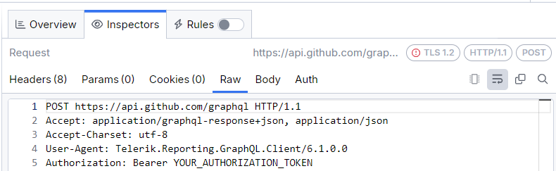

# Using Parameters with the GraphQLDataSource Component

The `GraphQLDataSource` component can request data in JSON format from a running GraphQL service. It requires the base URL of the service specified in the `Service URL` property, as well as a GraphQL query in the `Query` property. The GraphQLDataSource can take parameters. The supported data source parameter types are:

* [Inline Parameters](#inline-parameters)
* [Query Parameters](#query-parameters)
* [Header Parameters](#header-parameters)
* [Cookie Parameters](#cookie-parameters)

>caution Currently, Telerik Reporting supports variables only for the built-in pagination fields, for more information check the section [Cursor-Based Pagination Support](#cursor-based-pagination-support).
> For other dynamic values in your GraphQL query, use [inline parameters](#inline-parameters) instead. 

## Inline Parameters

The values of this parameter type replace the corresponding part of the `Service URL`, and can be included in the the GraphQL query of the request.

### Using Inline Parameters in Service Url

In the [GraphQLDataSource Wizard](), the Service URL can be provided as __constantUrl__, for example:

In the next step of the wizard, it is necessary to set the run-time and the design-time values for the parameter:

The entire Service URL can also be set to a GraphQLDataSource parameter, for example to `@serviceUrl`. This allows for larger flexibility in using different end-points of a GraphQL Service, or even different GraphQL Services for the same data item.

### Using Inline Parameters in the GraphQL Query

When you inject string values from inline parameters into a GraphQL query, the `GraphQLDataSource` does not include quotation marks around them. This allows you to use inline parameters to replace field names, type values, and so on. However, if you want to use these values as string literals, you need to add the quotation marks manually. For example, in the next set-up, `"@name"` is a string literal, `@status` is an enum value, and `@data` is a field name:

In this example, the inline parameters are configured as follows:

Finally, during design time, these inline parameters get resolved as follows in the end GraphQL query:

| **Parameter** | **Resolved to in the Query**              |
|---------------|-------------------------------------------|
| @data         | url                                       |
| @status       | CLOSED                                    |
| "@name"       | "reporting"                               |

## Query Parameters

The query type parameters are automatically concatenated to the Service URL. The final URL will be in the format `serviceUrl?queryParameterName1=value1&queryParameterName2=value2&...`. This is especially helpful if the GraphQL service supports REST-like behavior for handling query parameters alongside GraphQL queries. 

Below is an example of how query parameters can be configured in the GraphQLDataSource Wizard.

In this example, if the service URL for this GraphQLDataSource component was `http:\\localhost:50000\graphql`, the HTTP request during design time would be sent to `http:\\localhost:50000\graphql?userId=12345`.

## Header Parameters

Header parameters are sent as [HTTP headers](https://developer.mozilla.org/en-US/docs/Web/HTTP/Headers) within the request. The name of each header parameter corresponds to the name of the HTTP header, while the value of the parameter corresponds to the value of the HTTP header. A common use case for this type of parameter is attaching HTTP headers, such as [Authorization](https://developer.mozilla.org/en-US/docs/Web/HTTP/Headers/Authorization) required by the GraphQL service to allow access to protected resources. For example, a setup in the GraphQLDataSource Wizard could look as follows:

This results in an HTTP request that includes the `Authorization` header with the value `Bearer YOUR_AUTHORIZATION_TOKEN` during design time, as you can see in [Fiddler Everywhere](https://www.telerik.com/fiddler/fiddler-everywhere):

## Cookie Parameters

Cookie parameters are included in the [Cookie header](https://developer.mozilla.org/en-US/docs/Web/HTTP/Headers/Cookie) of the HTTP request. They're especially helpful if the GraphQL service requires certain cookies for session management, or to maintain state between requests. For example, if you have a parameter setup in the GraphQLDataSource Wizard, such as:

 

During design time, the HTTP request sent to the GraphQL service will include the cookie, as indicated in the [Fiddler Everywhere](https://www.telerik.com/fiddler/fiddler-everywhere) snapshot:

## Cursor-Based Pagination Support

The GraphQLDataSource component includes automatic support for cursor-based pagination in GraphQL queries. Instead of retrieving all items in one massive request, it allows you to fetch data in manageable chunks, using a *cursor*. This approach can prevent performance issues as large one-off requests can cause slowdowns of timeouts. When your GraphQL query references an `after` argument (or similar pagination fields), Telerik Reporting detects that the query is using cursor-based pagination and automatically:

1. Extracts the `endCursor` value from the `pageInfo` object returned in the GraphQL response.
1. Injects that value into the next request’s `variables` object.
1. Continues paginating as long as `hasNextPage` is `true`.

Below is an example of a query that uses cursor-based pagination.

In this case, the GraphQLDataSource component automatically sends consecutive requests to retrieve data in batches. It continues making requests as long as there are more items to fetch, determined by the `pageInfo.hasNextPage` field in each response. After it retrieves all available data, the component seamlessly merges the results into a single, unified response.

>tip The variable name does not matter—Telerik Reporting identifies the pagination pattern by analyzing the query argument `(after: $someVariable)` and the response fields (`pageInfo.endCursor`, `pageInfo.hasNextPage`).

## See Also

* [GraphQLDataSource Wizard]()
* [Using JSONPath to Filter JSON data]()
* [Using Parameters with GraphQLDataSource]()
