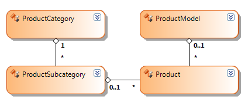

# Configuring the Database Connectivity with the OpenAccessDataSource Component

This section discusses how to specify a database connection to the __OpenAccessDataSource__ component that can be used both at design-time and when running the report in production. The provided examples and code snippets assume an existing __Telerik Data Access Model__ of the __Adventure Works__ sample database with the following structure:

Strictly speaking, it is not necessary to specify a database connection when working with the `OpenAccessDataSource` component. Simply specifying an `OpenAccessContext` and a member is enough to connect to the __Telerik Data Access Model__, because the `OpenAccessContext` is already configured to access the database. The following code snippet shows the minimum code necessary to setup the `OpenAccessDataSource` component:

{{source=CodeSnippets\CS\API\Telerik\Reporting\OpenAccessDataSourceSnippets.cs region=PropertyBindingSnippet}}
{{source=CodeSnippets\VB\API\Telerik\Reporting\OpenAccessDataSourceSnippets.vb region=PropertyBindingSnippet}}

When running the report in production the above code should work just fine. However, this is not the case when generating a preview of the same report in the designer, for example. The problem is that the `OpenAccessContext` searches its connection string in the configuration file of the current executing application or web site. When it is your application that is currently running, all that is necessary is to make sure the connection string is present in the right configuration file. On the other side, when running the report in the designer, the current executing application is __Microsoft Visual Studio__, so the connection string is no longer available. To overcome this, you can specify your connection string to the `OpenAccessDataSource` component. Assign the connection string to the `ConnectionString` property and the __ADO.NET__ provider to the `ProviderName` property, as shown in the following code snippet:

{{source=CodeSnippets\CS\API\Telerik\Reporting\OpenAccessDataSourceSnippets.cs region=ConnectionStringSnippet}}
{{source=CodeSnippets\VB\API\Telerik\Reporting\OpenAccessDataSourceSnippets.vb region=ConnectionStringSnippet}}

Instead of specifying an inline connection string you can assign the name of an existing connection string stored in the configuration file to the `ConnectionString` property. In that case specifying an __ADO.NET__ provider to the `ProviderName` property is no longer required, because that information is already present in the configuration. The following sample code demonstrates how to specify a named connection string from a configuration file: 

{{source=CodeSnippets\CS\API\Telerik\Reporting\OpenAccessDataSourceSnippets.cs region=ConnectionNameSnippet}}
{{source=CodeSnippets\VB\API\Telerik\Reporting\OpenAccessDataSourceSnippets.vb region=ConnectionNameSnippet}}

> Specifying an inline connection string directly to the `ConnectionString` property of the `OpenAccessDataSource` component is not recommended, because it might be difficult to maintain all your reports later, when that connection string changes. The recommended approach is to always specify the name of an existing connection string stored in the configuration file. When specifying a connection string form a configuration file it is important to understand which configuration file is used at design-time or when running the report in production. For example, let us consider the following simplified structure of a business application: 
>
> 
>
> The above schema assumes that the different parts of the business application are represented as separate projects in the solution, each with its own configuration file. Initially, when you create the __Telerik Data Access Model__ in the __Business Logic__ project, the connection string is stored automatically in the configuration file of that project. Later, when creating new reports in the __Report Library__ project, you need to add the connection string to the configuration file of that project, because this is where __Report Designer__ searches for existing connection strings. Finally, when deploying your application or web site in production, you need to add the connection string to the configuration file of your __Main Application__.
