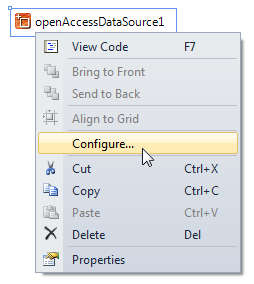

# Connecting to a Telerik Data Access Model with the OpenAccessDataSource Component

This section discusses how to connect the `OpenAccessDataSource` component to a __Telerik Data Access Model__. The provided examples and code snippets assume an existing __Telerik Data Access Model__ of the __Adventure Works__ sample database with the following structure:

The simplest way to configure `OpenAccessDataSource` in __Report Designer__ is to use the [OpenAccessDataSource Wizard](). That wizard is started automatically when you create a new `OpenAccessDataSource`, but you can invoke it manually at any time from the context menu associated with the data source by choosing `"Configure"`:

To configure the `OpenAccessDataSource` component programmatically you need to specify at least an `ObjectContext` and a property or a method from that `ObjectContext` which is responsible for data retrieval. Assign the type of the `OpenAccessContext` to the `ObjectContext` property of `OpenAccessDataSource` and the name of the desired member to the `ObjectContextMember` property, as shown in the following example:

{{source=CodeSnippets\CS\API\Telerik\Reporting\OpenAccessDataSourceSnippets.cs region=PropertyBindingSnippet}}
{{source=CodeSnippets\VB\API\Telerik\Reporting\OpenAccessDataSourceSnippets.vb region=PropertyBindingSnippet}}

The above code snippet connects the `OpenAccessDataSource` component to the `AdventureWorksEntities` context and retrieves the information for all products from the `Products` auto-generated property. Instead of specifying a type you can assign a live instance of the `OpenAccessContext`. In this case however it is your responsibility to destroy that `OpenAccessContext` instance when done with the report:

{{source=CodeSnippets\CS\API\Telerik\Reporting\OpenAccessDataSourceSnippets.cs region=InstanceBindingSnippet}}
{{source=CodeSnippets\VB\API\Telerik\Reporting\OpenAccessDataSourceSnippets.vb region=InstanceBindingSnippet}}

Binding to a method is more flexible than binding to a property, because it is possible to execute some custom business logic when retrieving data for the report. If the specified method has arguments, the `OpenAccessDataSource` component allows you to pass parameters to those arguments via the `Parameters` collection. For example, let us extend the `AdventureWorksEntities` context using a partial class that defines the following method:

{{source=CodeSnippets\CS\API\Telerik\Reporting\OpenAccessDataSourceSnippets.cs region=SampleMethodSnippet}}
{{source=CodeSnippets\VB\API\Telerik\Reporting\OpenAccessDataSourceSnippets.vb region=SampleMethodSnippet}}

You can bind the `OpenAccessDataSource` component to that method with the following code snippet:

{{source=CodeSnippets\CS\API\Telerik\Reporting\OpenAccessDataSourceSnippets.cs region=MethodBindingSnippet}}
{{source=CodeSnippets\VB\API\Telerik\Reporting\OpenAccessDataSourceSnippets.vb region=MethodBindingSnippet}}

> The names and types of the parameters in the `Parameters` collection should match exactly the names and types of the method arguments. In case this requirement is not fulfilled the `OpenAccessDataSource` component will not be able to resolve or call correctly the method and will raise an exception at runtime.
