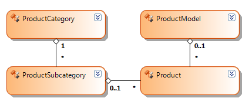

# Retrieving Data from a Telerik Data Access Model with the OpenAccessDataSource Component

This section discusses various techniques for retrieving data from a __Telerik Data Access Model__ with the help of the `OpenAccessDataSource` component. The provided examples and code snippets assume an existing __Telerik Data Access Model__ of the __Adventure Works__ sample database with the following structure:

The simplest approach to extract entities from a __Telerik Data Access Model__ is to bind the `OpenAccessDataSource` component directly to an auto-generated property of the model, as shown in the sample code below:

{{source=CodeSnippets\CS\API\Telerik\Reporting\OpenAccessDataSourceSnippets.cs region=PropertyBindingSnippet}}
{{source=CodeSnippets\VB\API\Telerik\Reporting\OpenAccessDataSourceSnippets.vb region=PropertyBindingSnippet}}

You can specify expressions to the data item to group, sort or filter the selected entities. The expressions are evaluated on the application level by the reporting engine after all entities are downloaded from the database. Sometimes it is preferable to offload certain tasks on the database level instead. To do this you need to define a custom method in the `OpenAccessContext` class that performs the required business logic. For example, the following method uses the `Where` extension method to filter the `Product` entities:

{{source=CodeSnippets\CS\API\Telerik\Reporting\OpenAccessDataSourceSnippets.cs region=SampleMethodSnippet}}
{{source=CodeSnippets\VB\API\Telerik\Reporting\OpenAccessDataSourceSnippets.vb region=SampleMethodSnippet}}

Using a method instead of a property has the additional benefit that you can pass data source parameters to it, as illustrated in the following code snippet:

{{source=CodeSnippets\CS\API\Telerik\Reporting\OpenAccessDataSourceSnippets.cs region=MethodBindingSnippet}}
{{source=CodeSnippets\VB\API\Telerik\Reporting\OpenAccessDataSourceSnippets.vb region=MethodBindingSnippet}}

Another common problem is related to the lazy loading feature of __Telerik Data Access__. For example, let us consider the following expression that obtains the category of a given product

`=Fields.ProductSubcategory.ProductCategory.Name`

The above expression relies upon the built-in lazy loading mechanism to obtain the `ProductSubcategory` entity for the current `Product` entity via the corresponding relation property, and then the `ProductCategory` entity for the current `ProductSubcategory` entity. While convenient, lazy loading requires additional round-trips to the database for the entities that are not present in memory. If this happens frequently it might significantly impact the performance of the report. To overcome this you need to query all entities needed for the report at once. This way lazy loading is avoided completely and all data is retrieved in a single round-trip from the database. The most flexible and efficient method for retrieving data from the __Telerik Data Access Model__ is to execute a custom query against the entities. The following sample method uses a __LINQ__ query to obtain only the necessary data for the report and then packs it into a collection of __POCOs__:

{{source=CodeSnippets\CS\API\Telerik\Reporting\OpenAccessDataSourceSnippets.cs region=LinqQuerySnippet}}
{{source=CodeSnippets\VB\API\Telerik\Reporting\OpenAccessDataSourceSnippets.vb region=LinqQuerySnippet}}

The sample code that binds the OpenAccessDataSource component to that method is shown here:

{{source=CodeSnippets\CS\API\Telerik\Reporting\OpenAccessDataSourceSnippets.cs region=LinqBindingSnippet}}
{{source=CodeSnippets\VB\API\Telerik\Reporting\OpenAccessDataSourceSnippets.vb region=LinqBindingSnippet}}

