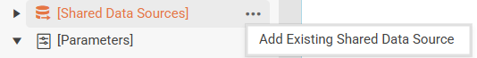
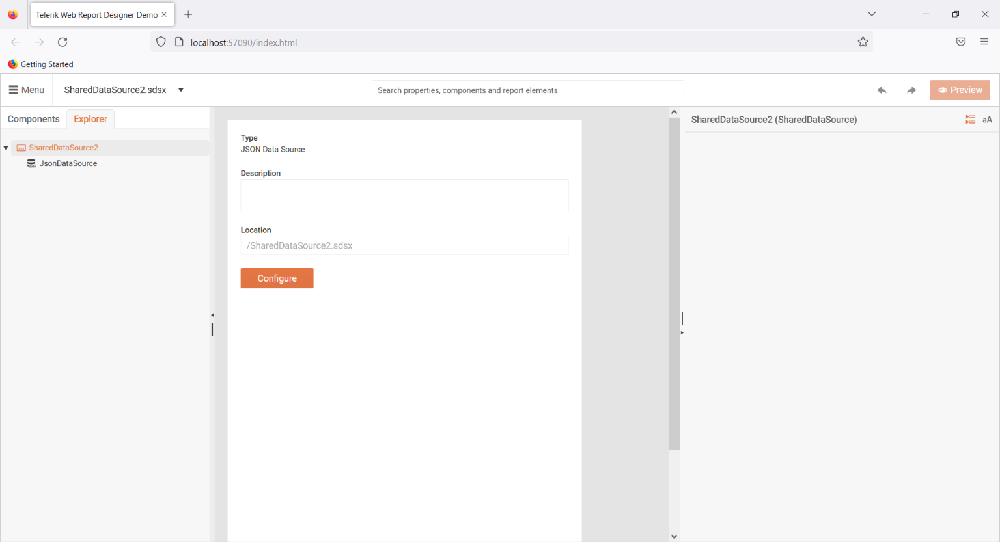
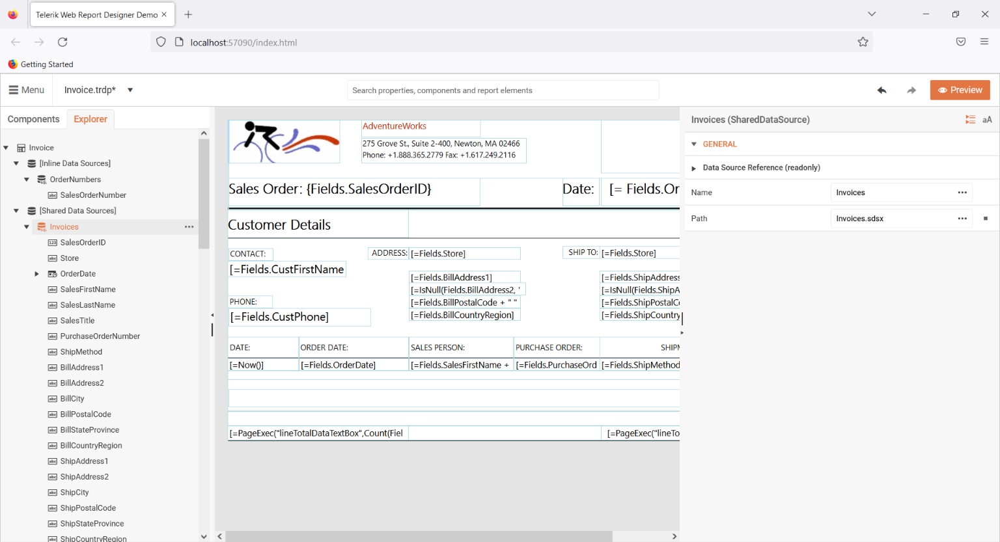

# SharedDataSource Component

> The SharedDataSource component as of __R1 2023__ is fully supported in the [Web Report Designer](). The [Standalone Report Designer]() can open reports with `SharedDataSource` components, but cannot edited them.

The [SharedDataSource](/api/Telerik.Reporting.SharedDataSource) component enables report designers to easily create and reuse a data source component across multiple reports.

Additionally, end users of the [Web Report Designer]() will be able to easily design their own reports with predefined `SharedDataSource` components.

All `SharedDataSource` componenents are accessible, by default, to all end-users via the [`Asset Manager`](#assets-manager).

The `SharedDataSource` component currently supports the following [data source components]():

* [SqlDataSource]()
* [WebServiceDataSource]()
* [ObjectDataSource]()
* [JsonDataSource]()
* [CsvDataSource]()

To add an existing shared data source to your report, follow these steps:

1. Open the __Explorer__ tab in the __Web Report Designer__.
1. Locate the __[Shared Data Sources]__ item in the tree, then hover on it.
1. Click the __...__ icon right next to the item.
1. Select __Add Existing Shared Data Source__.
1. Choose the desired shared data source, then click __Save__.

>tip Existing data source components can be configured into `SharedDataSource` components via the __Explorer__ tab in the __Web Report Designer__. Left-clicking the data source component will open the _context menu_ from which the option __Save As Shared Data Source__ can be chosen.

## Configuring the Component

__Configuration inside the SDSX file:__

Inside the `.sdsx` file, the _internal_ data source component can be edited and/or the `Description` of the `SharedDataSource` component can be written:

__Configuration inside the Report Definition:__

| Setting | Description |
| ------ | ------ |
|Name|Represents the text that will be displayed next to the component's icon.|
|Path|Represent the relative(to the report definition) path to the `.sdsx` file. [`Expressions`]() are supported.|

## Resolving SDSX XML

By default, the `.sdsx` files are resolved with path relative to the report definition in which they are utilized. However, Telerik Reporting does not impose any restrictions on how or where these files will be stored.

The `.sdsx` can be stored in any kind of storage, the only requirement is that if the local file system is not used, a custom `SharedDataSourceResolver` should be implemented via the `<sharedDataSourceResolver>` configuration option - [processing Element]()
