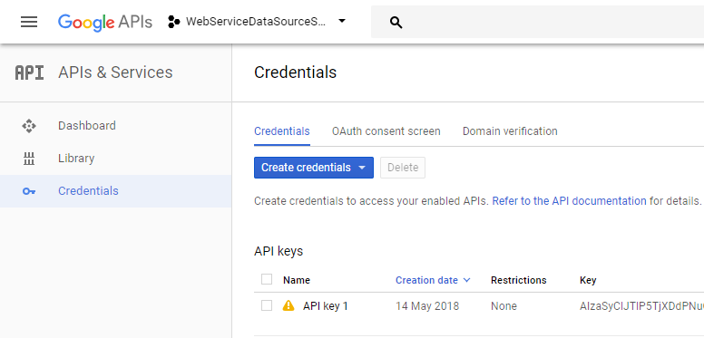
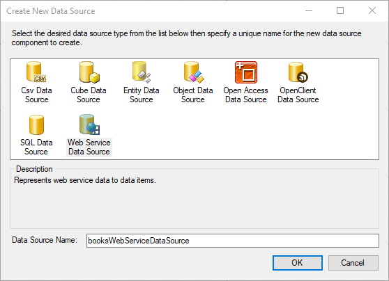
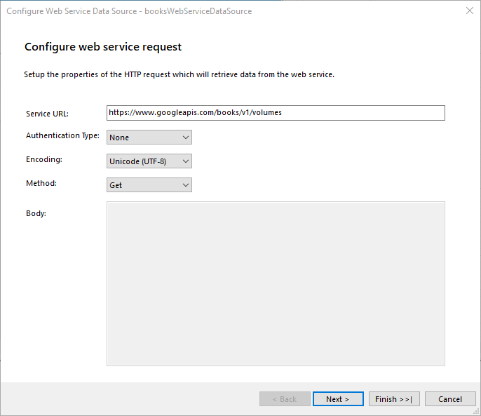
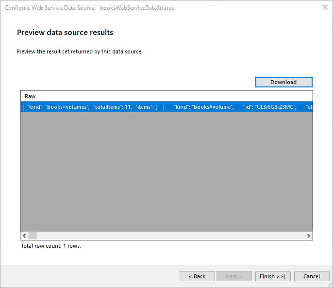
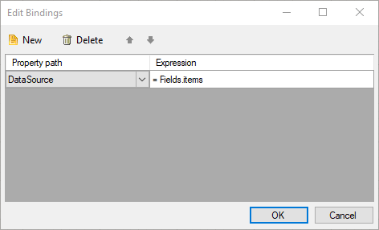
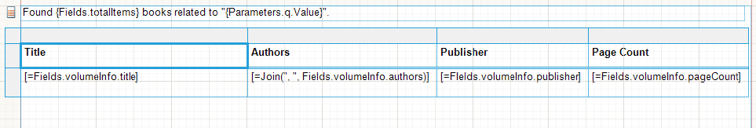
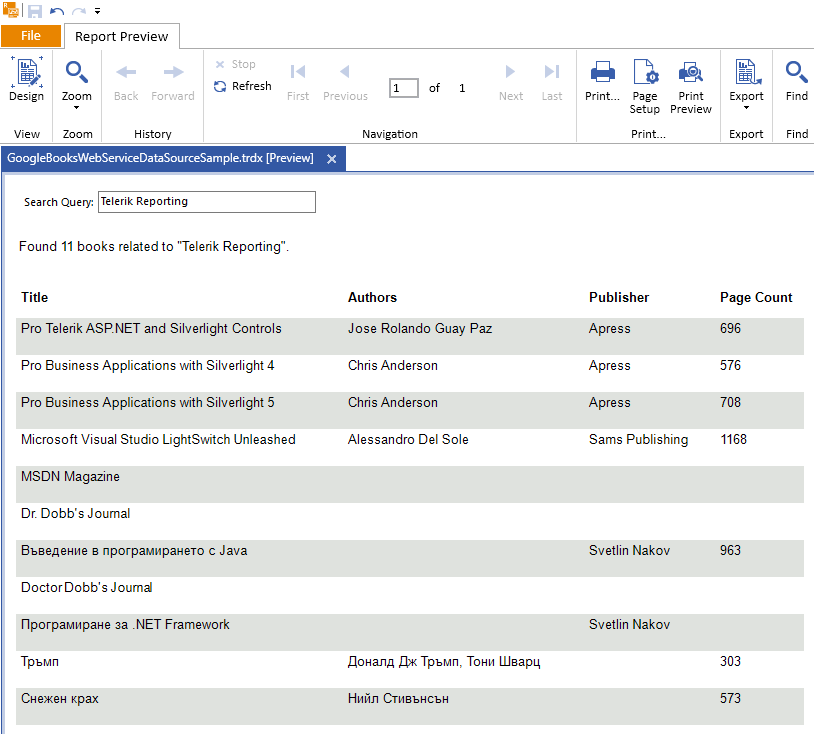

# How to Connect to Google Books APIs

In this article we are going to review the process of creating a report which retrieves data from the [Google Books APIs](https://developers.google.com/books/) using the WebServiceDataSource component.       

## Create a report and retrieve data from the Google Books APIs.

1. To connect to Google Books APIs first we need to get access to the API. There are multiple ways to achieve this described in [Using the API](https://developers.google.com/books/docs/v1/using). For this how-to we are going to acquire and use an API key according to the Google Books APIs documentation.               

  

1. After the API key is acquired we need to enable the Google Books API inside the Library menu or follow the direct link: [Google Books API](https://console.developers.google.com/apis/library/books.googleapis.com). 

1. Create a new report using the report designer of your choice. We are going to use the Standalone Report Designer for this article.

1. Select the report's DataSource property and click the "Add New Data Source..." link. Choose the WebServiceDataSource component.               

  

1. Setup the web service HTTP request properties. For this how-to we would like to retrieve books data from the APIs according to the search terms we input as parameters in the report. We are going to use the [GET https://www.googleapis.com/books/v1/volumes?q={search terms}](https://developers.google.com/books/docs/v1/reference/volumes/list) endpoint. We enter the exact service URL in the wizard page and select the appropriate HTTP request method. Since we will be using an API key, no authentication type is required at this point. 

  

1. Configure the HTTP request parameters. We need to send the API key with the query parameters, so we add a __key__ parameter with type __Query__ and enter its __Value__ which we got in step 1. The __Design-Time Value__ in this case will be the same key. It is used to retrieve the data schema and for the live preview of some data items during design-time. In addition, we are going to add a __q__ and a __maxResults__ query parameter according to the API reference which will be used to send the search terms and max number of results to the API. These API parameters will be connected to corresponding report parameters which we can control at run-time. To do that select __```<New Report Parameter>```__ in the drop-down for the __Value__ of the query parameter and follow the wizard to configure it. 

  

1. Preview data source results. Click the __Download__ button to retrieve the data according to the current settings and design-time parameters. The preview shows raw JSON data returned from the service. When the service returns a JSON array, the preview displays multiple rows of raw data. The Google Books API returns a single JSON object containing *items*, *kind*, and *totalItems*  properties. What we are interested in is the *items*  property which contains an array of the returned books filtered by our search terms. 

  

1. The datasource of the report is now set and we can display the total count of books in the query result by dragging the *totalItems* data field from the Data Explorer to the Detail section on the report design surface. To create a more sophisticated message we can use the following embedded expression: 

  ````
  Found {Fields.totalItems} books related to "{Parameters.q.Value}".
  ````  

1. Since the data for the actual books is inside the *items*  data field we need to use a nested data item to display the inner book objects. Insert a new Table item into the Detail section of the report. Instead of creating a new data source for this table, we will reuse the already retrieved data from the report's data source. We can do this by adding a new Binding to the Table item: 

  

1. Now that the binding for the data source is set we can start writing expressions in the Table cells to display the books data. Note that for the book authors we are using a Join() built-in function. The *authors*  value is an array of strings and we would like to show all of the contained strings concatenated by a comma. 

    >When using Bindings for the DataSource the data schema will not be available at design-time. It is required to write the data fields in expressions manually according to the used web service API.               
 

  

1. Preview the report to see the results.  

  

