# Using Parameters with the WebServiceDataSource component

The __WebServiceDataSource__  component can request data in JSON format from a running web service.         It requires the base URL of the servcie specified in the __Service URL__  property.         The WebServiceDataSource can take parameters. The supported data source parameter types are:       

* __Inline Parameters__ The values of this parameter type replace the corresponding part of the *Service URL* ,             and can be included in the body of a POST request.           

   + *Using Inline Parameters in Service Url* In the [WebServiceDataSource Wizard](), the Service URL can be provided as                 __constantUrl__ , for example:                 

  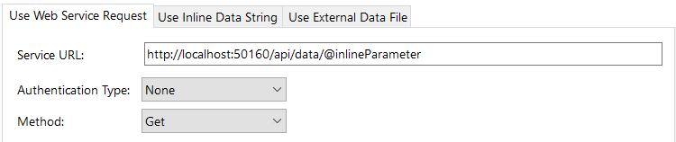In the next step of the Wizard it is necessary to set the run-time and the design-time values for the parameter:                 

  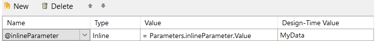The final request made by the WebServiceDataSource component to the web service with the design-time                 parameter value as captured by                  [Fiddler](https://www.telerik.com/download/fiddler)                  will look like:                 

  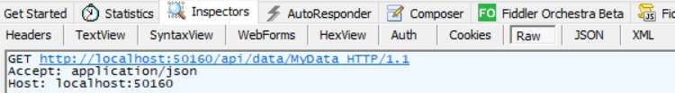The entire Service URL can also be set to a WebServiceDataSource parameter, for example to                 __@serviceUrl__ . This allows for larger flexibility in using different end-points of a Web Service,                 or even different Web Services for the same data item.               

   + *Using Inline Parameters in the Body of the POST request* The single-value parameter should be surrounded by quotation marks. The multi-value parameter is provided as it is.                 For example, in the next set-up, *@name*  is a single-value parameter and                 *@surname*  is a multi-value parameter:                 

  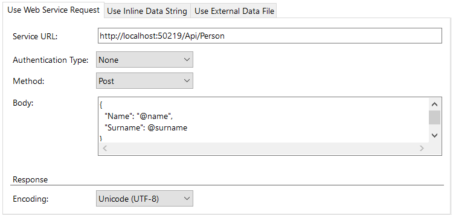It is necessary to provide an additional Header "Content-Type" with value "application/json". Generally, the Header                 Names are case-insensitive. The 'Content-Type' header that is needed for the POST requests is case-sensitive.               The multi-value parameter run-time and design-time values should be surrounded in square brackets to indicate                 an array:                 

  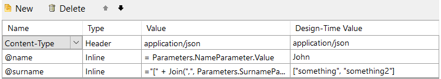The final request performed by the WebServiceDataSource component with the design-time values as seen in Fiddler:                 

  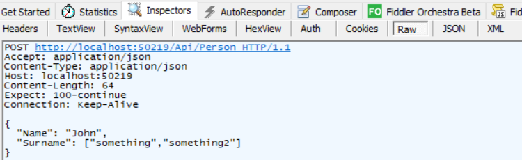

* __Query Parameters__ The query type parameters will be automatically concatenated to the Service URL. The final URL will be in the format           __serviceUrl__ For example, in a Web Api project to call the Action *GetWithQueryParameters(int id, string category)*              the default service URL will be *http://localhost:50160/api/data/GetWithQueryParameters* .             The images display how to set the query parameters in the Web Service Data Source Wizard of the Report Designer:             

  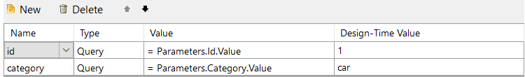and how will the generated final URL for the design-time parameter values look in Fiddler:             

  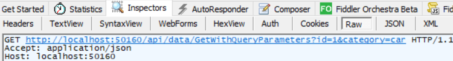

* __Header Parameters__ The parameter will be included as a *Header*  in the request with Header Name the name of             the parameter, and Header Value the value of the parameter. A setup in the Web Service Data Source Wizard like:             

  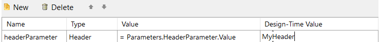will result in a request with the Header named *headerParameter*  and value             *MyHeader*  for its design-time values:             

  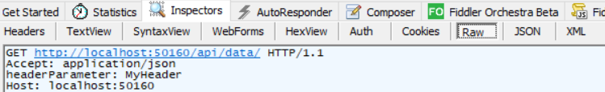

* __Cookie Parameters__ The parameter will be included as a Header *Cookie*  in the request.             For example, the parameter setup in the Web Service Data Source Wizard as:             

  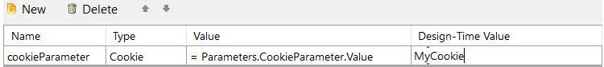for its design-time values will result in a request with a *Cookie*  Header as captured              by Fiddler:             

  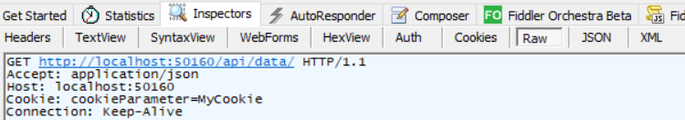

# See Also

 * [Using Parameters with Data Source objects]()
