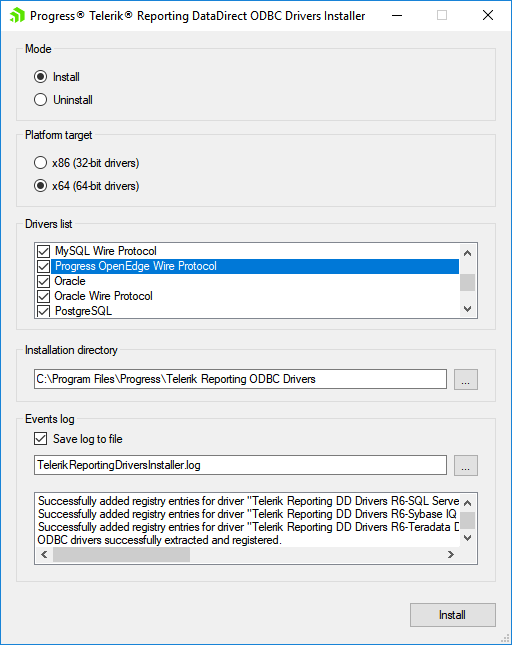

# Connect to Data Sources with the DataDirect ODBC Drivers

Our product can connect to virtually any database through an ADO.NET or ODBC data provider, but these providers usually require downloading, installing and setting up a 3rd party driver on the client's machine, which makes the setup unnecessarily complicated. Telerik Reporting helps easing the process, coming with a bundle of Progress DataDirect® ODBC drivers that can connect your report to some of the major databases used today. The DataDirect drivers are recognized as a market leading product, providing high performance and rich data sources coverage.

## Progress DataDirect® ODBC Drivers Bundle

> note These DataDirect ODBC drivers are branded and will work exclusively with Telerik Reporting and Telerik ReportServer .NET Framework applications. The drivers are not intended to be used in .NET Core+ apps, or in a 3rd party application. In such cases a warning message will be displayed.

The drivers library and installers can be downloaded as a separate ZIP-file from the user's account. The archive contains three files:

- _Telerik.Reporting.DataDirectDriversInstaller.dll_ - the resource library file, that contains the **x86** and **x64** versions of the drivers.
- _Telerik.Reporting.DataDirectDriversInstaller.CLI.exe_ - a command-line interface for installing the drivers via batch file or script.
- _Telerik.Reporting.DataDirectDriversInstaller.UI.exe_ - a Windows Forms application that provides a convenient UI and an option to log the installation output.

## Telerik Reporting DataDirect ODBC Drivers List

The following tables describe the available drivers that are distributed by the installer. Some of the drivers have only **x86** (32-bit) versions The drivers platform should be considered based on the target application platform.

> caption Telerik Reporting DataDirect ODBC drivers - (x64) 64-bit

| Driver                          | Short name |
| ------------------------------- | ---------- |
| Apache Hive                     | HIVE       |
| DB2 Wire Protocol               | DB2        |
| Greenplum Wire Protocol         | GPLM       |
| Impala Wire Protocol            | IMPALA     |
| Informix Wire Protocol          | IFCL       |
| MySQL Wire Protocol             | MYSQL      |
| Oracle                          | OR8        |
| Oracle Wire Protocol            | ORA        |
| PostgreSQL Wire Protocol        | PSQL       |
| Progress OpenEdge Wire Protocol | OE         |
| Salesforce                      | SFRC       |
| SQL Server Wire Protocol        | SQLS       |
| SQL Server Legacy Wire Protocol | MSSS       |
| Sybase Wire Protocol            | ASE        |
| Sybase IQ Wire Protocol         | SYIQ       |
| Teradata                        | TERA       |

The list with the 32-bit DataDirect ODBC drivers includes all the databases that have 64-bit drivers and adds the following ones, listed below:

> caption Telerik Reporting DataDirect ODBC drivers - (x86) 32-bit drivers (extends the list with 64-bit drivers)

| Driver          | Short name |
| --------------- | ---------- |
| Btrieve         | BTR        |
| dBase DBF files | DBF        |
| Informix        | INF        |
| Text Files      | TXT        |

## Command-Line Interface Installer

The CLI tool is useful when the drivers installation or uninstallation is executed from a script or batch file. Since the tool needs access to the Windows Registry, the CLI executable must be started from a user account that has the necessary permissions. The following table lists the available arguments to be passed to the CLI tool. The arguments are case-insensitive and they can follow any order.

<style>
table th:first-of-type {
	width: 20%;
}
table th:nth-of-type(2) {
	width: 20%;
}
table th:nth-of-type(3) {
	width: 60%;
}
</style>

> caption CLI arguments

| Argument        | Mandatory                | Description                                                                                                                                                                                                                                                                                            |
| --------------- | ------------------------ | ------------------------------------------------------------------------------------------------------------------------------------------------------------------------------------------------------------------------------------------------------------------------------------------------------ |
| _/mode_         | Yes                      | Determines the mode of the installation. Available values: **install** or **uninstall** .                                                                                                                                                                                                              |
| _/targetPath_   | Only in **install** mode | Sets the path to the directory in which the drivers will be installed. When the directory name contains spaces, the argument value must be quoted. When in **uninstall** mode, this key will not be respected and can be omitted, because the target path will be extracted from the registry entries. |
| _/platform_     | Yes                      | Defines the drivers platform. The installer comes with 32-bit (x86) and 64-bit (x64) versions of DataDirect ODBC drivers and this key determines which set will be installed. Available values: **x64** or **x86** .                                                                                   |
| _/drivers_      | Yes                      | Determines which drivers will be installed or uninstalled. The argument value is a quoted comma-separated string, containing the shortened names of the drivers. The available values are listed in the [drivers section](#telerik-reporting-datadirect-odbc-drivers-list).                            |
| _/successToken_ | No                       | A token that will be output to console after successful installation/uninstallation. It is useful in scenarios where the console output is monitored to determine if the process completed successfully.                                                                                               |

**Example usage:**

```powershell
/mode install /targetpath "C:\Program Files\Progress\Telerik Reporting ODBC Drivers" /platform x86 /drivers "SQLS,ORA" /successToken "OK"
```

Installs the 32-bit SQL Server and Oracle drivers to the target path and outputs "OK" if installation succeeds.

```powershell
/mode uninstall /platform x86 /drivers "SQLS,ORA" /successToken "OK"` - uninstalls the 32-bit  SQL Server and Oracle drivers and outputs "OK"
```

If uninstallation succeeds.

## Graphical User Interface Installer



The drivers can be installed or uninstalled using a Windows Forms application, which makes the installation process more intuitive and convenient. It provides the same options as the CLI installer and adds the ability to output the installation log to an external file. It also automatically detects the current application's platform and selects the corresponding **x86** or **x64** option.

## Additional Information

The installer does not create or modify any data source names (DSN) in ODBC Manager application. In order to use the installed driver to fetch data from a database and show it in a report, a DSN must be created in the ODBC Manager. The report should contain a SQL DataSource, which connects to this DSN and provide the necessary permissions.

The tool supports partial uninstallation - i.e. only a particular driver can be removed from registry and installation folder. However, if all the drivers are selected for uninstallation, the tool will perform a complete uninstall and remove the whole directory, if there are no other subdirectories in it.

## See Also

- [Progress DataDirect ODBC Drivers documentation](https://docs.progress.com/bundle/datadirect-connect-odbc-71/page/Welcome-to-the-Progress-DataDirect-Connect-Series-for-ODBC.html)
- [DataDirect ODBC Drivers Keys and Values](https://docs.progress.com/bundle/datadirect-connect-odbc-distribution/page/Keys-and-Values.html)
