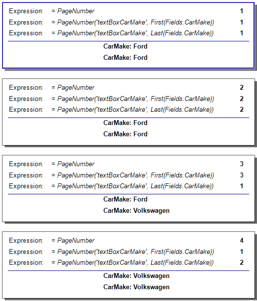

# Page Functions

>note Page aggregates should be used in page sections only (Page Header, Page Footer). Page aggregates are supported in page oriented formats only: IMAGE (TIFF, EMF, BMP, JPEG, GIF, Print), PDF, PPTX, DOCX, RTF, XPS.         

## PageExec

The __PageExec(scope, aggregateFunction)__ function executes the specified aggregate function in the given scope. It can be used in the page header or page footer of the report. In order to specify the scope in which the aggregate would be evaluated, you need to specify the __Name__ of a Group, Section, or Report Item as a string parameter of the function.         

It takes two parameters:

* __scope__ – determines which data objects are included in the PageExec accumulation. For each instance of the Report Group/Section/Item with the specified __Name__ that occurs on the current page, its data object is accumulated. __Table/List/Crosstab/Graph Groups__ cannot be used as __scope__ for Page Functions. For workaround, see the KB article [Page Level Summary for Table Groups Data]() 

* __aggregateFunction__ – the aggregate that is accumulated for each page. The expression used as an argument of the aggregate function is evaluated against the collected data objects.             

For example the expression         

`= PageExec("lineTotalTextBox", Sum(Fields.LineTotal))`

used in a page section (page header or footer) will return the *LineTotal*  summary for every single page of the report.         

## PageNumber

The __PageNumber(scope, aggregateFunction)__  function allows resetting the page number on any page based on the data in the report. This allows for the generation of flexible page section content such as separate page numbering for each Group/Section/Report Item occurrence, “continues on next page” logic, and simultaneous overall report book numbering and specific numbering inside each of its reports.         

Under the hood, this function will call the __PageExec__ function with the provided __scope__ and __aggregateFunction__  arguments. Based on the PageExec function result it will return a scoped page number. The scoped page number is the number of subsequent pages of the report up to the current page, where the value returned from the PageExec function stays exactly the same. When the value changes, the scoped page number is reset and a new page number sequence is started. It can be used in the page header or page footer of the report. In order to specify the scope in which the aggregate function expression would be evaluated, you need to specify the __Name__ of a Group, Section, or Report Item as a string parameter of the function.         

It takes two parameters:

* __scope__  – determines which data objects are included in the PageExec accumulation. For each instance of the Group/Section/Report Item with the specified __Name__ that occurs on the current page, its data object is accumulated.             

* __aggregateFunction__ – the aggregate function expression is evaluated against the collected data objects. If no aggregate function is present the *First(expression)* aggregate function will be used by default.             

For example the expression         

`= PageNumber("group1", Fields.GroupName)`

used in a page section (page header or footer) will first evaluate the expression against the specified scope. Then, if the current page is the first page where this value occurs, it will return '1' as the page number. For each subsequent page where the result of the evaluation stays exactly the same, the page number will be incremented. When the result of the evaluation changes, the current page number will be reset and a new sequence will be started.         

The PageNumber function has an overload which takes a PageExec function as a single parameter. The result is the same whether you use the shorthand notation with two parameters or the longhand notation with a single PageExec function argument:         

`= PageNumber(PageExec("group1", Fields.GroupName))`

>note Where it is applicable, use page breaks for the Group/Section/Report Item (or its parent section) used in the  __scope__ parameter. This will prevent instances of the specified scope belonging to different sequences of pages to be present on the same page. The most common example is the last page number from the first page sequence to be overlapping on the same page with the first page number from the next page sequence. If such scenario occurs, use  *First(expression)* or *Last(expression)*  aggregates in the  __aggregateFunction__  parameter to specify which page sequence you would like to use to display the page number, as shown in the image below:           
  

  

> Using PageNumber or PageCount functions inside conditional statements implemented with the [Conditional and Null-coalescing operators]() ( __?:__  and  __??__ ) may prevent these functions from executing for a particular page. This will disrupt the current page sequence and the functions may produce unexpected results. In this case it is recommended to use the [Conditional Functions]() instead of the above operators.           

## PageCount

The __PageCount(scope, aggregateFunction)__ function allows keeping track of multiple scoped page counts simultaneously for each Group/Section/Report Item. This function will use the __PageNumber__ and __PageExec__  functions internally to calculate the scoped page count for each sequence of pages where PageExec returns the same value. Each sequence of pages is determined by the given __scope__  and __aggregateFunction__. It can be used in the page header or page footer of the report. In order to specify the scope in which the aggregate function expression would be evaluated, you need to specify the __Name__ of a Group, Section, or Report Item as a string parameter of the function.         

It takes two parameters:

* __scope__ – determines which data objects are included in the PageExec accumulation. For each instance of the Group/Section/Report Item with the specified __Name__ that occurs on the current page, its data object is accumulated.             

* __aggregateFunction__ – the aggregate function expression is evaluated against the collected data objects. If no aggregate function is present the *First(expression)* aggregate function will be used by default.             

For example the expression         

`= PageCount("group1", Fields.GroupName)`

used in a page section (page header or footer) will find all sequences of pages where the *Fields.GroupName* expression in the provided scope evaluates to exactly the same value and then return the page count in the current sequence of pages.         

The PageCount function also has an overload which takes a PageExec function as a single parameter. The result is the same whether you use the shorthand notation or the longhand notation:         

`= PageCount(PageExec("group1", Fields.GroupName))`
