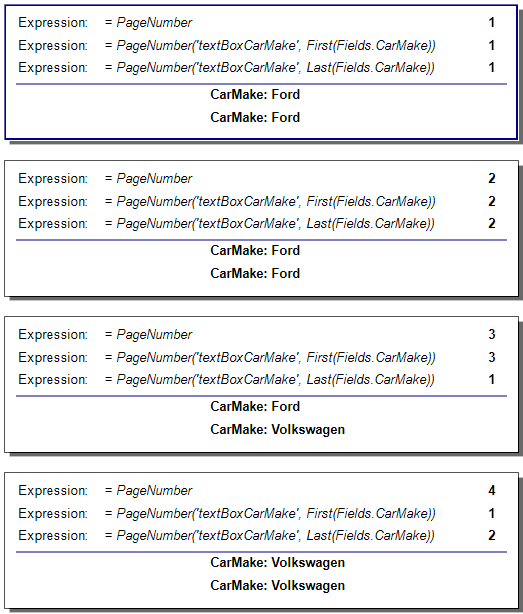

# Page Functions Overview

Page functions are expression functions that work with the pages produced during report rendering. Use them when you need page-level values such as the current page number, the total page count, or a page-specific aggregate in the page header or page footer.

>note Page aggregates should be used in page sections only (Page Header, Page Footer). Page aggregates are supported in page oriented formats only: IMAGE (TIFF, EMF, BMP, JPEG, GIF, Print), PDF, PPTX, DOCX, RTF, XPS.

## What Page Functions Do

Page functions solve two different scenarios:

- Use the `PageNumber` and `PageCount` properties when you need numbering for the entire rendered report, for example `1 of 12`.
- Use the `PageNumber(scope, aggregateFunction)` and `PageCount(scope, aggregateFunction)` functions when you need numbering that restarts for a specific group, section, or report item.
- Use `PageExec(scope, aggregateFunction)` when you need a page-level aggregate, for example a subtotal for the current page.

The scoped versions are not a separate numbering system. They are based on page-level evaluation of report data. Telerik Reporting first determines which data belongs to the current page, then uses that result to decide whether the page belongs to the current numbering sequence or starts a new one.

## PageExec

The `PageExec(scope, aggregateFunction)` function executes the specified aggregate function in the given scope. Use it in the page header or page footer when you need a value calculated only from the data that appears on the current page.

To specify the evaluation scope, pass the `Name` of a Group, Section, or Report Item as a string parameter.

It takes two parameters:

* `scope` – determines which data objects are included in the `PageExec` accumulation. For each instance of the Report Group, Section, or Item with the specified `Name` that occurs on the current page, its data object is accumulated. **Table**, **List**, **Crosstab**, and **Graph** groups cannot be used as the `scope` for page functions. For a workaround, see [Page Level Summary for Table Groups Data](slug:page-level-summary-for-table-groups).
* `aggregateFunction` – the aggregate that is accumulated for each page. The expression used as an argument of the aggregate function is evaluated against the collected data objects.

For example, the expression

`= PageExec("lineTotalTextBox", Sum(Fields.LineTotal))`

used in a page section returns the `LineTotal` summary for the current page only.

## PageNumber

Use the `PageNumber` property when you want the current page number for the entire report. For example, the following expression displays `Current Page Number is 1` on the first page of the report:

`= "Current Page Number is " + PageNumber`

The `PageNumber(scope, aggregateFunction)` function is different. It resets the page number according to the data on the page. Use it when you need separate numbering sequences for each Group, Section, or Report Item occurrence, for `continues on next page` logic, or for report books that need both overall page numbering and per-report page numbering.

### Why `PageNumber` Has Two Forms

The property form and the function form solve different problems:

- `PageNumber` returns the current page number in the full rendered document.
- `PageNumber(scope, aggregateFunction)` returns the current page number inside a sequence of pages that share the same page-level value.

Internally, the scoped function uses `PageExec(scope, aggregateFunction)`. Telerik Reporting evaluates the page-level value for each rendered page and compares it with the previous page:

- If the value stays the same, the scoped page number increases.
- If the value changes, Telerik Reporting starts a new numbering sequence at `1`.

This is why there is no completely separate "page-number reset mechanic". The reset behavior depends on page-level data evaluation, and `PageExec` is the mechanism that provides that value.

Use the function in the page header or page footer. To specify where the aggregate expression is evaluated, pass the `Name` of a Group, Section, or Report Item as a string parameter.

It takes two parameters:

* `scope` – determines which data objects are included in the `PageExec` accumulation. For each instance of the Group, Section, or Report Item with the specified `Name` that occurs on the current page, its data object is accumulated.
* `aggregateFunction` – the aggregate expression evaluated against the collected data objects. If no aggregate function is specified, `First(expression)` is used by default.

For example, the expression

`= PageNumber("group1", Fields.GroupName)`

used in a page section first evaluates `Fields.GroupName` in the specified scope. If the current page is the first page where that value appears, the function returns `1`. For each following page where the evaluated value stays the same, the function increments the page number. When the evaluated value changes, the page number resets and a new sequence starts.

The `PageNumber` function also has an overload that takes a `PageExec` function as a single parameter. The result is the same whether you use the shorthand form with two parameters or the longhand form with a single `PageExec` argument:

`= PageNumber(PageExec("group1", Fields.GroupName))`

### Example: Restart Page Numbering Per Group

Assume `group1` is a report group based on `Fields.GroupName` and each group starts on a new page. In the page footer:

- `= PageNumber` returns the page number in the full report, for example `7`.
- `= PageNumber("group1", Fields.GroupName)` returns the page number inside the current group, for example `1`, `2`, or `3`.

This lets you show values such as `Page 2 of 3 for the current customer group` while keeping the report's overall page numbering separate.

>note Where possible, use page breaks for the Group, Section, or Report Item used in the `scope` parameter, or for its parent section. This prevents instances of different page sequences from appearing on the same page. A common example is the last page number from one sequence overlapping with the first page number from the next sequence on the same page. If this happens, use `First(expression)` or `Last(expression)` in the `aggregateFunction` parameter to specify which page sequence to use, as shown below:

>important Using `PageNumber` or `PageCount` inside conditional statements that use the [conditional and null-coalescing operators](slug:telerikreporting/designing-reports/connecting-to-data/expressions/expressions-reference/operators) (`?:` and `??`) may prevent these functions from executing on a page. This can disrupt the current page sequence and produce unexpected results. In this case, use the [conditional functions](slug:telerikreporting/designing-reports/connecting-to-data/expressions/expressions-reference/functions/conditional-functions) instead.

## PageCount

Use the `PageCount` property when you need the total page count for the full report. For example, the following expression displays `1 of 3` on the first page of a three-page report:

`= PageNumber + " of " + PageCount`

The `PageCount(scope, aggregateFunction)` function tracks multiple scoped page counts at the same time for each Group, Section, or Report Item. Internally, it uses `PageNumber` and `PageExec` to calculate the page count for each sequence of pages where `PageExec` returns the same value. Each sequence is determined by the specified `scope` and `aggregateFunction`.

Use it in the page header or page footer. To specify where the aggregate expression is evaluated, pass the `Name` of a Group, Section, or Report Item as a string parameter.

It takes two parameters:

* `scope` – determines which data objects are included in the `PageExec` accumulation. For each instance of the Group, Section, or Report Item with the specified `Name` that occurs on the current page, its data object is accumulated.
* `aggregateFunction` – the aggregate expression evaluated against the collected data objects. If no aggregate function is specified, `First(expression)` is used by default.

For example, the expression

`= PageCount("group1", Fields.GroupName)`

used in a page section finds all sequences of pages where `Fields.GroupName` in the specified scope evaluates to the same value and then returns the page count for the current sequence.

The `PageCount` function also has an overload that takes a `PageExec` function as a single parameter. The result is the same whether you use the shorthand or the longhand form:

`= PageCount(PageExec("group1", Fields.GroupName))`

### Example: Display Group Page Numbering

To display numbering such as `Page 2 of 5` inside the current group sequence, use both scoped functions together:

`= "Page " + PageNumber("group1", Fields.GroupName) + " of " + PageCount("group1", Fields.GroupName)`

This expression does not show the overall report page number. It shows the page number and page count only for the current group sequence.
