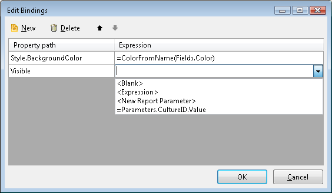

# Bindings Overview

Bindings allow you to dynamically set report item properties using expressions. While only certain properties support expressions natively (like the TextBox `Value` property), bindings extend this capability to any write-enabled property.

When the report renders, the expression is evaluated and assigned to the bound property. For example, you can bind `Style.BackgroundColor` to `=Fields.CarColor` to set colors dynamically from your data.

>caption Bindings vs. Other Approaches

| Scenario | Use This | Reason |
|--------------|--------------|------------|
| Displaying field values in text boxes | Value expressions (e.g., `=Fields.Total`) | The `Value` property supports expressions natively. |
| Styling multiple properties based on conditions | [Conditional Formatting]() | User-friendly interface, one rule can set multiple style properties. |
| Complex expressions for styling | Bindings | Full expression flexibility, cleaner for complex logic like `IIF(Fields.Amount > 1000, 'Red', 'Green')`. |
| Setting DataSource, Visible, or other properties without native expression support | Bindings | Only bindings can dynamically set these properties. |

## Common Binding Scenarios

| Property | Expression Example | Purpose |
|--------------|------------------------|-------------|
| `Style.BackgroundColor` | `=IIF(Fields.Amount > 1000, 'Red', 'Green')` | Change background color based on value |
| `Visible` | `=Fields.ShowDetails` | Show/hide items based on data |
| `DataSource` | `=Fields.NestedData` | Dynamically assign nested data from a JSON field |
| `Style.Font.Bold` | `=Fields.IsHighlight` | Conditionally format text |
| `DocumentMapText` | `=Fields.CategoryName` | Set document map entries |

## How to Create a Binding

1. Select the report item and locate the `Bindings` property in the **Properties** window.
1. Click the ellipsis button **[...]** to open the **Edit Bindings** dialog.
1. Click **New** to add a new binding.
1. From the **Property path** dropdown, select the property to bind (for example, `DataSource`). Only write-enabled properties can be bound.
1. Enter the expression in the **Expression** field. The expression must return a value compatible with the property type.
1. Click **OK** to apply the bindings.

>tip Not all item properties support expression bindings. Refer to the [Reporting API Reference](/api/) to verify if a specific property supports binding.

## See Also

* [Expression]()
* [Telerik.Reporting.Binding](/api/Telerik.Reporting.Binding)
* [Telerik.Reporting.BindingCollection](/api/Telerik.Reporting.BindingCollection)
