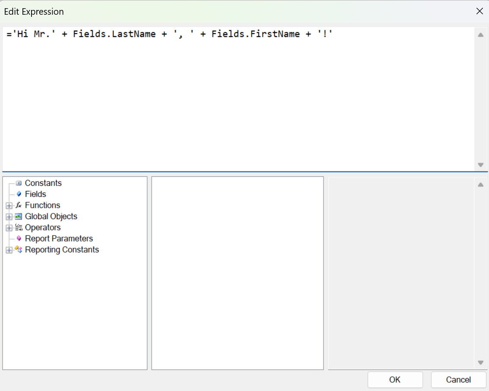

# Expressions as Values of Item Properties

By default, the report items’ properties are strongly typed. Anyway, you can use expressions as values for some of them. To specify that the value of a property is an expression, the value should be a string starting with the equal `=` sign. If the equal sign is not present, the value will be interpreted as a string literal.

This expression:

`='Hi Mr.' + Fields.LastName + ', ' + Fields.FirstName + '!'`



when evaluated will result in:

`Hi Mr. Smith, John!`

If you want part of the expression to be put on another line, you have to insert a new line character in a string literal. For example, here is how the expression should look in the [Expression Editor]():

````
='Hi Mr.' + Fields.LastName + ', ' + Fields.FirstName + '!

How are you today?'
````

The result would be:

````
Hi Mr. Smith, John!

How are you today?
````

On the design surface, expressions are usually displayed surrounded by square brackets `[]`. For example, the expression `=Fields.PersonID`, when used in `TextBox.Value` property, would appear as `[=Fields.PersonID]`.

The following objects and properties support expressions as property values:

| Object | Property |
| ------ | ------ |
|Barcode|Value|
|CheckBox|Value<br/> TrueValue<br/> FalseValue<br/> IndeterminateValue<br/> Text|
|PictureBox|Value|
|Report|DocumentName|
|ReportBook|DocumentName|
|ReportParameter|Value|
|TextBox|Value|
|ReportItemBase (all items)|BookmarkID<br/> DocumentMapText|
|Group|BookmarkID<br/> DocumentMapText|
|TableGroup|BookmarkID<br/> DocumentMapText|
|CalculateField|Expression|
|Filter|ExpressionValue|
|Sorting|Expression|
|Grouping|Expression|
|ReportParameter|Value|
|ReportParameter.AvailableValues|ValueMember<br/> DisplayMember|
|Parameter|Valuе|
