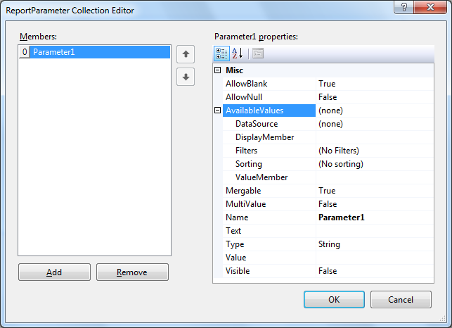
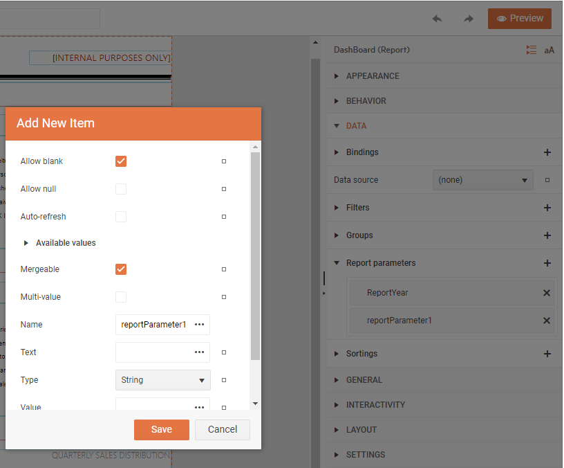

# Approaches for Adding Report Parameters

Report parameters typically filter report data that is retrieved from a data source. Filtering data at the data source can improve performance for processing and viewing a report. For the times when you cannot filter data at the source, you can use parameters to filter report data after it is retrieved. You can also sort and group data in a report based on report parameters.

## Add a Report Parameter using Report Designer

There are several ways to add a Report Parameter to the Report depending on the preferred designer:

### Desktop Report Designers

1. Invoke the __ReportParameter Collection editor__ with one of the following approaches:

	* Using the `Report.ReportParameters` property in the property grid.
	* Select the __Report Parameters...__ option from the [Context Menu]()
	* Right click on the `[Parameters]` node of the [Report Explorer]()
	* From the __Configure Data Source Parameters__ step of the [DataSource Components]()

	

1. Click the __Add__ button to create a new parameter.

### Web Report Designer

1. Expand the `DATA` node of the Report Explorer properties to view the inner node `Report parameters`.
1. Click on the `+` sign beside `Report parameters` to create a new parameter and open the dialog with its properties.

## Configure the Properties of a Report Parameter using Report Designer

1. In `Name`, type the name of the parameter.
1. In `Text` type the text for the parameter to be displayed in the report viewer as prompt to the end user. If not set, the Name of the parameter will be used instead.
1. In `Type`, select the data type for the parameter value. By default `String` type is selected.
1. You can leave the `Value` property blank, enter a literal value or click the ellipses to invoke the [Expression Edit Dialog]().
1. If the parameter can contain a blank value, set `AllowBlank` accordingly.
1. If the parameter can contain a null value, set `AllowNull` accordingly.
1. To allow a user to select more than one value for the parameter, set `MultiValue` accordingly.
1. To allow a user to select or change a parameter value, set `Visible` to `True`.

## Defining AvailableValues for ReportParameter’s UI using Report Designer

Expand the `AvailableValues` property of the report parameter and fill the following settings to determine the values the end user can choose from.

* Set the `DataSource` property to specify data source from which the available values of the editor will be loaded. The same object types used as data source for the report can be used as data source for the report parameters. If no DataSource is specified, available values are not loaded.
* In the `ValueMember` property choose a column from the data source from which the editor to load the values.
* In the `DisplayMember` property choose a column from the data source from which the editor to draw the value labels.
* In the `Filters` you can limit the number of records in the available values based on specified filter rules. If the conditions of the rules are met the record is included. Filters are defined using the [Edit Filter Dialog]().
* Sorting can be performed on the available values through the `Sorting` property. Sorting controls the order of the items provided to the user to choose from. Sorting is defined using the [Edit Sorting Dialog.]()

## Add a Report Parameter programmatically

{{source=CodeSnippets\CS\API\Telerik\Reporting\ReportSnippets.cs region=AddNewReportParameterSnippet}}
{{source=CodeSnippets\VB\API\Telerik\Reporting\ReportSnippets.vb region=AddNewReportParameterSnippet}}

## Defining AvailableValues for ReportParameter’s UI programmatically

{{source=CodeSnippets\CS\API\Telerik\Reporting\ReportSnippets.cs region=Define_AvailableValues_for_ReportParameter_Snippet}}
{{source=CodeSnippets\VB\API\Telerik\Reporting\ReportSnippets.vb region=Define_AvailableValues_for_ReportParameter_Snippet}}

