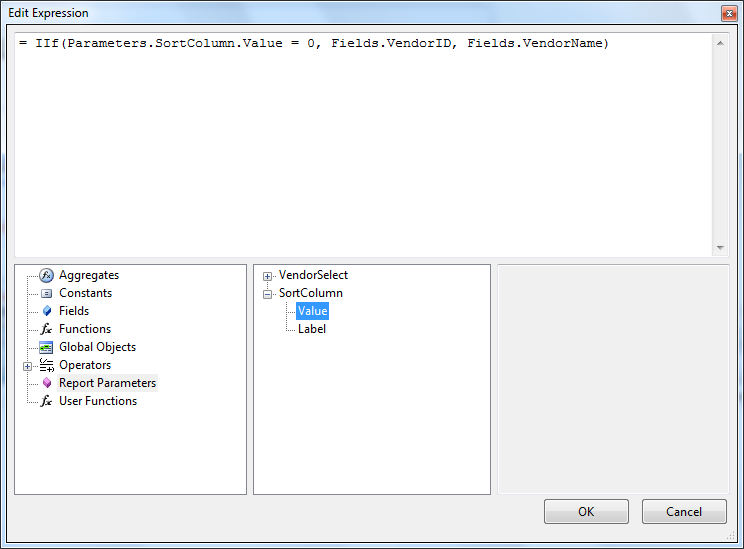

# Using Report Parameters in Expressions

Report Parameters can be used in expressions that you display directly and can also be used with other elements in an expression. These expressions in turn can be used as criteria for [filters](), [sorting]() and [grouping]().

## Report Parameters in Expressions

For example if you have a "Vendor List" report you can define a "VendorSelect" parameter. To display this value directly in the report you can assign an expression to a TextBox as in the example below:

You can show the Label value in the same manner by using similar expression e.g. `=Parameters.VendorSelect.Label`. This same parameter can be used to filter the vendor listing. In the example below we set up an expression where the VendorName from the database is compared, using a Like operator to the VendorSelect parameter. The expression is appended with the "%" wildcard so that any VendorName that starts with the characters passed in the parameter will be included in the report.

To extend this example to handle sorting choices a second column "VendorID" is added to the report and a second parameter called "SortColumn" is added. In the Report Sorting property an expression is added that checks the value of SortColumn. If SortColumn is zero then the sort is by the VendorID column, otherwise the sort column is VendorName.

