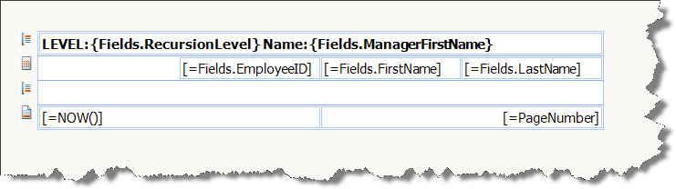
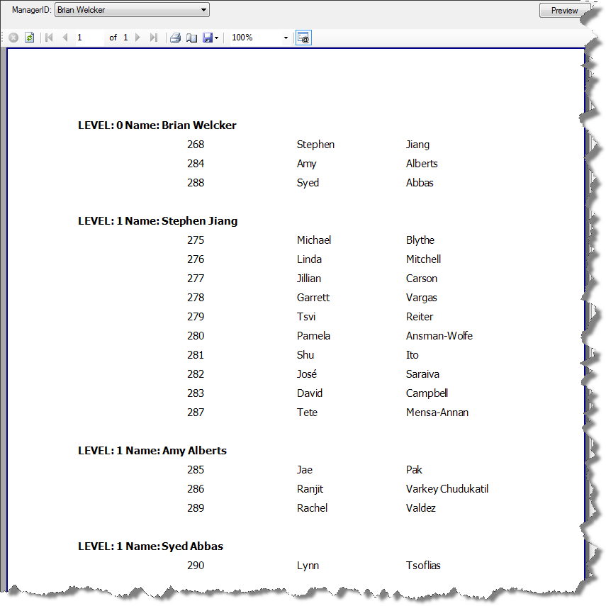

# Using Report Parameters Programmatically

In the report viewing application you can populate the values of __ReportParameters__ collection members prior to displaying the report.

{{source=CodeSnippets\CS\API\Telerik\Reporting\Processing\ParameterSnippets.cs region=Pass_ReportParameter}}
{{source=CodeSnippets\VB\API\Telerik\Reporting\Processing\ParameterSnippets.vb region=Pass_ReportParameter}}

At runtime you can access the report parameters through the [Telerik.Reporting.Processing.Report.Parameters](/api/Telerik.Reporting.Processing.Report#Telerik_Reporting_Processing_Report_Parameters) dictionary. Each [Parameter](/api/Telerik.Reporting.Processing.Parameter) object contains resolved available values, current value and label. The label returns the currently selected DisplayMember from the available values (if available values are defined).

>note Prior to version 2010 Q1 the processing report exposes a dictionary containing only the current values of the report parameters. 

## Example:

1. Create a __Telerik Report__
1. Use the instructions from the [How to Connect to a SQL Database]() article to bind to the __uspGetManagerEmployees__ stored procedure from the __AdventureWorks__ table.
1. Leave the Value for the __@ManagerID__ data source parameter empty and finish the wizard.
1. Create the following layout for the report

	

1. [Add a report parameter]() and name it __ManagerID__.
1. Change its Type to Integer.
1. Set its Visible property to True.
1. Expand the __AvailableValues__ and bind it to __SqlDataSource__ component with the following query:

	{{source=CodeSnippets\CS\API\Telerik\Reporting\Processing\ParametersSqlDataSourceQuery.sql}}

1. Set the __ValueMember__ to __= Fields.ManagerID__.
1. Set the __DisplayMember__ to __= Fields.Name__.
1. Add grouping for the report with __= Fields.ManagerID__ as grouping expression.
1. Wire the [NeedDataSource event]() of the report.
1. In the report.cs file set the __DataSource__ property to __null__ ( __Nothing__ in VB.NET) so that NeedDataSource event is fired.
1. Add the following code to the NeedDataSource event handler:

	{{source=CodeSnippets\CS\API\Telerik\Reporting\Processing\ParameterSnippets.cs region=Pass_Parameter_In_NeedDataSource}}

	{{source=CodeSnippets\VB\API\Telerik\Reporting\Processing\ParameterSnippets.vb region=Pass_Parameter_In_NeedDataSource}}

1. Display the Report in a report viewer.
1. Select a parameter from the available values in the parameter editor and click __Preview__.

	
