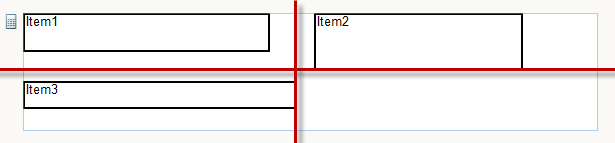
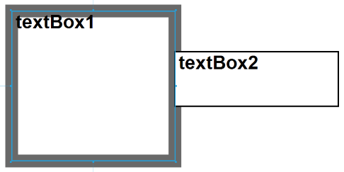

# Basic Design Considerations for Report Items

This article lists some tips and tricks for rendering the report items of your report as desired.

## Arranging Report Items

All report items grow from top to bottom and some (SubReport, and Table, Crosstab, List with rotated layout) can grow from left to right as well. When they grow, the items below/on the right are pushed down/right. Changing visibility of items at runtime would trigger the same effect i.e. items below or on the right side of the hidden item would move up or to the left to occupy the space of the hidden item.

If you have two report items positioned vertically with 1in space between them, hiding the first report item would result in the second item occupying the first item's height only. The 1in space between the report items is preserved at all times.

In Telerik Reporting versions prior to R3 2016, sections/Panel item can grow to accommodate their children but cannot shrink/take space that is no longer occupied. To remove such space in a container (report section or panel item), set its height to a very small value (e.g. 1mm, but not zero unit). If you want a section/panel to shrink only at runtime you can set its Height property in the report constructor or via expression. For the purpose, place the Height property assignment code just after the `IntializeComponent()` method call or use a [binding]() to the item's Height property.

As of [`Telerik Reporting R3 2016`](https://www.telerik.com/support/whats-new/reporting/release-history/telerik-reporting-r3-2016-(version-10-2-16-914)) report sections and Panel item have CanShrink property. If the container’s content is hidden or shrunk, when CanShrink is turned on, the container will collapse accordingly.

>note Report items can grow vertically even when their `CanGrow` property is set to false. This behavior can be observed when the report item height is smaller than the report item font height, which causes the item to grow vertically in order to accommodate at least a single line of text with the specified font style.

> Page sections do not collapse or expand based on their content. For more details, check [Understanding Rendering Behaviors(Page Header and Footer sections)](#page-header-and-footer-sections).

## Showing and Hiding Report Items

Report items can be hidden or displayed by default, or hidden or displayed conditionally using [Conditional Formatting]() or [Bindings](). Optionally, the visibility can be switched by clicking another report item ([Drilldown Report Action]()).

In a report with complex layout, changing the visibility of an item does not guarantee that the space it occupies would be filled in by the items below or to the right of it.

The following visibility rules apply when rendering report items (red lines define layout dependency):

* If Item1 is hidden, all items below Item2 would remain in place.
* If Item1 is hidden, all items right to Item3 would remain in place.
* If Item1 and Item3 are hidden, Item2 will move to the left to fill the space. Renderers maintain the space between report items that you define in the report layout.
* If the visibility of a report item and its contents can be switched by clicking another report item, then pagination changes to accommodate the report item and its contents only when it is initially displayed.
* If a report item is placed in a Panel, its visibility does not affect the original layout of items outside the Panel.

## Keeping Report Items Together

Report items in a report can be kept together on a single page by setting the KeepTogether property. For keeping items in a report group or table group together, set [GroupKeepTogether](/reporting/api/Telerik.Reporting.Group#Telerik_Reporting_Group_GroupKeepTogether) property. Report items are always rendered on the same page if the report item is smaller in size than the usable page area. If a report item does not completely fit on the page on which it starts, a page break is inserted before the report item, forcing it to the next page. For logical page renderers, the page grows to accommodate the report item.

For more detail about the result of keeping items together, check [Understanding Pagination(Paging and Keep Together)](#paging-and-keep-together).

## Setting the Order of Report Items and Borders

Report items are rendered in succession (one by one). The order of rendering is determined by the following rules:

* Items in Table/Crosstab cells are rendered starting from the first cell of the first row across the entire Table/Crosstab horizontally and then down the Table/Crosstab vertically.
* Report items which are children of the same parent container are rendered in the order in which they have been added to the container's definition (most often during design-time).
* Each report item/section renders all of its children as part of its rendering operation. When the report is rendered the report items tree is traversed in depth-first manner.

This rendering behavior will affect how report item borders are rendered according to the following rules:

* When a report item has a border half of the border is rendered inside the item bounds and half of it is rendered outside the item bounds.
* When two sibling report items overlap the item which is rendered second will be drawn on top of the other item.
* When two sibling report items are adjacent to each other the borders on the common side of the items will overlap according to the above rules. If the report item which was rendered second has a non-transparent background color or background image, the background will be rendered on top of the first report item's border.

	

>important Setting __BorderStyle__ and __BorderWidth__ properties of report item to conflicting values (for example: BorderStyle=Solid, BorderWidth: 0px) can produce unexpected result in some rendering formats. To hide the border, set BorderStyle=None. Otherwise, the width of the border needs to be set greater than 0.

>note Some borders and lines might be thicker or disappear on report's preview. The reason for this is that GDI component installed on the machine uses anti-aliasing that softens sharp edges so they appear less jagged when rendered on the display.
>
>The GDI component works together with the display driver software to determine which pixels will be turned on to show the line on a particular display. That is why some lines can be missing or be thinner/thicker when zoom is applied.
>
>The general suggestion is to set the border/line width to minimum 2px which can be rendered on a machine with 96dpi resolution. Using pixels instead of points is also recommended as a more media oriented unit.
