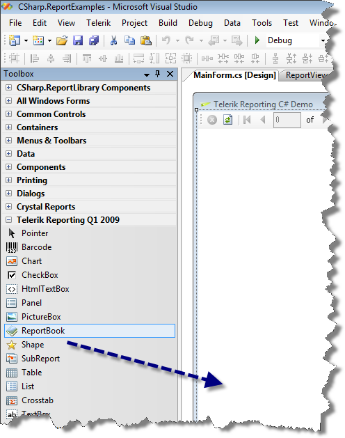
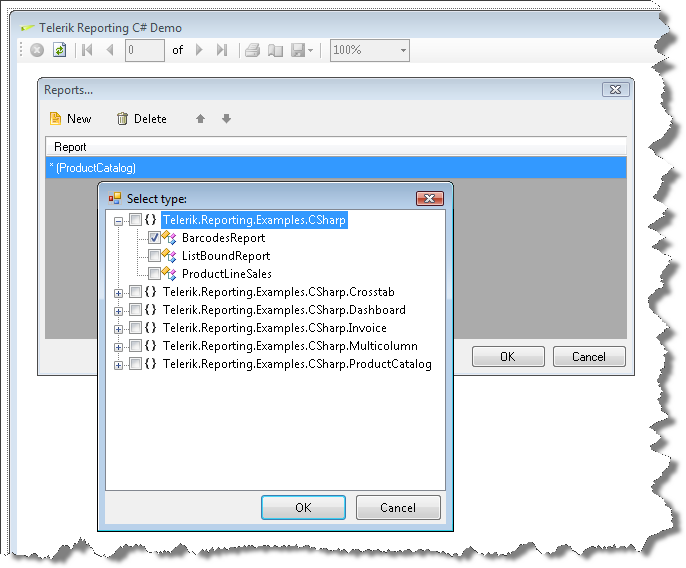

# How to Use ReportBook in Windows Forms Apps

## Creating a Report Book at Design-time

Report Books can be created either at design-time or on the fly at run-time. Follow these steps to create a Report Book at design-time:

1. Add a ReportViewer to your form by following the help topic: [Embedding the Windows Forms Report Viewer on a Form]()

1. Add a ReportBook component from the "Telerik Reporting" tab of the `Visual Studio Toolbox` to the design surface.  

  

1. You will be presented with a dialog to choose the reports once you have added the report book component to the design surface. Select the reports and adjust the order in which you would like them to appear in the report book. 

   >note Make sure you have built the project(s) containing the report(s) that you want to add  

  

1. Select the ReportViewer control and click on the ellipsis of its "ReportSource" property in the Properties Window and choose object instance. The report book component that you added in the previous step should be listed under the "Select Report Document" dialog.           
