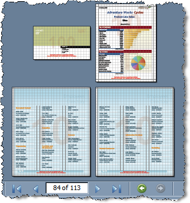

# Page Settings, Sizes and Naming in ReportBooks

## Page Settings and Sizes

Physical page formats support combining reports with different page sizes into one report book. When rendering to one of those formats, each page will preserve the size from the page settings of the report it belongs to.
  

  

When exporting to XLS, each report will occupy a separate worksheet in the Excel workbook.

The CSV rendering extension simply combines all reports one after the other in the CSV file it produces.

>caution When viewing a Report Book in the Viewer the `Page Settings` button is disabled by design

## Document Name

You can use the `DocumentName`  property of a Report Book to suggest a file name when exporting in exactly the same manner as you would do with a single report.

## See Also

 * [Report Book Parameters]()

 * [Report Book Paging]()
