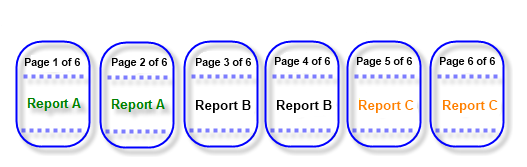
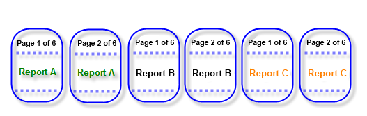

# Report Book Paging

Reports are displayed in the order they were added to the report book, each report starting on a new page. The way pages are counted (the evaluation of the `PageNumber` global object) may be different in the context of a report book compared to counting pages in a single report. The Report class has a property of type `PageNumberingStyle` that will let you control the behavior of page counting in the context of a report book.

>note The  `PageNumberingStyle` property has meaning and effect only when the report is part of a report book.

The `PageNumberingStyle` enumeration has three values with the default being `Continue`:

- `ResetNumbering` - resets page numbering while page count aggregation continues;
- `ResetNumberingAndCount` - resets both page numbering and page count;
- `Continue` - indicates that both page numbering and page count aggregations continue from where the previous report in the book has left off.

Below is a small example of how to use the PageNumberingStyle assuming that each of the three reports has a total of two pages:

__The value of the TextBox in the PageHeader is equal to = "Page: " + PageNumber + " of " + PageCount__ 

>caption PageNumberingStyle.Continue

>caption PageNumberingStyle.ResetNumbering

>caption PageNumberingStyle.ResetNumberingAndCount

## Multiple PageNumberingStyles and Reports order

When working with the `PageNumberingStyle` property, if the Reports have different values set for that property, the order of reports will matter for the values of the `PageNumber` and `PageCount` objects.

For example, if there is a Report Book of two reports - `Report1.trdp` that uses `PageNumberingStyle.ResetNumberingAndCount` and `Report2` that uses `PageNumberingStyle.Continue`, and the order of the reports is the following:

- Report1.trdp - 5 total pages
- Report2.trdp - 1 total page

In such a case, when the total page count is being counted and the reporting engine goes to the second report, since it uses `PageNumberingStyle.Continue`, the total `PageCount` will be added to that of the `Report1.trdp` report and if it has a total of _5 pages_, and `Report2.trdp` is one page, the `PageCount` object will return `6` for both reports(only when rendered in the context of a Report Book).

On the other hand, if the order of the two reports is switched and now `Report2.trdp` is first, since the next report(`Report1.trdp`) uses `PageNumberingStyle.ResetNumberingAndCount`, when the counting gets to it the `PageCount` will be restarted and it will now return the total page count of `5`.

## See Also

* [Report Book Parameters]()
* [Page Settings, Sizes and Naming]()
