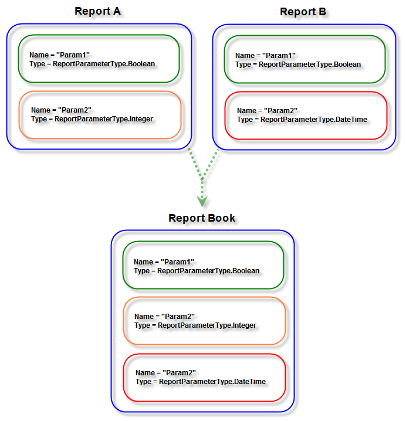
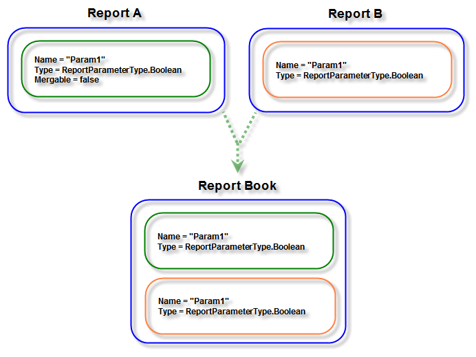

# Report Book Parameters Overview

Often, one or more reports that are part of a report book will contain report parameters. The report book is shown as a single document in the report viewer, and the parameters area represents the visible report parameters defined in all child reports.

The described behavior is valid when you pass the Report Parameter values in the ReportSource wrapping the entire ReportBook, and when you pass them separately, with each report's ReportSource added to the ReportBook's ReportSources collection.

Telerik Reporting provides a mechanism known as parameter merging. If the [`Name`](/api/Telerik.Reporting.IReportParameter#Telerik_Reporting_IReportParameter_Name) and [`Type`](/api/Telerik.Reporting.IReportParameter#Telerik_Reporting_IReportParameter_Type) of two (or more) parameters from different reports are the same, then they are considered equivalent and are displayed as a single parameter in the viewer's Parameters Area.

>note When one or more parameters are merged, the UI settings of the __first__ one are used for the generated input control in the parameters area.

You can control parameter merging via the [`Mergeable`](/api/Telerik.Reporting.IReportParameter#Telerik_Reporting_IReportParameter_Mergeable) boolean property of the `ReportParameter` class. The default value of the `Mergeable` property is true. Set the `Mergeable` property to `false` if you want to prevent a parameter from being merged with its equivalent ones.

## Passing Values for Report Parameters in a Reportbook through ReportSource

* __When report parameters have unique names or the target parameters are merged:__ If a parameter is distinguishable by its Name property or the Name denotes several merged parameters, refer to the parameter directly by the value of its Name property.

{{source=CodeSnippets\CS\API\Telerik\Reporting\ReportSourceSnippets.cs region=Set_Values_For_Unique_Or_Mergable_ReportParameters_In_ReportSource_Snippet}}
{{source=CodeSnippets\VB\API\Telerik\Reporting\ReportSourceSnippets.vb region=Set_Values_For_Unique_Or_Mergable_ReportParameters_In_ReportSource_Snippet}}

* __When report parameters have repeating names but they are not merged:__ In this case, you need to refer to the individual occurrence of the parameter in a particular report. This is done by denoting the target report by its zero-based index inside the report book.

{{source=CodeSnippets\CS\API\Telerik\Reporting\ReportSourceSnippets.cs region=Set_Values_For_NotMergable_ReportParameters_In_ReportSource_Snippet}}
{{source=CodeSnippets\VB\API\Telerik\Reporting\ReportSourceSnippets.vb region=Set_Values_For_NotMergable_ReportParameters_In_ReportSource_Snippet}}

>note If you do not use the specified syntax and you refer to the report parameter directly by the `Name` property's value, the value will be set only for the _first_ occurrence of the report parameter in the report book.
