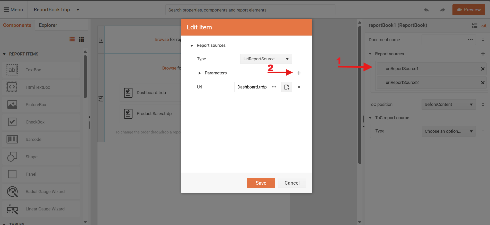
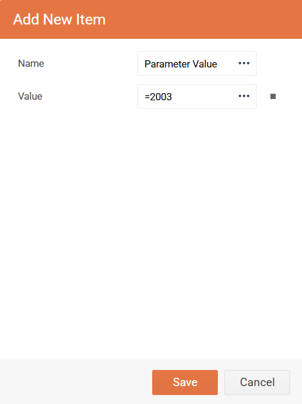

# Report Book Parameters Overview

Often, one or more reports that are part of a report book will contain report parameters. The report book is shown as a single document in the report viewer and the parameters area represents the visible report parameters defined in all child reports.

Telerik Reporting provides a mechanism known as parameter merging. If the [`Name`](/api/Telerik.Reporting.IReportParameter#Telerik_Reporting_IReportParameter_Name) and [`Type`](/api/Telerik.Reporting.IReportParameter#Telerik_Reporting_IReportParameter_Type) of two (or more) parameters from different reports are the same, then they are considered equivalent and are displayed as a single parameter in the viewer's Parameters Area.

>note When one or more parameters are merged, the UI settings of the __first__ one are used for the generated input control in the parameters area.


You can control parameter merging via the [`Mergeable`](/api/Telerik.Reporting.IReportParameter#Telerik_Reporting_IReportParameter_Mergeable) boolean property of the `ReportParameter` class. The default value of the `Mergeable` property is true. Set the `Mergeable` property to `false` if you want to prevent a parameter from being merged with its equivalent ones.


## How to set a value for a report parameter in ReportBook

In the sample pictures below, you will see in few steps how to set a value for a report parameter in ReportBook using Standalone Designer. For this example, the **Dashboard.trdp** and **Product Sales.trpd** reports are used, which can be found in the installation folder - **C:\Program Files (x86)\Progress\Telerik Reporting 2025 Q1\Report Designer\Examples**.

### In Standalone Designer

1. Click on the **Dashboard.trdp**
1. From the Toolbar, click on the **Parameters**
1. The **Edit Parameter** window will open, then select New


### Web Report Designer

1. In Report Sources, click on the `uriReportSources1 `
1. Next to Parameters, you will see a plus sign(+). Click on it.
1. In the `Add New Item` window, you will be able to set the name and value of the parameter.





## Passing Values for Report Parameters in a Reportbook through ReportSource Programatically

* __When report parameters have unique names or the target parameters are merged:__ If a parameter is distinguishable by its Name property or the Name denotes several merged parameters, refer to the parameter directly by the value of its Name property.

````C#
#region Set_Values_For_Unique_Or_Mergable_ReportParameters_UriReportSource
var UriReportSource = new Telerik.Reporting.UriReportSource();
UriReportSource.Uri = "MyReportBook.trbp";

// Passing a value for a unique or repeating report parameter that should have one and the same value
// for all reports part of the report book through the report source
UriReportSource.Parameters.Add(new Telerik.Reporting.Parameter("ProductCategory", "Bikes"));
#endregion
````
````VB.NET
'#Region Set_Values_For_Unique_Or_Mergable_ReportParameters_UriReportSource
Dim UriReportSource As New Telerik.Reporting.UriReportSource()
UriReportSource.Uri = "MyReportBook.trbp"

' Passing a value for unique Or repeating report parameter that should have one And the same value
' for all reports part of the report book through the report source
UriReportSource.Parameters.Add(New Telerik.Reporting.Parameter("ProductCategory", "Bikes"))
'#End Region
````

* __When report parameters have repeating names but they are not merged:__ In this case, you need to refer to the individual occurrence of the parameter in a particular report. This is done by denoting the target report by its zero-based index inside the report book.

````C#
#region Set_Values_For_NotMergable_ReportParameters_In_UriReportSource_Snippet
var UriReportSource = new Telerik.Reporting.UriReportSource();
UriReportSource.Uri = "MyReportBook.trbp";

// Passing a value for not mergeable report parameter targeting the FIRST report in the report book
//through the report source
UriReportSource.Parameters.Add(new Telerik.Reporting.Parameter("reports(0).ClientID", 102));

// Passing a value for not mergeable report parameter targeting the SECOND report in the report book
//through the report source
UriReportSource.Parameters.Add(new Telerik.Reporting.Parameter("reports(1).ClientID", 103));
#endregion
````
````VB.NET
'#Region Set_Values_For_NotMergable_ReportParameters_In_UriReportSource_Snippet
Dim UriReportSource As New Telerik.Reporting.UriReportSource()
UriReportSource.Uri = "MyReportBook.trbp"

' Passing a value for Not mergeable report parameter targeting the FIRST report in the report book
' through the report source
UriReportSource.Parameters.Add(New Telerik.Reporting.Parameter("reports(0).ClientID", 102))

' Passing a value for Not mergeable report parameter targeting the SECOND report in the report book
' through the report source
UriReportSource.Parameters.Add(New Telerik.Reporting.Parameter("reports(1).ClientID", 103))
'#End Region
````

>note If you do not use the specified syntax and you refer to the report parameter directly by the `Name` property's value, the value will be set only for the _first_ occurrence of the report parameter in the report book.
