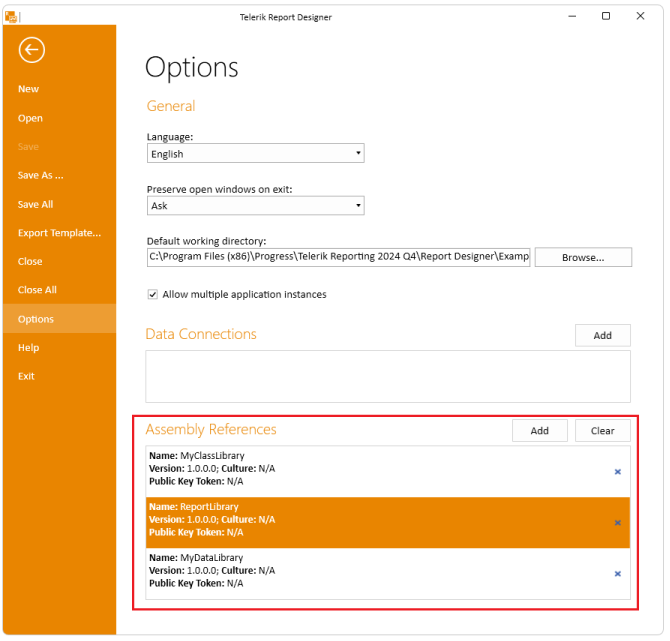

# Extending Report Designer to Recognize Custom Assemblies

It is a common requirement to add your own [User Functions]() or bind to custom CLR objects, data models (such as a Telerik Data Access model), external assemblies with custom data source objects, data feeds (including OData), and web services.

To expose your data, so it can be utilized by the Object/OpenAccess/Entity [data source components](), or extend the default behavior of the Telerik Reporting engine with custom User Functions, you have to use the [assemblyReferences Element]() of the Telerik.Reporting configuration section to reference your custom assembly:

````XML
<configuration>
	<configSections>
		<section
			name="Telerik.Reporting"
			type="Telerik.Reporting.Configuration.ReportingConfigurationSection, Telerik.Reporting"
			allowLocation="true"
			allowDefinition="Everywhere"/>
	</configSections>
	...
	<Telerik.Reporting>
		<AssemblyReferences>
			<add name="MyCustomAssembly" version="1.0.0.0" culture="neutral" publicKeyToken ="null" />
		</AssemblyReferences>
	</Telerik.Reporting>
</configuration>
````

This can be achieved either by manually editing the configuration file or by using the Standalone Report Designer's **Options** page.

## Update the Designer Configuration File through the UI

As of **Q4 2024** the [Standalone Report Designer]()'s **Options** page contains a new section: **Assembly References**:

  

It contains a grid listing the currently registered assemblies, similar to the grid used in the Data Connections section: 

  

Adding an assembly by clicking the **Add** button will open a new OpenFile dialog set to show *.dll and *.exe files. If the selected assembly is targeting a .NET version that is different than the current runtime, the following confirmation message occurs:

   

Closing the dialog will trigger the routine for registering assemblies in the application configuration file and loading them in the app domain.

Deleting an Assembly Reference is performed by clicking the "X" button:

.   

Closing the dialog will trigger the routine for unregistering assemblies in the application configuration file.

> Deleting an Assembly Reference in the Standalone Report Designer for .NET Framework requires restarting the application.

## Manually Update the Designer Configuration File 

The section should be added to the designer configuration file, __Telerik.ReportDesigner.exe.config__ that can be found in the Report Designer folder, which is the root location where the application is being executed. By default, this is '(*Telerik Reporting installation folder*)\Report Designer'. The Report Designer would also search the assembly itself in this base folder.

To instruct the Report Designer to look for assemblies in other locations as well, use the [`<probing>` Element](https://learn.microsoft.com/en-us/previous-versions/dotnet/netframework-2.0/823z9h8w(v=vs.80)). For more information, see [Locating the Assembly through Codebases or Probing](https://learn.microsoft.com/en-us/previous-versions/dotnet/netframework-4.0/15hyw9x3(v=vs.100)):

````XML
<configuration>
...
	<runtime>
		<assemblyBinding xmlns="urn:schemas-microsoft-com:asm.v1">
			<probing privatePath="MyDir;MyDir2\SubDir"/>
		</assemblyBinding>
	</runtime>
	<Telerik.Reporting>
		<AssemblyReferences>
			<add name="MyCustomAssembly" version="1.0.0.0" culture="neutral" publicKeyToken ="null" />
		</AssemblyReferences>
	</Telerik.Reporting>
...
</configuration>
````

## See Also

* [How to use external assemblies with custom CLR objects in the Report Designer]()
* [Previewing a report definition that uses an external assembly]()
* [Configuration]()
* [Report Designer Configuration]()
