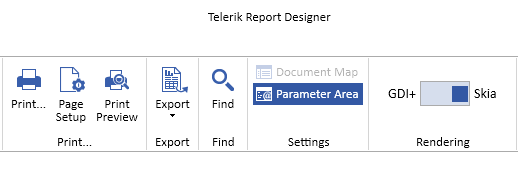

# Standalone Report Designer Overview

This document explains how end users can utilize the Standalone Report Designer. We briefly describe how to start the Standalone Report Designer and what are its basic UI elements.

## Standalone Report Designer Overview

The Standalone Report Designer empowers report authors with creating, editing, and sharing ad-hoc reports. It is a standalone Windows tool powered by the Telerik Reporting engine, which uses the latest UI standards to assist power users with the process of creating reports, analyzing data on their machines, and exporting and sharing report documents.

The Standalone Report Designer is distributed as a single EXE file, which simplifies its distribution and does not require installation. Visual Studio is not required to create reports with the Standalone Report Designer. Reports are processed on the client's machine.

Since its introduction in 2013 R2, the Standalone Report Designer is built against `.NET Framework 4.6.2` and is distributed as a part of the Telerik Reporting package. The designer comes in two flavors - Telerik.ReportDesigner.x86.exe which is compiled as a 32-bit application, and Telerik.ReportDesigner.exe, which is compiled as a 64-bit application.

Starting with [R3 2022 (16.2.22.914)](https://www.telerik.com/support/whats-new/reporting/release-history/progress-telerik-reporting-r3-2022-16-2-22-914), a new version of the Standalone Report Designer is available. It is named Telerik.ReportDesigner.Net and targets .NET {{site.mindotnetversion}}. Its main purpose is to allow report authors to load and use their assemblies compiled against .NET Standard, .NET Core, and .NET {{site.mindotnetversion}}+. The Standalone Report Designer for .NET is distributed with the product installer, and also as ZIP packages, containing the x86 or x64 flavor of the application.

## Differences between the .NET and .NET Framework designers' functionality

This section explains the differences between both versions of Standalone Report Designer - for .NET Framework and .NET 10. Although lots of code was shared between the versions, the .NET induced some changes that are listed below.

- **Open, Design, and Preview Coded Reports** - Starting with the [2025 Q3](https://www.telerik.com/support/whats-new/reporting/release-history/progress-telerik-reporting-2025-q3-19-2-25-813) release, the Standalone Report Designer for .NET can open, design, and preview coded reports. This is the recommended designer for editing coded(type) reports that are part of [.NET-based](https://dotnet.microsoft.com/en-us/) solutions - [Coded Reports in the Standalone Report Designer for .NET]().
- **Preview and Export using Skia Graphics Engine** - The Standalone Report Designer for .NET can switch between GDI+ and Skia graphics engines when previewing, printing, and exporting reports. This functionality, introduced with 2024 Q3 (18.2.24.806), is useful for report authors who design their reports on Windows machines but the target platform for their application is Linux or macOS, where the Skia library is used for processing and rendering. Since Skia does not support EMF format (vector drawing for image rendering), the previewed image may look blurry when zoomed in or out. Switching the state is applied to the Print Preview, Print, and Export functionalities. It affects all reports currently loaded in the Standalone Report Designer for .NET.

  

- **Automatic discovery of 3rd party ADO.NET Data Providers** - The Standalone Report Designer for the .NET Framework required manually adding an entry in the DbProviderFactories section in the application configuration file when needed to use a third-party ADO.NET provider. The Report Designer for .NET will try to discover and automatically load the available ADO.NET data providers when building a new SQL connection. The supported providers are: `Microsoft.Data.SqlClient`, `System.Data.SqlClient`, `Npgsql for PostgreSQL`, `System.Data.SQLite`, `MySql.Data.MySqlClient`, `Oracle.ManagedDataAccess.Client`. `ODBC` and `OleDB` data sources are also supported.

  > If any of the supported data providers doesn't appear in the dropbox of the SqlDataSource wizard you need to add its .dll and its dependency .dll files in the folder with the `Telerik.ReportDesigner.Net.exe` file.

- **Query Builder** - the Query Builder uses Telerik OpenAccess to define the relations between the tables in a database. Telerik OpenAccess has limited support for .NET, so currently the Query Builder functionality for the .NET designer is restricted.
- **Import Report Wizard** - the Import Report functionality relies on external 3rd-party assemblies that do not have .NET-compatible versions. The Import Report Wizard option is not available on the .NET designer's initial page.
- **Report Server** - Connecting and working with Telerik Report Server is currently not supported.
- **HTML Expression Editor** - The .NET Framework implementation of HTML Expression Editor relies on external assemblies like `mshtml.dll` that are not .NET-compatible. Currently, the HTMLTextBox expression is edited in the Expression Editor window.
- **Assembly Probing** - The [probing](https://learn.microsoft.com/en-us/dotnet/framework/configure-apps/file-schema/runtime/probing-element) element that was previously used for specifying application base subdirectories for the designer application to search when loading assemblies for the `ObjectDataSource` component and `User Functions` is not supported in `.NET Core`. With that being said, the subdirectory can instead be specified in the given assembly reference entry inside the [assemblyReferences]() element, for example `<add name="bin/UserFunctions.dll" />`

## Starting the Standalone Report Designer for .NET Framework 4.6.2

- **From the Windows Start menu:**

  1.  Open the Start menu, click `All Programs`, then click `Telerik`, and then click `Reporting`.
  1.  Click `Report Designer`.
  1.  The Standalone Report Designer opens, and you can create or open a report.

- **From another desktop application:** Developers can enable users to start the Standalone Report Designer from another .NET desktop application. This is possible with the .NET Framework [Process.Start](https://learn.microsoft.com/en-us/dotnet/api/system.diagnostics.process.start?view=netframework-4.7.2#overloads) Method. Optionally, the Standalone Report Designer accepts an argument path to a report document, which will be opened with the report designer. To provide a report definition for editing in the report designer, developers can use the [Process.Start (String, String)](https://learn.microsoft.com/en-us/dotnet/api/system.diagnostics.process.start?view=netframework-4.7.2#System_Diagnostics_Process_Start_System_String_System_String_) Method.

## Starting the Standalone Report Designer for .NET

- **From your Telerik Account:**

  1.  Navigate to the Progress Telerik Reporting installation folder. By default, it is `%PROGRAMFILES(x86)%\Progress\Telerik Reporting YYYY RR` where YYYY RR stands for the currently installed year and release moniker.
  1.  Navigate to the `Report Designer\.NET` subfolder.
  1.  Start the Telerik.ReportDesigner.Net.exe to run the 64-bit flavor of Standalone Report Designer for .NET.
  1.  Navigate to the `x86` subfolder and start the Telerik.ReportDesigner.Net.x86.exe to run the 32-bit flavor of Standalone Report Designer for .NET.
  1.  The Standalone Report Designer opens, and you can create or open a report.

* __Starting Standalone Report Designer using the latest installed .NET runtime:__
The Standalone Report Designer will be targeting LTS (Long-Term-Support) versions of .NET. If it is necessary to run the application against STS (Standard-Term-Support) .NET versions like .NET 10, or a pre-release version of LTS .NET, please use the `RollForward` feature of .NET runtime. Start the Standalone Report Designer from a command prompt, adding the `--roll-forward` parameter:

	````powershell
C:\Program Files (x86)\Progress\Telerik Reporting {Version}\Report Designer\.NET>Telerik.ReportDesigner.Net.exe --roll-forward LatestMajor"
````

```powershell
C:\Program Files (x86)\Progress\Telerik Reporting {{site.suiteversion}}\Report Designer\.NET>Telerik.ReportDesigner.Net.exe --roll-forward LatestMajor"
```

For further information about controlling the `RollForward` behavior at runtime, check the related Microsoft documentation article section [Control roll-forward behavior](https://learn.microsoft.com/en-us/dotnet/core/versions/selection#control-roll-forward-behavior).

## Major UI Elements in the Standalone Report Designer


The image above shows the major UI elements in the Standalone Report Designer:

- **View tab:** Lets you open the [Report Explorer](), [Data Explorer](), [Group Explorer](), **Property Browser** or navigate to **Startup Page**
- **Report selector button:** Clicking this button makes the report active in the `Properties` window.
- **Rulers:** Located on the top and left side of the designer, they provide a point of reference for the report layout.
- **Report Sections**: The high-level report design consists of report sections for the report header, report footer, page header, page footer, detail, group header, and group footer. Each section can be resized by dragging the sizing grips at the bottom/right of each section. Most sections except the detail can be deleted by selecting the section and hitting the delete key. To delete a group section, you have to delete the whole group from the [Group Explorer]()
- **Component Tray:** Shows the [DataSource components]() that are used in this report.
- **View Mode Buttons:** Use these buttons to switch between the `Design`, and `Preview` views.
- [Context Menu]() (not shown on the image above): Appears on right-click and conditionally displays content depending on the area that was right-clicked.

## Additional UI Elements

Additionally, the Standalone Report Designer includes the following helpful elements:

- **ToolStrip**: This is a UI element that includes various buttons that are designed to ease you while you design reports. The `ToolStrip`, which is shown in the image below, is placed in the lower-left corner of the design surface.

  

  You will find the following buttons in the `ToolStrip`:

  - **Zoom** - the combo box enables you to easily specify the zoom percentage in which you see the design surface. You can do that by holding the Ctrl key and using the mouse wheel to zoom as well.

    

  - **Show/hide the snap grid** button switches on or off the displayed **snap grid**. The snap grid provides a set of horizontal and vertical gridlines that — when you drag an object on the design surface — will _snap_ or pull towards the closest vertical or horizontal gridlines. Objects can also snap to column and row dividers within a grid panel. Here is a workspace showing the snap grid turned on:

    

  - **Turn on/off snapping to gridlines** - this option allows you to drag objects on the design surface and have them snap to the grid lines shown on the designer surface. The snapping will be applied regardless of the visibility of the snap grid.
  - **Turn on/off snapping to snaplines** - when this option is enabled, it allows you to drag objects on the design surface and snap them to the margins or alignment lines (red dashed line) of other objects within the same container element such as a layout panel, column and row dividers in a grid panel. If a container has padding applied, it will be taken into account when snapping an object inside the container.

    

  - **Show/Hide Dimensions** - when enabled, the designer will show the distances from the currently selected object to the nearest elements.

    

  - **Show/Hide watermarks** - if enabled, the report watermarks will be shown in the designer. Note that the displayed watermarks are just for reference and their contents may not look the same as when rendered.
  - **Turn On/Off Pan** - this option allows you to switch between drag and pan mode in Designer. When enabled, the cursor is changed to a hand, and clicking and dragging on the designer surface will move the report contents. This tool is useful when working on higher zoom levels.

- **Show/Hide the Report Map** - In the lower-right corner of the design surface, click on the magnifying glass to show or hide the **Report Map**. This element is especially useful when you have zoomed the report and want to focus on a specific element. To hide the map, click on the design surface to have it closed.

  

- **Change the alignment of an element** Alignment determines how an element resizes. For example, a left-aligned element stretches to the right as the parent layout container gets resized. To change the alignment of an element use the `Layout` toolbar and do _one_ of the following:

  

  - Select two report items and change their HorizontalAlignment by clicking `Left`, `Center`, `Right`, or `Stretch`.
  - Select two report items and change their VerticalAlignment by clicking `Top`, `Center`, `Bottom`, or `Stretch`. You can also change alignment by moving an element on the design surface.
