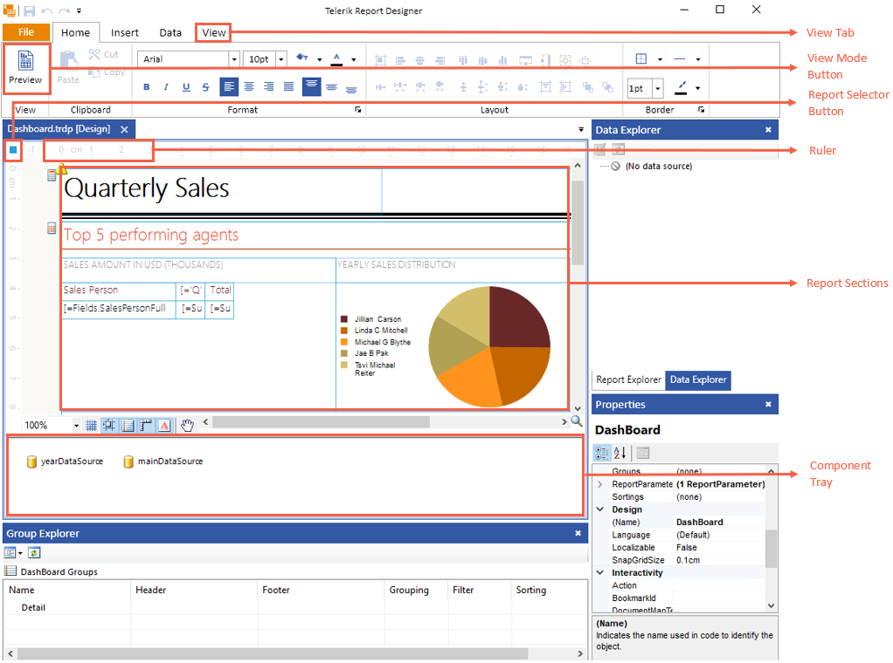
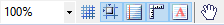
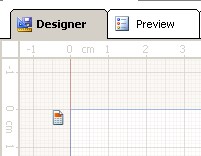
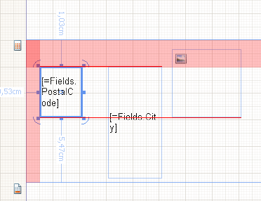
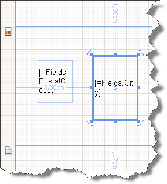
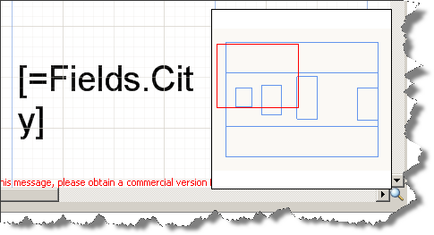
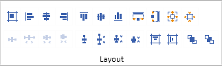

# Standalone Report Designer Overview

This document explains how end users can utilize the Standalone Report Designer. We briefly describe how to start the Standalone Report Designer and what are its basic UI elements.

## Standalone Report Designer Overview

The Standalone Report Designer empowers report authors with creating, editing and sharing ad-hoc reports. It is a standalone Windows tool powered by the Telerik Reporting engine, which uses the latest UI standards to assist power users with the process of creating reports, analyzing data on their machines, and exporting and sharing report documents. 

The Standalone Report Designer is distributed as a single EXE file, which simplifies its distribution, and does not require installation. Visual Studio is not required to create reports with the Standalone Report Designer. Reports are processed on the client machine.

Since its introduction in 2013 R2, the Standalone Report Designer is built against .NET Framework 4.0 and is distributed as a part of Telerik Reporting package. The designer comes in two flavors - Telerik.ReportDesigner.x86.exe which is compiled as 32-bit application, and Telerik.ReportDesigner.exe, which is compiled as 64-bit application.
Starting with 2022 R3, a new version of Standalone Report Designer is available. It is named Telerik.ReportDesigner.Net and is built against .NET 6.0. Its main purpose is to allow the report authors to load and use their assemblies compiled against .NET Standard, .NET Core and .NET 5+. The Standalone Report Designer for .NET is currently distributed as two .ZIP packages, each for the corresponding x86 or x64 flavor of the application.

## Differences between the .NET and .NET Framework designers' functionality
This section explains the differences between both versions of Standalone Report Designer - for .NET Framework and .NET 6.0. Although lots of code was shared between the versions, the .NET induced some changes that are listed below.

* __Automatic discovery of 3rd party ADO.NET Data Providers__ - The Standalone Report Designer for .NET Framework required manually adding an entry in DbProviderFactories section in the application configuration file when needed to use a third party ADO.NET provider. The Report Designer for .NET will try to discover and automatically load the available ADO.NET data providers when building a new SQL connection. The supported providers are: `Microsoft.Data.SqlClient`, `System.Data.SqlClient`, `Npgsql for PostgreSQL`, `System.Data.SQLite`, `MySql.Data.MySqlClient`, `Oracle.ManagedDataAccess.Client`. `ODBC` and `OleDB` data sources are also supported.
* __Query Builder__ - the Query Builder uses Telerik OpenAccess to define the relations between the tables in a database. Telerik OpenAccess does not have .NET-compatible version so currently Query Builder is not supported.
* __Import Report Wizard__ - the Import Report functionality relies on external 3rd-party assemblies that do not have .NET-compatible versions. The Import Report Wizard option is not available in the .NET designer's initial page.
* __Report Server__ - Connecting and working with Telerik Report Server is currently not supported.
* __HTML Expression Editor__ - The .NET Framework implementation of HTML Expression Editor relies on external assemblies like `mshtml.dll` that are not .NET-compatible. Currently the HTMLTextBox expression is edited in the Expression Editor window.
* __Assembly Probing__ - The [probing](https://learn.microsoft.com/en-us/dotnet/framework/configure-apps/file-schema/runtime/probing-element) element that was previously used for specifying application base subdirectories for the designer application to search when loading assemblies for the `ObjectDataSource` component and `User Functions` is not supported in `.NET Core`. With that being said, the subdirectory can instead be specified in the given assembly reference entry inside the [assemblyReferences]() element, for example `<add name="bin/UserFunctions.dll" />`

## Starting the Standalone Report Designer for .NET Framework 4.0

* __From the Windows Start menu:__

	1. Open the Start menu, click __All Programs__, then click  __Telerik__ and then click __Reporting__.
	1. Click __Report Designer__.
	1. The Standalone Report Designer opens, and you can create or open a report.

* __From another desktop application:__ Developers can enable users to start the Standalone Report Designer from another .NET desktop application. This is possible with the .NET Framework [Process.Start](https://learn.microsoft.com/en-us/dotnet/api/system.diagnostics.process.start?view=netframework-4.7.2#overloads) Method. Optionally, the Standalone Report Designer accepts an argument path to a report document, which will be opened with the report designer. To provide a report definition for editing in the report designer, developers can use the [Process.Start (String, String)](https://learn.microsoft.com/en-us/dotnet/api/system.diagnostics.process.start?view=netframework-4.7.2#System_Diagnostics_Process_Start_System_String_System_String_) Method.

## Starting the Standalone Report Designer for .NET

* __From your Telerik Account:__

	1. Navigate to the Progress Telerik Reporting installation folder. By default it is `%PROGRAMFILES(x86)%\Progress\`.
	1. Navigate to `.net` subfolder.
	1. Start the Telerik.ReportDesigner.Net.exe to run the 64-bit flavor of Standalone Report Designer for .NET.
	1. Navigate to `x86` subfolder and start the Telerik.ReportDesigner.Net.x86.exe to run the 32-bit flavor of Standalone Report Designer for .NET.
	1. The Standalone Report Designer opens, and you can create or open a report.

## Major UI Elements in the Standalone Report Designer  

The image above shows the major UI elements in the Standalone Report Designer:

* __View tab:__ Lets you open the [Report Explorer](), [Data Explorer](), [Group Explorer](), __Property Browser__ or navigate to __Startup Page__
* __Report selector button:__ Clicking this button makes the report active in the __Properties__ window.
* __Rulers:__ Located on the top and left side of the designer, they provide a point of reference for the report layout.
* __Report Sections__ : The high-level report design consists of report sections for the report header, report footer, page header, page footer, detail, group header and group footer. Each section can be resized by dragging the sizing grips at the bottom/right of each section. Most sections except the detail can be deleted by selecting the section and hitting the delete key. To delete a group section, you have to delete the whole group from the [Group Explorer]()
* __Component Tray:__ Shows the [DataSource components]() that are used in this report.
* __View Mode Buttons:__ Use these buttons to switch between the __Design__, __Preview__ view.
* [Context Menu]() (not shown on the image above): Appears on right click and conditionally displays content depending on the area that was right-clicked.

## Additional UI Elements

Additionally, the Standalone Report Designer includes the following helpful elements:

* __ToolStrip__ : This is a UI element that includes various buttons that are designed to ease you while you design reports. The __ToolStrip__, which is shown on the image below, is placed in the lower-left corner of the design surface.

	

	You will find the following buttons in the __ToolStrip__ :

	+ __Zoom__ - the combo box enables you to easily specify the zoom percentage in which you see the design surface. You can do that by holding the Ctrl key and use the mouse wheel to zoom as well.

		

	+ __Show/hide the snap grid__ button switches on or off the displayed __snap grid__. The snap grid provides a set of horizontal and vertical gridlines that — when you drag an object on the design surface — will *snap* or pull towards the closest vertical or horizontal gridlines. Objects can also snap to column and row dividers within a grid panel. Here is a workspace showing the snap grid turned on:

		

	+ __Turn on/off snapping to gridlines__ - this option allows you to drag objects on the design surface and have them snap to the grid lines shown on the designer surface. The snapping will be applied regardless of the visibility of the snap grid.
	+ __Turn on/off snapping to snaplines__ - when this option is enabled, it allows you to drag objects on the design surface and snap them to the margins or alignment lines (red dashed line) of other objects within the same container element such as a layout panel, column and row dividers in a grid panel. If a container has padding applied, it will be taken into account when snapping an object inside the container.

		

	+ __Show/Hide Dimensions__ - when enabled, the designer will show the distances from the currently selected object to the nearest elements.

		

	+ __Show/Hide watermarks__ - if enabled, the report watermarks will be shown in the designer. Note that the displayed watermarks are just for a reference and their contents may not look the same as when rendered.
	+ __Turn On/Off Pan__ - this option allows you to switch between drag and pan mode in designer. When enabled, the cursor is changed to a hand and clicking and dragging on the designer surface will move the report contents. This tool is useful when working on higher zoom levels.

* __Show/Hide the Report Map__ - In the lower-right corner of the design surface, click on the magnifying glass to show or hide the __Report Map__. This element is especially useful when you have zoomed the report and want to focus on a specific element. To hide the map, click on the design surface to have it closed.

	

* __Change the alignment of an element__ Alignment determines how an element resizes. For example, a left aligned element stretches to the right as the parent layout container gets resized. To change the alignment of an element use the __Layout__ toolbar and do *one* of the following:

	

	+ Select two report items and change their HorizontalAlignment by clicking __Left__, __Center__, __Right__, or __Stretch__.
	+ Select two report items and change their VerticalAlignment by clicking __Top__, __Center__, __Bottom__, or __Stretch__. You can also change alignment by moving an element on the design surface.
