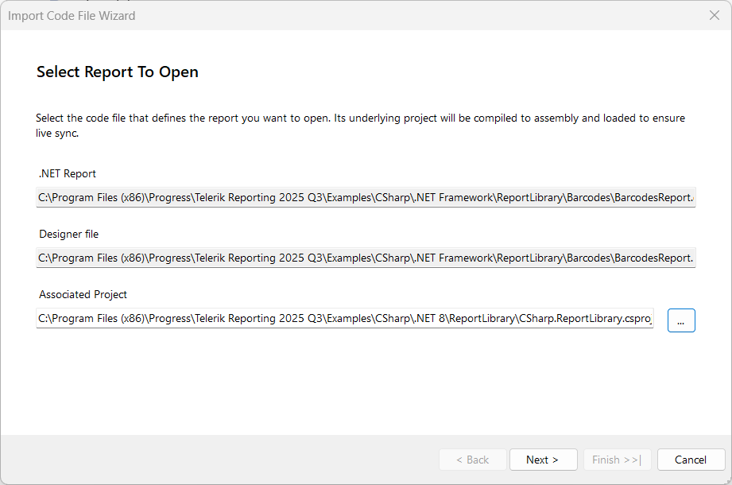
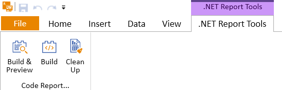
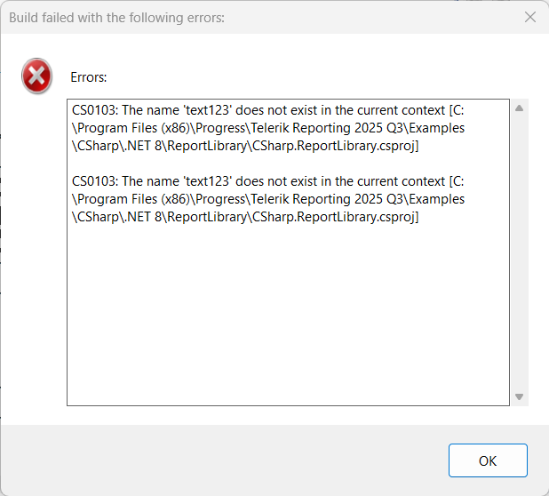
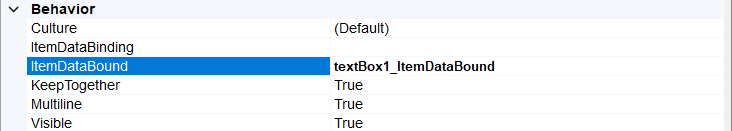
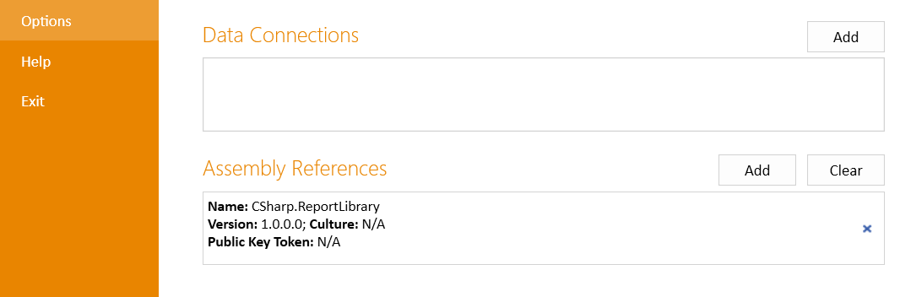
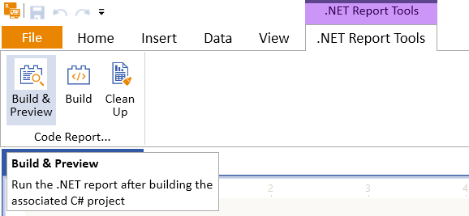
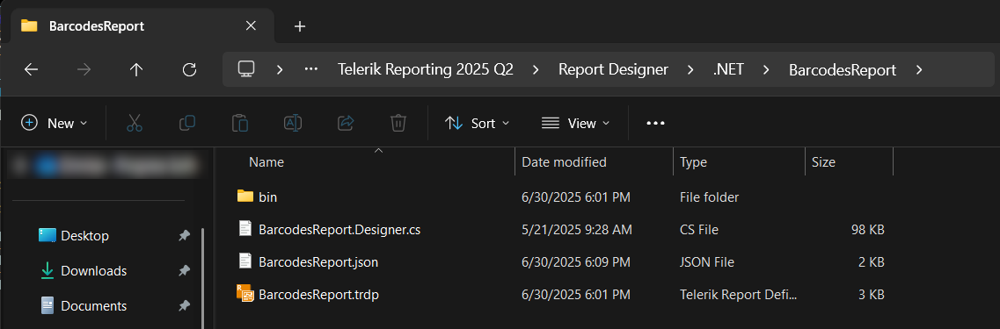

# Coded Reports in the Standalone Report Designer for .NET

Starting with the [Progress® Telerik® Reporting 2025 Q3 (19.2.25.813)](https://www.telerik.com/support/whats-new/reporting/release-history/progress-telerik-reporting-2025-q3-19-2-25-813) release, the [Standalone Report Designer for .NET](#starting-the-standalone-report-designer-for-net) (SRD.NET) supports opening, designing, and previewing Coded Report definitions hosted in CS projects targeting .NET. This feature addresses a long-standing limitation: the Visual Studio-integrated report designer does not support SDK-style projects or .NET Core/.NET 5+ targets. Due to architectural constraints, it could not be extended to support these project types. SRD.NET now provides a smooter alternative for working with type report definitions.

While this workflow is fully supported, we recommend using declarative (XML-based) report definitions for most scenarios. Declarative reports offer broader tooling support, easier maintenance, and easier integration across Telerik Reporting tools.

> This feature is only available for C# reports due to limitations in VB.NET's CodeDOM serialization.

This article explains and visually demonstrates how to open, edit, and preview .NET coded (.CS) reports using the Standalone Report Designer for .NET.

## When to Use This Workflow

This workflow is ideal if:

- You are migrating from a .NET Framework-based report library to a .NET report library and prefer to retain coded report definitions.
- You are introducing embedded reporting in a .NET Core application and favor a code-first approach to report development.

## Prerequisites
 
The designer's functionality for working with Coded Reports relies on [MSBuild](https://github.com/dotnet/msbuild) version 15 or higher. 
If you have Visual Studio 2017 or newer installed, the required MSBuild version will be available out of the box.

> The .NET SDK corresponding to your project’s target framework must also be installed. 
For example, if your report library targets .NET 8, ensure the .NET 8 SDK is present.
Without it, SRD.NET will fail to compile the project.

## Opening Coded Reports

In addition to **TRDP/TRDX** files, **.CS** files can now be opened directly from the standard Open File menu in the Standalone Report Designer for .NET. 

The designer requires a compiled version of the report to initiate the design workflow. A dedicated wizard facilitates this process and is triggered only once, during the initial opening of the report.
Subsequent sessions load the design surface directly without recompilation. 

1. Upon opening a .NET type report, the `Open Code File Wizard` launches and attempts to auto-populate the required inputs: the corresponding **designer.cs** file and the nearest .NET project file. You can adjust these paths if needed.

	

	> Ensure the selected project targets `.NET`. Projects targeting `.NET Framework` produce assemblies incompatible with SRD.NET.

1. The next step builds the project and creates all necessary assets in a dedicated folder next to the SRD.NET executable.

	

> **Limitation:** The designer cannot open two reports with the same file name, even if they reside in different folders. Use the **Clean Up** tool (introduced below) before opening the second report.

## Designing Coded Reports

Once opened in SRD.NET, the coded report design experience includes all tools available in both the Standalone and Visual Studio-integrated designers—data connectivity, component tree editing, and visual styling. Each Save operation updates the **.designer.cs** file to reflect the current report state.

> Avoid modifying the **.designer.cs** file manually. Changes made outside SRD.NET will not be reflected in the designer. If manual edits are necessary, use the **Clean Up** tool and reopen the report to regenerate assets.

## Previewing Coded Reports and Code-Behind support

Use the standard `Home`->`Preview` tool to view the report based on the **.designer.cs** content. If your report includes custom logic in the main **REPORT_NAME.cs** file, use the `.NET Report Tools` toolbar:



- `Build & Preview`: Builds the C# project and previews the report with custom code-behind logic (e.g., [report events]()).
- `Build`: Builds only the report project and updates the assembly in the assets folder. Dependencies are reused from the initial build. If build errors occur, they are displayed in the UI:

	

> **Implication:** If you modify a dependency project, use **Clean up** and restart the design session to reflect changes.

- `Clean Up` - Closes the report and deletes temporary design assets. Save your work before using this tool. When reopening the report, the initial build process will run again.

	


## Creating and Using Report Event Handlers

For demonstration purposes, the following steps will assume that a type report has already been created inside a [.NET Class Library](https://learn.microsoft.com/en-us/dotnet/standard/class-libraries), the report is named "SampleReport" and the goal is to handle the [ItemDataBound](/api/telerik.reporting.reportitembase#Telerik_Reporting_ReportItemBase_ItemDataBound) event of a `textBox` report item:

1. In the report class, add a handler method for the [ItemDataBound](/api/telerik.reporting.reportitembase#Telerik_Reporting_ReportItemBase_ItemDataBound) event.

	````C#
public partial class SampleReport : Telerik.Reporting.Report
{
	public SampleReport()
	{
		//
		// Required for Telerik Reporting designer support
		//
		InitializeComponent();
	}
	private void textBox1_ItemDataBound(object sender, EventArgs e)
	{
		Telerik.Reporting.Processing.TextBox processingTextBox = (Telerik.Reporting.Processing.TextBox)sender;
		Telerik.Reporting.Processing.IDataObject dataObject = (Telerik.Reporting.Processing.IDataObject)processingTextBox.DataObject;
		if ((string)dataObject["Title"] == "Developer")
		{
			processingTextBox.Style.BackgroundColor = System.Drawing.Color.BlueViolet;
		}
	}
}
````


1. Set the name of the event handler function to the `ItemDataBound` property of the report item in the Standalone Report Designer for .NET:

	

1. Open the **Options** view in the Standalone Report Designer for .NET, and allow the class library assembly by adding it to the **Assembly References** list:

	

1. Use the `Build & Preview` button to build a new copy of the assembly, which contains the new event handler method, and preview the report with it.

	


## Creating and Using Custom Functions

For demonstration purposes, the following steps will assume that a type report has already been created inside a [.NET Class Library](https://learn.microsoft.com/en-us/dotnet/standard/class-libraries), the report is named "SampleReport" and the goal is to implement a [custom user function]() that returns the last day of the month.

1. In the report class, create a new **public static** method that looks as follows:

	````C#
public partial class SampleReport : Telerik.Reporting.Report
{
	public SampleReport()
	{
		//
		// Required for Telerik Reporting designer support
		//
		InitializeComponent();
	}
	[Function(Category = "My Date Functions", Namespace = "MyDateFunctions", Description = "Get the last date of the current month")]
	public static DateTime GetLastDayOfMonth()
	{
		DateTime today = DateTime.Today;
		return new DateTime(today.Year,today.Month,DateTime.DaysInMonth(today.Year, today.Month));
	}
}
````


1. To invoke this custom function, set the following expression to a `textBox` or `htmlTextBox` report item - `= MyDateFunctions.GetLastDayOfMonth()`.
1. Open the **Options** view in the Standalone Report Designer for .NET, and allow the class library assembly by adding it to the **Assembly References** list:

	

1. Use the `Build & Preview` button to build a new copy of the assembly, which contains the new custom function, and preview the report with it.

	


## Migrate from .NET Framework Report library to .NET (Core) Report library

Migrating a `.NET Framework` report library to a .NET (Core or .NET 8+) report library involves several steps to ensure compatibility and modernization. Here's a short list of the main steps to focus on for the migration process:

1. Create a new .NET SDK style Class Library project - [Create a .NET class library using Visual Studio](https://learn.microsoft.com/en-us/dotnet/core/tutorials/library-with-visual-studio). 
1. Copy all the report files (including the `.designer.cs` and the `.resx` files) to the new .NET project. 
1. Ensure all reports are included in the new project and build it in Visual Studio/Visual Studio Code.
1. Open at least one report in the Standalone Report Designer for .NET and make sure it builds successfully. 
1. Apply changes, save the file, and use the `Build & Preview` button to preview the type report with code-begind.

## .NET Reports Design Workflow Explained (Advanced)

To edit a report, the designer needs a live object model. For declarative formats (XML/JSON), this is loaded via parsing, while for `.CS` files, the Standalone Report Designer for .NET compiles the project, loads the resulting assembly, and instantiates the report object.

The compiled assembly and dependencies are stored in a temporary folder named after the report file, located next to the Standalone Report Designer for .NET executable.

Once instantiated, the designer treats the report like a declarative definition (note the .trdp file in the assets folder). 
On **Save**, the report tree is serialized into the `InitializeComponent` method in the **.designer.cs** file using [CodeDOM APIs](https://learn.microsoft.com/en-us/dotnet/api/system.codedom?view=windowsdesktop-9.0).

> The serialization mimics Visual Studio's behavior semantically. 
The first Save may introduce significant changes in InitializeComponent, but the report structure remains intact. 
Use source control to track changes. Custom code in non-designer files remains untouched.

> **Limitation:** If the report’s *parameterless constructor* modifies the component tree beyond calling `InitializeComponent`, those changes will be reflected in the saved designer file.

Below is a list of the temporary assets folder contents:

- `bin`: Contains the compiled report assembly and dependencies.
- `{ReportName}.Designer.cs`: Backup of the designer file.
- `{ReportName}.json`: Metadata for the design session.
- `{ReportName}.trdp`: Internal report definition used by the designer.



> **Disclaimer:** The structure and contents of the temporary assets folder are intended for internal use by the Standalone Report Designer for .NET. 
They may change in future product releases without notice. Developers should avoid relying on this folder's layout or contents for custom tooling or automation.

## See Also

* [.NET Coded Report Design, No IDE Strings Attached](https://www.telerik.com/blogs/net-coded-report-design-no-ide-strings-attached)
* [Extending Report Designer to Recognize Custom Assemblies]()
* [Using event handlers in the Standalone Report Designer]()
* [Custom User Functions]()
