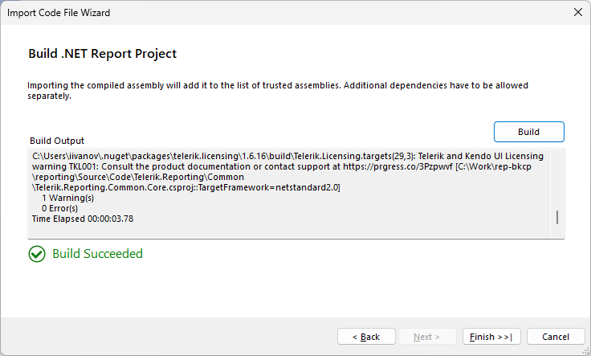
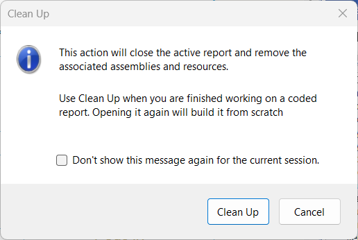

# Type Reports in the Standalone Report Designer for .NET

Starting with the [Progress® Telerik® Reporting 2025 Q2 (19.1.25.521)](https://www.telerik.com/support/whats-new/reporting/release-history/progress-telerik-reporting-2025-q2-19-1-25-521) release, the [Standalone Report Designer for .NET](#starting-the-standalone-report-designer-for-net) supports loading, designing, and previewing Type Report definitions hosted in CS projects targeting .NET.

>note The feature is in **Preview** state and will be further developed in the coming releases.

In this article, we will explain and visually demonstrate how the Standalone Report Designer for .NET can be used to open, edit, and preview .NET type (.CS/) reports, and we will also share what the designer does behind the scenes to handle the previously unsupported format.

## Import Code File Wizard

Just as one would open a **TRDP/TRDX** file, now the **.CS** files will also be openable from the standard open file menu of the Standalone Report Designer for .NET.

1. Upon selecting a .NET type report to open, the `Import Code File Wizard` will start, and it will automatically populate the necessary inputs:

	

	> At this step, it is important to ensure that the project that will be used to build the report targets `.NET`. A project that targets the older `.NET Framework` would produce an assembly that is not compatible with the Standalone Report Designer for .NET.

1. The next step is building the project. This step will create a new folder in the same directory as the executable file of the Standalone Report Designer for .NET, whose name will be the *name of the Type Report*.

	

## Working with the .NET Type Report in the Report Designer

Once the **Import Code File Wizard** is completed, the imported report will be automatically opened in a new tab in the Standalone Report Designer for .NET application.

When a .NET Type Report is opened in the application, and this is the currently focused tab, a new tab will appear in the toolbar menu - `.NET Report Tools`.

- `Build & Preview` - This button will trigger a build of the project (like the button 'Build') and a preview of the .NET Type Report with any custom code behind included. For example, custom code written in [report events]() should be respected when previewing through this button.
- `Build` - This button will trigger a new build of the project that was used to import the report. The generated assemblies of the built project(s) will be copied to the dedicated directory for the type report. The dependencies already added to the folder by a previous build will be reused, making the process faster. Use the 'Clean Up' button to trigger a complete rebuild.

	The report project will be rebuilt entirely from the modified code. If there is a problem, you will see the build errors, as shown below:

	

- `Clean Up` - Clean all the assets generated and copied with the build process of the opened CS report. If you build the report afterwards, it will be built from scratch, as during the initial build, and all the assets will be regenerated.

	

> Be advised that our algorithm mimics the Visual Studio one only semantically. This means that the initial report modification will introduce significant changes in the serialized code, but the component tree will be preserved. Please use versioning for your reports to have clear tracking of the changes. The non-designer partial class files stay intact, so custom code is preserved and ready to work alongside the generated design logic.

## Internal Logic for .NET Type Reports in the Report Designer

While it will appear that the .NET Type Report is being rendered by the Standalone Report Designer for .NET, internally, we read and display the report definition as a `TRDP` file.

When the .NET Type Report is initially imported, the designer creates a dedicated folder based on the type name of the report class. This folder contains the following files and subfolders:

- `bin` - Contains the assembly of the built project of the report and all of its dependent assemblies.
- `{ReportName}.Designer.cs|.vb` - A backup of the `.designer` file that can be used in case our logic fails and the original file is wrongly edited by the application.
- `{ReportName}.json` - A `JSON` file containing the report's type name, the loaded full type, paths to the project file, the designer file, etc.
- `{ReportName}.trdp` - The actual report definition file loaded and displayed by the Standalone Report Designer for .NET. When editing the .NET Type Report from the tab in the designer application, behind-the-scenes, this is the actual file that is being changed, and its contents are later serialized from `XML` to `C#/VB` code in the `.designer` file through the [CodeDOM APIs](https://learn.microsoft.com/en-us/dotnet/api/system.codedom?view=windowsdesktop-9.0). Our code keeps the two files - the original `.designer` and the `TRDP` files in live-sync.

## See Also

* [.NET Coded Report Design, No IDE Strings Attached](https://www.telerik.com/blogs/net-coded-report-design-no-ide-strings-attached)
* [How to use Visual Studio Report Designer to edit CS/VB Reports in .NET Projects]()
