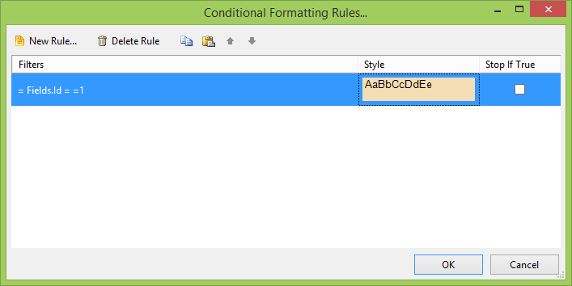

# Conditional Formatting Rules Dialog Overview

The __Conditional Formatting Rules__ dialog lets you define rules that when fired change the style formatting of the selected item. Details on creating rules can be found in the [Filter Rules]() article. You can define multiple rules that will format the same report item. Each rule is made up of a set of conditions and a style to use when the conditions of the rule are met. Rules are executed in the order they appear in the __ConditionalFormatting__ collection. You can choose whether to continue evaluating all rules in the collection or interrupt execution when a rule is satisfied. 

Use the __New Rule__, and __Delete Rule__ buttons to add, and delete formatting rules. Use the arrow buttons to change the order of precedence where rules higher in the list are evaluated before rules occurring later in the list. Select the __Stop if true__ checkbox to interrupt rule processing if the rule conditions are satisfied.

