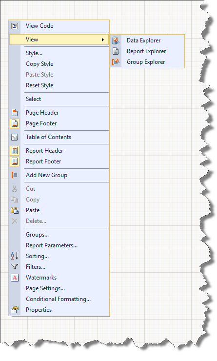
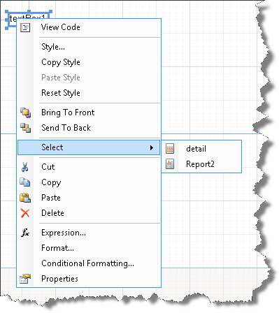

# Report Designer Context Menu

The context menu will conditionally display items depending on the area of the report that was right-clicked. Some of the significant context menu items are:

* __View:__ The sub menu of View allows you to select[Data Explorer](), [Report Explorer]() and [Group Explorer]().
* __Style:__ Invokes the Edit Style dialog for the right-clicked item. From here you can set the Text, Background, Edges and Line style for the report items, sections or the report as a whole.
* __Copy, Paste, Reset Style:__ To copy the style from one item in the report, right-click a report item and select __Copy Style__, then right-click another report item and select __Paste Style__. Right-click and select __Reset Style__ to restore an items previous style before the paste.
* __Page Header, Page Footer, Report Header:__ and __Report Footer__ : These menu items can be toggled on and off to create and remove respective sections in the report.
* __Add New Group:__ This menu item adds a new group to the report and new group component to the tray below the report designer.
* __Groups:__ This menu item opens the __Group Collection Editor__ dialog and allows you to add or remove groups to the report.
* __Report Parameters:__ This menu item opens the __ReportParameter Collection Editor__ dialog and allows you to add or remove report parameters to the report.
* __Sorting:__ This menu item opens the __Edit Sorting__ dialog and allows you to add or remove sort expressions to sort the data in the report.
* __Filters:__ This menu item opens the __Edit Filters__ dialog and allows you to add or remove filter expressions to restrict the data that is being shown in the report.

In the figure below the menu is invoked in the area next to the report design surface.

In the example below, a [TextBox]() was right-clicked to display its context menu. It includes the following menu items:

* __Bring To Front/Send To Back:__ Allow you to change the order of the items in the items collection of a section.
* __Select:__ Variations of this menu item allow you to select the report, sections in the report or items in sections of the report. The menu choices allow you to select elements of the report that are underneath the right-clicked item.
* __Expressions:__ This menu item invokes the [Edit Expression]().
* __Format__ Selecting this item displays the [Format Builder]().
* __Conditional Formatting:__ This menu item invokes the [Conditional Formatting Rules Dialog]().

