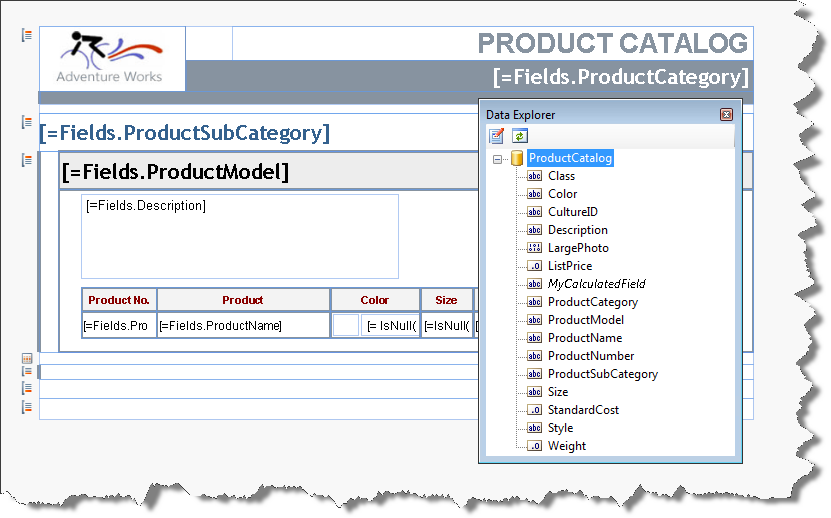
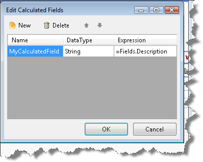

# Data Explorer of the Report Designer

The Data Explorer provides an overview of the database fields that are available to your report and the calculated fields you have created. It is available whenever you have a report open in design view.

The Data Explorer can be accessed from the context menu View | Data Explorer when right-clicking the area next to the report design surface.

The Data Explorer window lists the data source columns and calculated fields defined for your report. Drag column names from the Data Explorer to the report design surface to create new data bound [report items](). The report designer automatically creates appropriate report items for data source columns based on the column data type, e.g. if the column has character data a [TextBox]() report item will be created, if the column has image data then a [PictureBox]() report item will be created.

> The Data Explorer would be populated only when there is DataSource set in design time through the report's DataSource property.

The Data Explorer Toolbar contains two buttons - __Edit Calculated Fields__ and __Refresh__. Clicking on the __Edit Calculated Fields__ button would show the __Edit Calculated Fields dialog__ which allows you to __Add__ or __Delete__ new Calculated Fields. Please see [Calculated Fields]() topic for more information.

