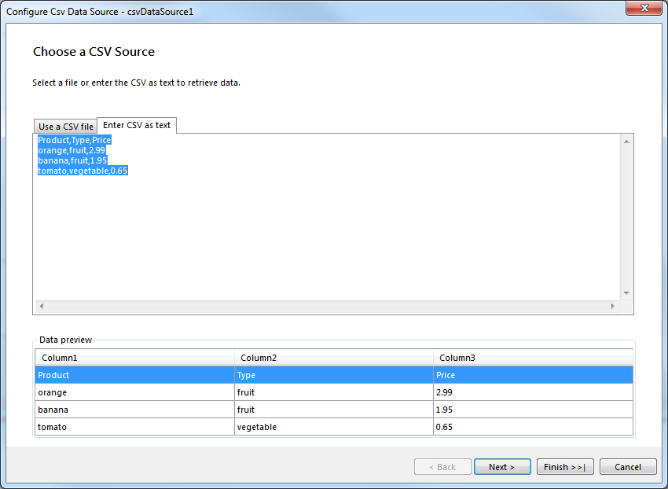
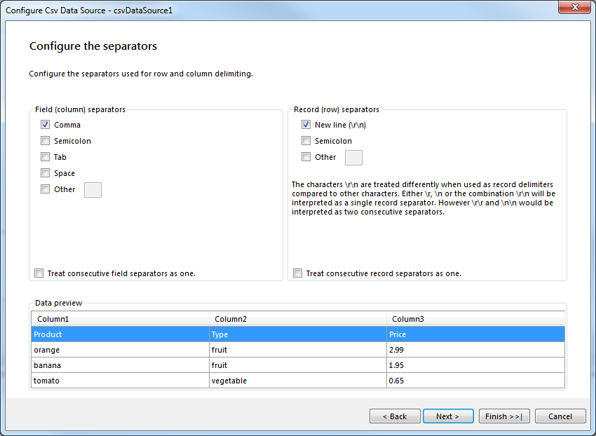
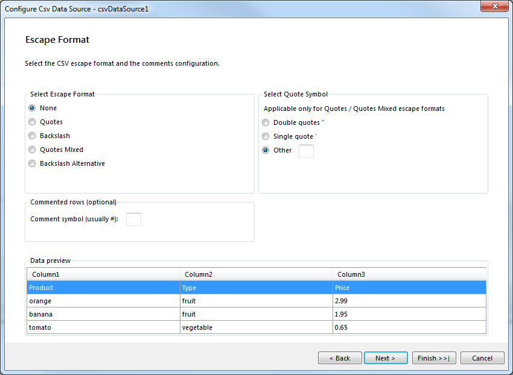
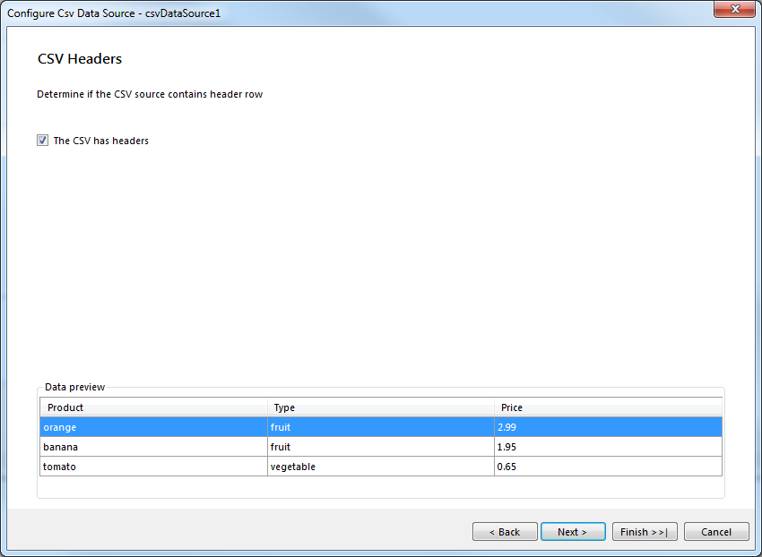
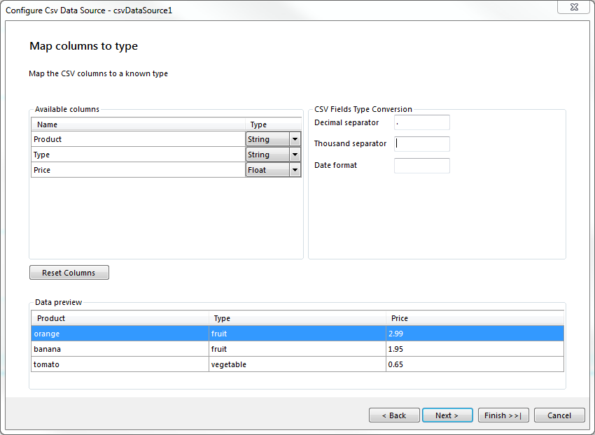
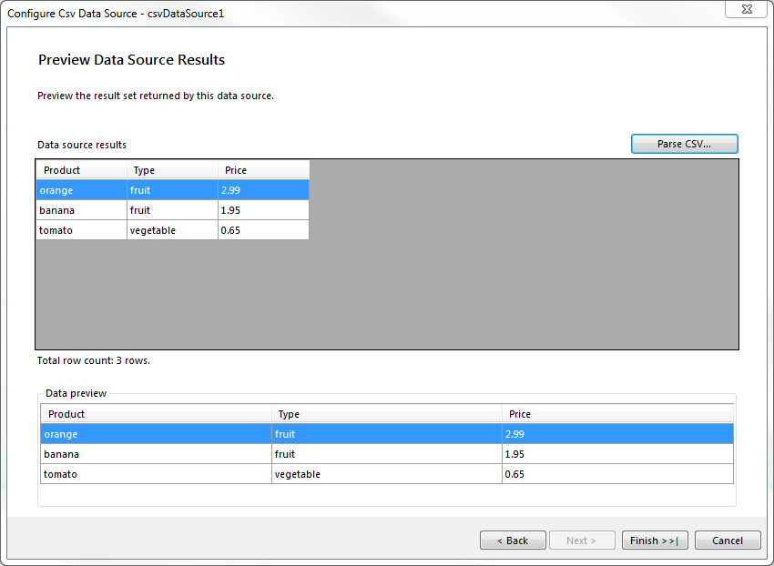

# CsvDataSource Wizard of the Report Designer

The __CSV Data Source Wizard__ allows you to create a new or edit an existing __CsvDataSource__ component based on several settings. After the wizard appears you have to perform the following steps:

1. __Choose a CSV Source__ Choose between file or inline string

	

1. __Configure the Separators__ Check at least one separator from each list. Check the consecutive field/record separators option (or both) if empty fields/records have to be omitted.

	

	>note If the same symbol, for example semicolon, is selected for both field and record separators this is not considered to be a valid CSV format. A warning will be displayed and moving forward will not be possible.

1. __Escape Format__ Choose the Escape format that is most suitable for the CSV document. If Quotes or QuotesMixed is checked the Quote option also must be configured. If the CSV document has comments enter the symbol which marks the start of a comment. If nothing is set the document is considered to not have comments. For more information regarding the Escape formats please check [CsvDataSource Escape Formats]().

	

1. __CSV Headers__ If the CSV document has a header row check the checkbox.

	

1. __Map Columns to Types__ Choose the data type for each column. Set the number (decimal and thousand separators) and date formats for the CsvDataSource. In case the CSV document does not have headers, the column names could be edited directly in the grid, so your data set fields would have meaningful names.

	

1. __Preview Data Source Results__ Preview the result set returned by the data source.

	
