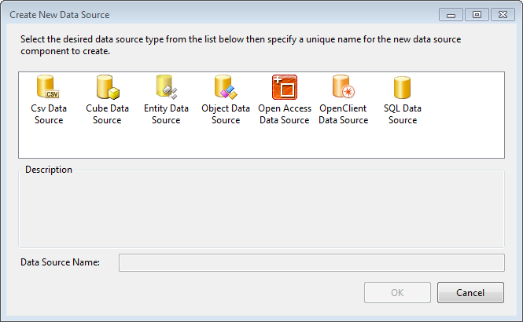

# DataSource Wizard Overview

The Data Source Wizard allows you to select from one of the available data source components:

* SqlDataSource - represents an SQL Database to data items
* CsvDataSource - represents a CSV data source that provides data to data items
* ObjectDataSource - represents a business object that provides data to data items
* EntityDataSource - represents an Entity data model to data items
* OpenAccessDataSource - represents an Open Access data model to data items
* CubeDataSource - represents OLAP cube data model to data items
* OpenClientDataSource - represents OpenEdge AppServer ABL procedures which provide data to data items

and selecting one of those choices, starts the respective wizard:

* [SqlDataSource Wizard]()
* [ObjectDataSource Wizard]()
* [EntityDataSource Wizard]()
* [OpenAccessDataSource Wizard]()
* [CubeDataSource Wizard]()
* [OpenClientDataSource Wizard]()

There are two ways to start the Data Source wizard:

1. From the DataSource property of a data report item 

	+ Select the DataSource property of a data report item (Report, Table/Crosstab/List, Chart)
	+ Click on the __Add New Data Source__ link
	+ The Data Source Wizard is started

	

1. From the [Report Wizard](), [Table and CrossTab Wizards](), Graph Wizard or Map Wizard: 

	+ Navigate to __Choose Data Source__ page of the Wizard
	+ click the __Add New Data Source__ button
	+ The Data Source Wizard is started

	
