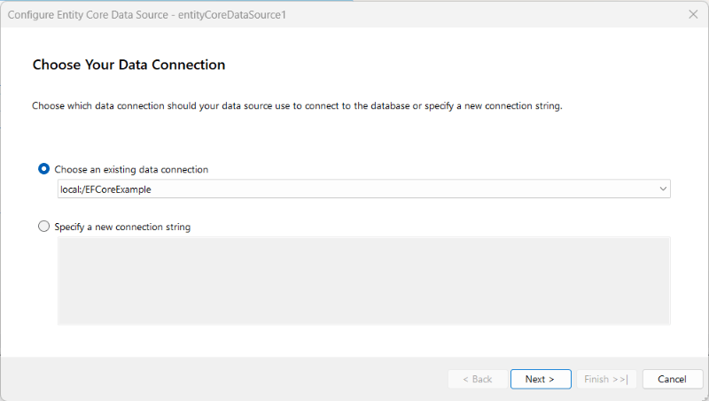
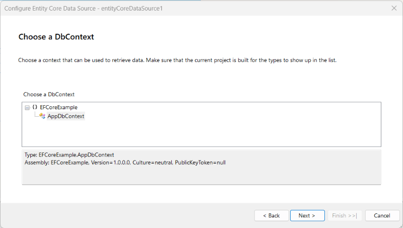
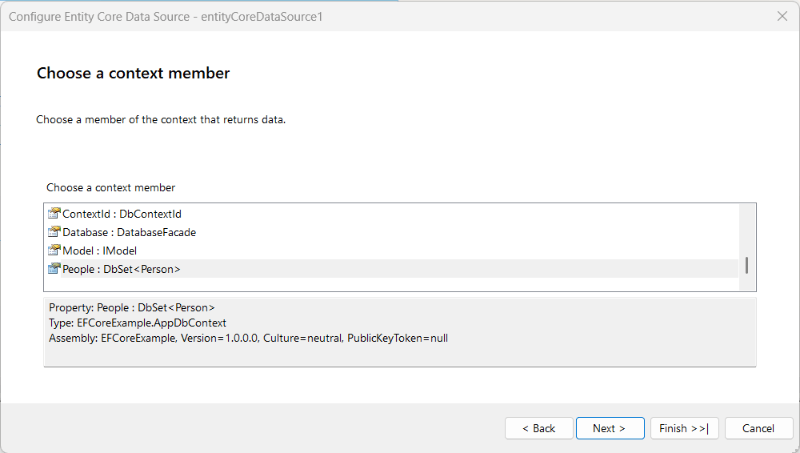
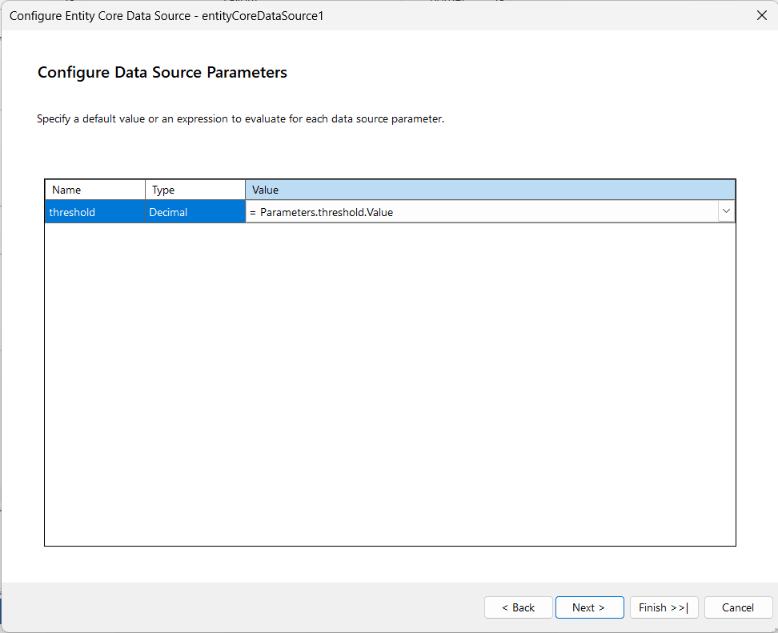
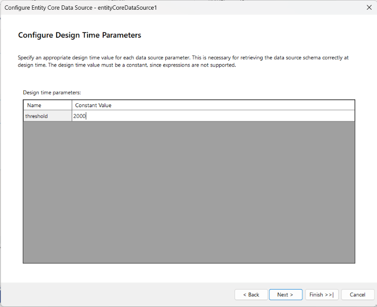
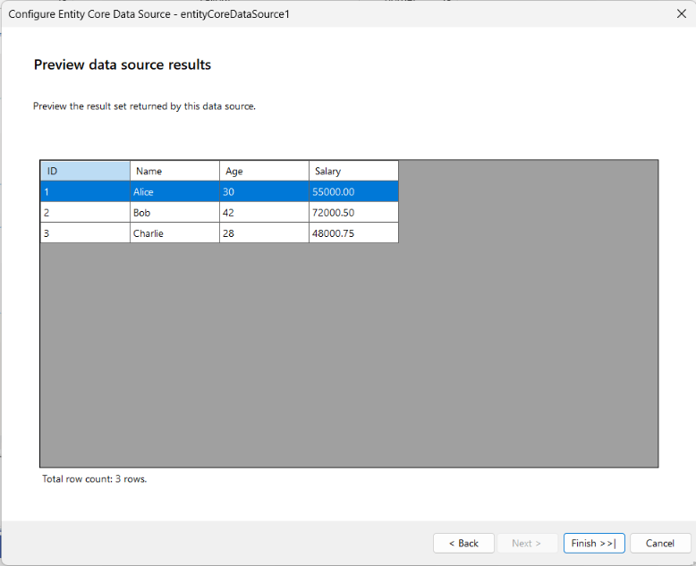

# EntityCoreDataSource Wizard of the Standalone Report Designer for .NET

The **EntityCoreDataSource Wizard** is available in the **Standalone Report Designer for .NET** since [2026 Q2 (20.1.26.520)](https://www.telerik.com/support/whats-new/reporting/release-history/progress-telerik-reporting-2026-q2-(20-1-26-520)). It lets you create new or edit existing `EntityCoreDataSource` components based on an [Entity Framework Core](https://learn.microsoft.com/en-us/ef/core/) `DbContext`. The wizard discovers the available `DbContext` types in an assembly that you provide, configures data retrieval, and resolves any parameters required to execute the selected member.

> Make sure the assembly that contains your Entity Framework Core `DbContext` is built against a .NET version compatible with the **Standalone Report Designer for .NET** and that all referenced assemblies (including the Entity Framework Core runtime and the database provider) are available next to it. If a dependency cannot be resolved, the wizard will not be able to list the `DbContext` types.

After the **EntityCoreDataSource** wizard appears, you have to perform the following steps:

1. **Choose Your Data Connection**. In this step, you have to point the wizard to the connection string to the database that the Entity Framework Core `DbContext` you want to use at design time. The designer will use it to connect to the database when the connection string cannot be resolved from the code.

	

1. **Choose a DbContext**. In this step, you have to specify the `DbContext` type that is responsible for accessing your model. The available `DbContext` types are organized in a hierarchical manner, grouped by namespace.

	

	> The wizard instantiates the selected `DbContext` at design time to read its model and to execute the selected member when previewing data. Make sure that the `DbContext` can be created by the wizard — for example, through a public parameterless constructor and a registered `IDesignTimeDbContextFactory<TContext>` implementation. For more information, refer to [Design-time DbContext Creation](https://learn.microsoft.com/en-us/ef/core/cli/dbcontext-creation).

1. **Choose a context member**. In this step, you have to specify a member of the chosen `DbContext` that is responsible for data retrieval. You can choose either a property that returns the desired entities directly (typically a `DbSet<T>`) or a method that executes some business logic against the model to obtain the required data for the report.

	

	> If the chosen member does not have any parameters, this is the last step of the wizard. However, if the specified member is a method with parameters, the next step allows you to configure those parameters.

1. **Configure Data Source Parameters** (_optional_). Each argument of the selected method corresponds to a data source parameter. This step allows you to specify, for each parameter, a constant value, an expression, or a new `ReportParameter` whose value will be assigned to the parameter automatically.

	

	> The names and types of the defined parameters must match exactly the arguments of the selected method. If this requirement is not fulfilled, the `EntityCoreDataSource` component will not be able to resolve or call the method correctly and will raise an exception at runtime.

1. **Configure Design Time Parameters** (_optional_). This step allows you to specify a value for each data source parameter that can be used at design time to retrieve the schema of the `EntityCoreDataSource` component. At design time, there is no expression context, so expressions are not supported, and the values must be constant.

	

	> Specifying design-time values for the parameters is necessary because the designer might need to execute the selected member to populate the schema displayed in the [Data Explorer](slug:telerikreporting/designing-reports/report-designer-tools/desktop-designers/tools/data-explorer) tool window and in the [Edit Expression Dialog](slug:telerikreporting/designing-reports/report-designer-tools/desktop-designers/tools/edit-expression-dialog). These values do not affect the execution of the member at run time.

1. **Preview data source results** Preview first 100 data rows based on the design-time parameter values.

	

This is the last step of the wizard. After pressing the **Finish** button, the wizard will configure the `EntityCoreDataSource` component with the specified settings and close.

## See Also

* [DataSource Wizard Overview](slug:telerikreporting/designing-reports/report-designer-tools/desktop-designers/tools/data-source-wizards/datasource-wizard)
* [EntityDataSource Wizard](slug:telerikreporting/designing-reports/report-designer-tools/desktop-designers/tools/data-source-wizards/entitydatasource-wizard)
* [Standalone Report Designer for .NET](slug:telerikreporting/designing-reports/report-designer-tools/desktop-designers/standalone-report-designer/overview#starting-the-standalone-report-designer-for-net)
