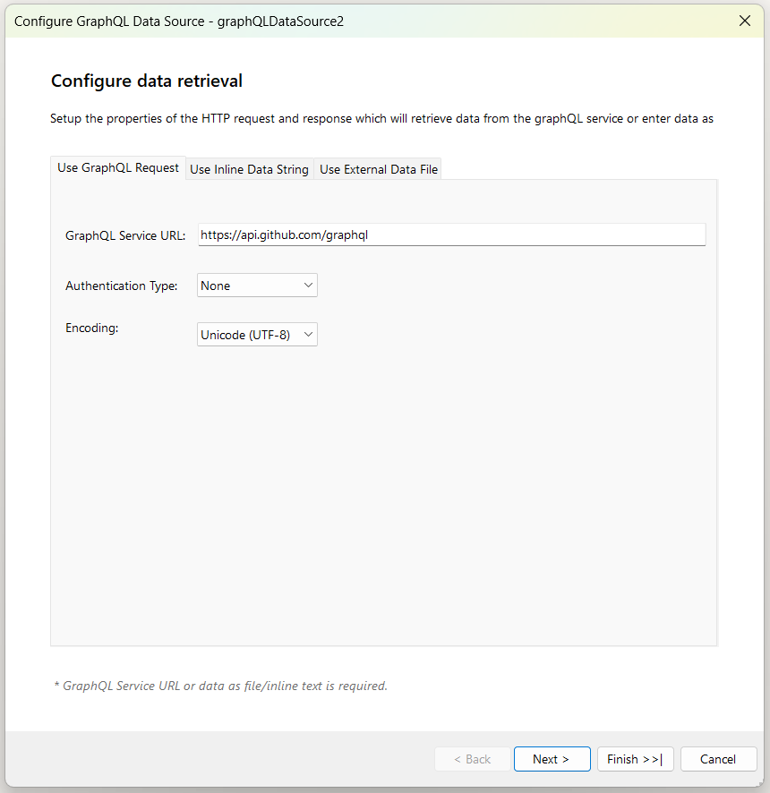
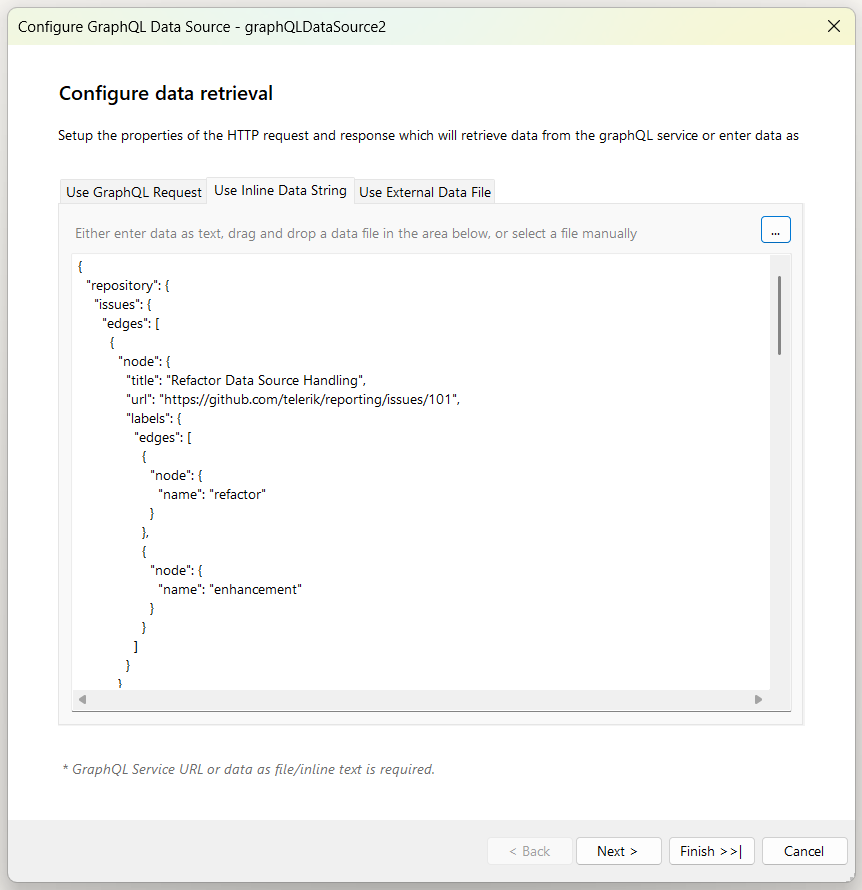
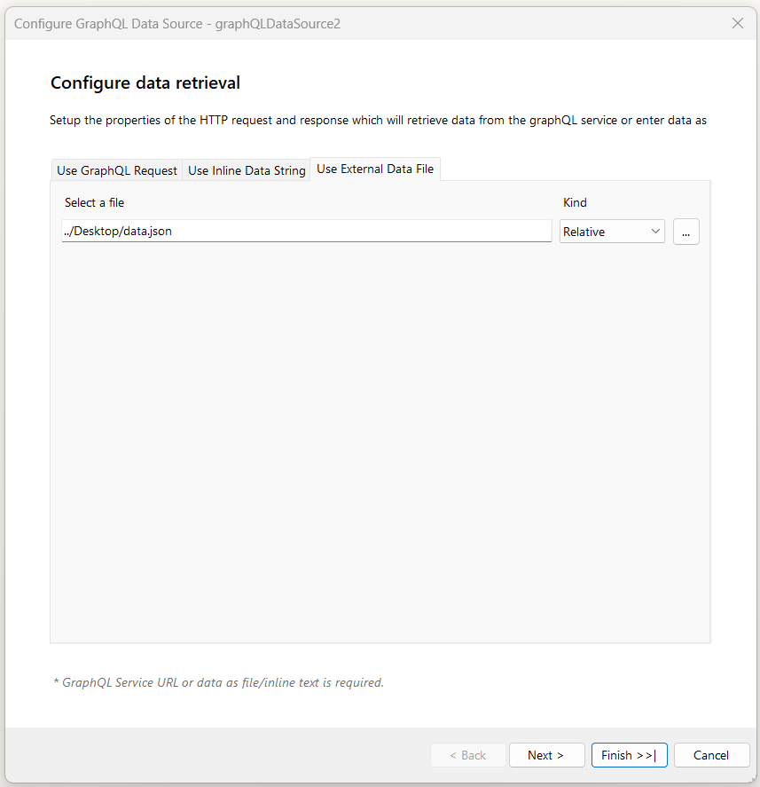
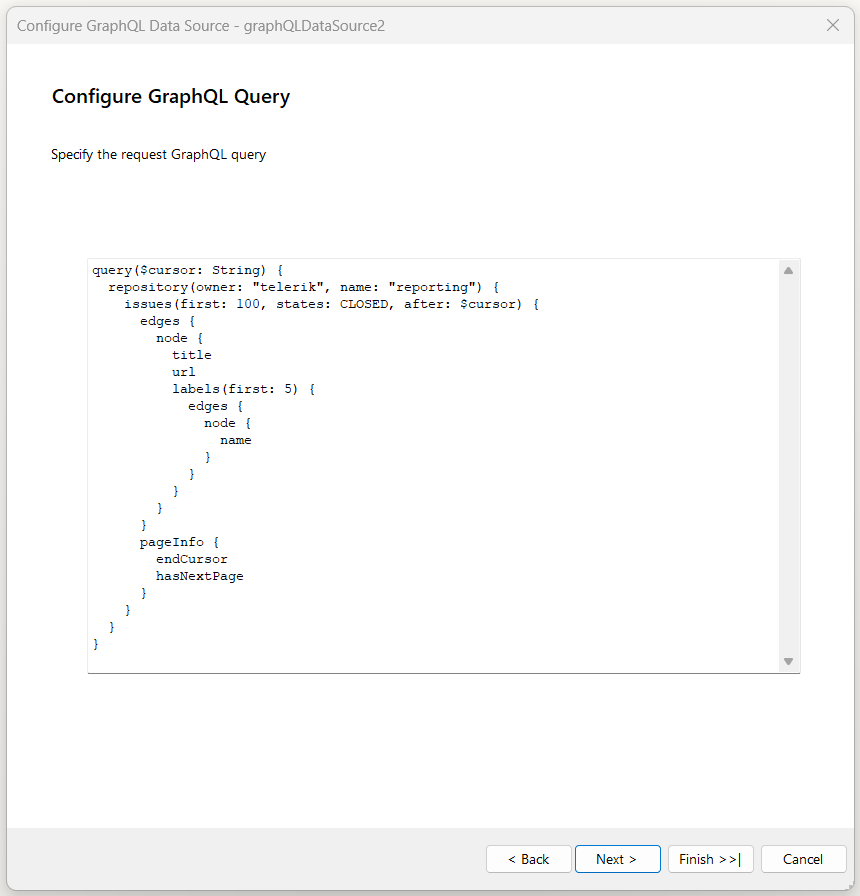
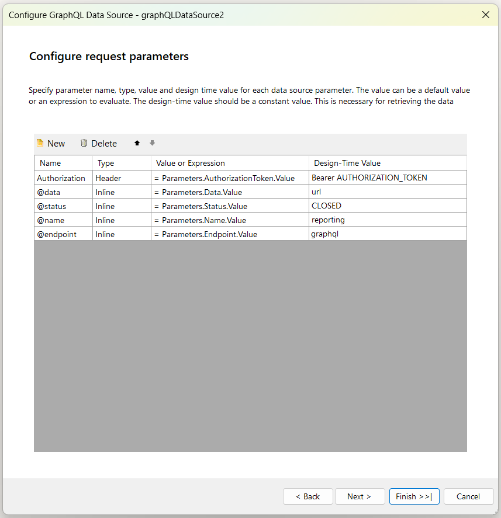
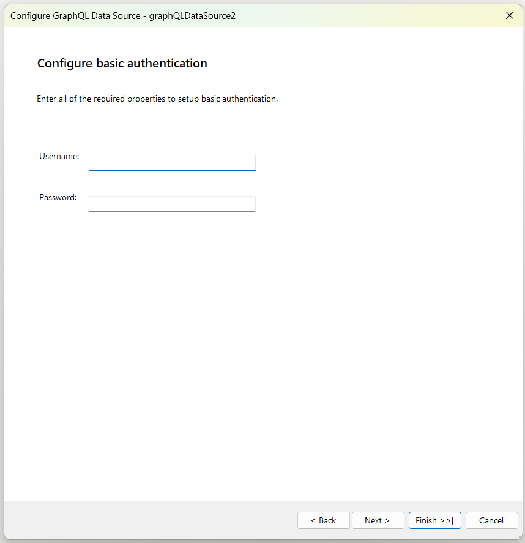
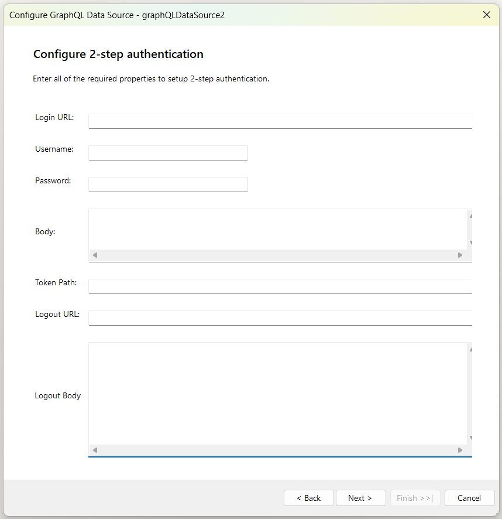

# GraphQLDataSource Wizard of the Report Designer

The __GraphQL Data Source Wizard__ allows you to create new or edit existing __GraphQLDataSource__ components based on several settings. After the wizard appears, you have to perform the following steps:

1. __Configure data retrieval__: Setup the properties of the HTTP request that will retrieve data from the GraphQL service: 

	

	| Setting | Description |
	| ------ | ------ |
	|Service URL|The URL the request is sent to. Returns the data from the GraphQL service. Required.|
	|Authentication Type|The authentication type. The supported options are Basic and 2-step authentications.|
	|Encoding|Data encoding. The default is UTF-8.|

	And/or enter data inline:

	

	| Setting | Description |
	| ------ | ------ |
	|Source|The inline data string containing the data. Required if the Service URL or external data file is not set.|

	And/or reference an external data file:

	

	| Setting | Description |
	| ------ | ------ |
	|Source|The external data file containing the data. The URI to the file might be relative or absolute. Required if the Service URL or inline data string is not set.|

1. __Configure GraphQL Query__: Allows you to define the actual GraphQL query that will be sent to the service. You can write a static query or use inline parameters to dynamically inject values into the query string.

	

1. __Configure request parameters__: The parameters of the HTTP request to be applied. The supported types are Query, Header, Cookie, and Inline. The inline parameters are parameters that are used to replace parameter tokens (@param1) in the URL and the GraphQL Query fields with an expression result or static value. For more information about the different types of parameters, refer to [Using Parameters in the GraphQLDataSource]().

	

1. __Basic Authentication__

	

	| Setting | Description |
	| ------ | ------ |
	|Username|The username used to authenticate. Required.|
	|Password|The password used to authenticate.|

1. __2-Step Authentication__

	

	| Setting | Description |
	| ------ | ------ |
	|Login URL|This URL returns the authentication token or session key that allows you to access the API. Required.|
	|Username|The username used to authenticate. The username and password are needed only when the Login URL uses Basic Authentication to retrieve the authentication token/key.|
	|Password|The password used to authenticate.|
    |Body|The body of the login HTTP request.|
	|Token Path|This is a regular expression that allows to retrieve the authentication or session key from the response received via the Login URL. For example, when the Login URL returns a JSON response containing the authentication token in the form: *{"access_token":"cbm9W3MeTeVPuO5CIq_DTvG5KbzydpRQ","token_type":"bearer","expires_in":1799,"userName":"demouser",".issued":"Tue, 15 May 2018 08:42:32 GMT",".expires":"Tue, 15 May 2018 09:12:32 GMT"}* the token path regular expression to retrieve the token would be: *(?:"access_token":")(.*?)(?:")* |
	|Logout URL|This URL is called if the resource features a lockout for having too many sessions open. Refresh the report and try again after successfully logging out.|
	|Logout Body|The body of the logout HTTP request.|

1. __2-Step Authentication Parameters__: The parameters of the HTTP request to be applied. The supported types are Query, Header, Cookie, and Inline. The inline parameters are parameters that are used to replace parameter tokens (@param1) in the URL and the Body fields with an expression result or static value.

1. __Preview data source results__: Allows you to preview the result from the configurations you have applied so far.

	

	| Setting | Description |
	| ------ | ------ |
	|Data Selector|The [JSONPath](https://www.newtonsoft.com/json/help/html/QueryJsonSelectTokenJsonPath.htm) expression string, which will be used to query the data. For more information, refer to [How to Use JSONPath to filter JSON data]().|

## See Also

* [GraphQLDataSource Component Overview]()
* [Using JSONPath to Filter JSON data]()
* [Using Parameters with GraphQLDataSource]()
