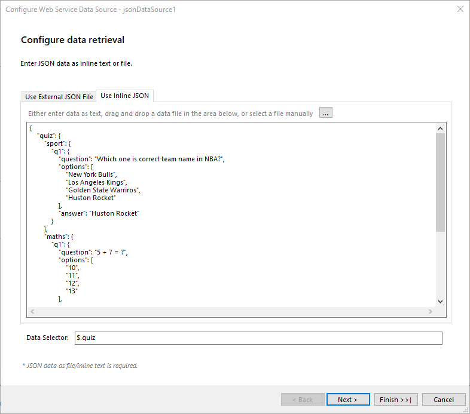
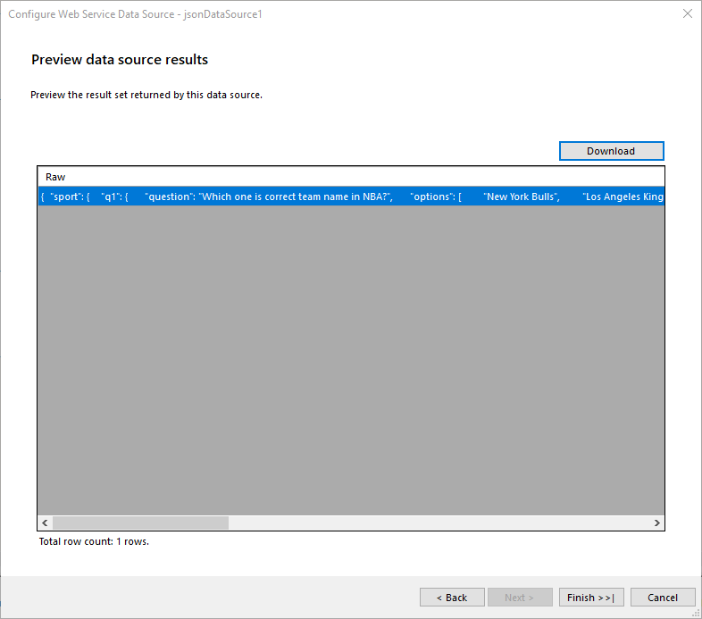

# JsonDataSource Wizard of the Report Designer

The **JSON Data Source Wizard** allows you to create a new or edit an existing **JsonDataSource** component based on several settings. After the wizard appears you have to perform the following steps:

1. **Choose a JSON Source** Choose between external file or inline string.

   

   Optionally use the data selector to query and filter the JSON data.The data selector is a [JSONPath](https://www.rfc-editor.org/rfc/rfc9535) string which will be used to query the data. For more information please refer to [How to Use JSONPath to filter JSON data]().

1. **Preview Data Source Results** Preview the result set returned by the data source.

   
